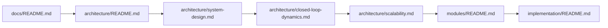
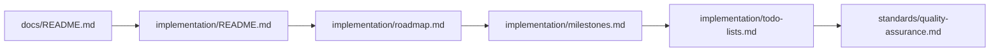
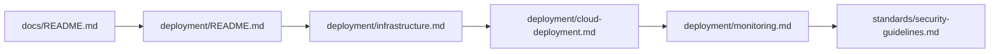

# 📁 Project Structure & Cross-Reference Guide

> **Complete navigation guide for the 一键升级-uplus documentation ecosystem**

## 🎯 Documentation Ecosystem Overview

The 一键升级-uplus documentation is designed as an **interconnected knowledge system** that mirrors our platform's closed-loop architecture. Each document enhances and references others, creating a comprehensive understanding framework.

## 📋 Complete Documentation Map

```
docs/
├── 📋 README.md                           # Main documentation entry point
├── 📁 PROJECT_STRUCTURE.md               # This file - Complete navigation guide
├── 🏛️ architecture/                       # System architecture documentation
│   ├── README.md                          # Architecture overview and principles
│   ├── system-design.md                   # Detailed technical specifications
│   ├── closed-loop-dynamics.md           # Perpetual intelligence cycle
│   ├── data-flow.md                      # Integration and communication patterns
│   └── scalability.md                    # Performance and scaling strategies
├── 🔧 modules/                           # Individual module specifications
│   ├── README.md                          # Module overview and integration
│   ├── ai-pm/                            # AI Product Manager module
│   │   ├── README.md                      # Complete AI-PM specification
│   │   ├── api-specification.md           # API endpoints and contracts
│   │   ├── dialogue-engine.md             # Socratic intelligence implementation
│   │   └── validation-framework.md        # Requirement validation system
│   ├── bitcup/                           # BITCUP Modeling Language
│   │   ├── README.md                      # BITCUP language specification
│   │   ├── language-grammar.md            # Formal language definition
│   │   ├── semantic-analysis.md           # Semantic processing engine
│   │   └── transformation-engine.md       # Bidirectional transformation
│   ├── low-code/                         # AI Low-Code Platform
│   │   ├── README.md                      # Low-code platform specification
│   │   ├── code-generation.md             # Intelligent code generation
│   │   ├── deployment-engine.md           # Automated deployment system
│   │   └── quality-assurance.md           # Built-in QA automation
│   └── memory/                           # Document Memory Intelligence
│       ├── README.md                      # Memory intelligence specification
│       ├── knowledge-graph.md             # Temporal knowledge representation
│       ├── pattern-recognition.md         # Pattern analysis algorithms
│       └── predictive-engine.md           # Prediction and insight generation
├── 🚀 implementation/                    # Implementation planning and guides
│   ├── README.md                          # Implementation overview and philosophy
│   ├── roadmap.md                        # Strategic development timeline
│   ├── milestones.md                     # Detailed milestone definitions
│   ├── todo-lists.md                     # Prioritized task breakdown
│   └── technical-solutions.md            # Technical implementation guides
├── 📏 standards/                         # Development standards and guidelines
│   ├── README.md                          # Standards overview and principles
│   ├── coding-standards.md               # Language-specific coding guidelines
│   ├── quality-assurance.md              # QA processes and requirements
│   ├── security-guidelines.md            # Security best practices
│   └── performance-standards.md          # Performance requirements and optimization
├── 🔌 api/                              # API documentation
│   ├── README.md                          # API overview and conventions
│   ├── ai-pm-api.md                      # AI-PM service API specification
│   ├── bitcup-api.md                     # BITCUP service API specification
│   ├── low-code-api.md                   # Low-Code platform API specification
│   └── memory-api.md                     # Memory intelligence API specification
├── 🚢 deployment/                       # Deployment and operations guides
│   ├── README.md                          # Deployment overview
│   ├── infrastructure.md                 # Infrastructure requirements
│   ├── cloud-deployment.md               # Cloud deployment strategies
│   ├── monitoring.md                     # Monitoring and observability
│   └── maintenance.md                    # Maintenance and operations procedures
└── 🎨 assets/                           # Images, diagrams, and other assets
    ├── diagrams/                         # System architecture diagrams
    ├── screenshots/                      # UI mockups and interface designs
    └── templates/                        # Document and code templates
```

## 🔗 Document Relationships & Dependencies

### Primary Navigation Paths

#### For **System Architects**


#### For **Module Developers**
```mermaid
graph LR
    A[docs/README.md] --> B[modules/README.md]
    B --> C[modules/{module}/README.md]
    C --> D[api/{module}-api.md]
    D --> E[standards/coding-standards.md]
    E --> F[implementation/technical-solutions.md]
```

#### For **Product Managers**


#### For **DevOps Engineers**


### Cross-Reference Matrix

| Document | References | Referenced By | Key Dependencies |
|----------|------------|---------------|------------------|
| **README.md** | All major sections | External entry point | None |
| **architecture/README.md** | system-design.md, modules/ | README.md, implementation/ | Core platform understanding |
| **architecture/system-design.md** | closed-loop-dynamics.md, modules/ | architecture/README.md | Technical foundation |
| **modules/README.md** | Individual module specs | architecture/, implementation/ | System architecture |
| **modules/ai-pm/README.md** | api/ai-pm-api.md, standards/ | modules/README.md | AI-PM understanding |
| **implementation/README.md** | roadmap.md, milestones.md | README.md, modules/ | Project planning |
| **standards/README.md** | All standards documents | All implementation docs | Quality foundation |

## 🎯 Document Purpose & Audience

### Documentation Categories

#### **Strategic Documents** (Product Leadership)
```yaml
Primary Audience: Product Managers, Executives, Stakeholders
Documents:
  - README.md: Platform vision and overview
  - implementation/README.md: Strategic implementation approach
  - implementation/roadmap.md: Development timeline and phases
  - implementation/milestones.md: Key deliverables and success criteria

Key Information:
  - Business value and objectives
  - Strategic roadmap and timeline
  - Resource requirements and allocation
  - Success metrics and validation criteria
```

#### **Architectural Documents** (Technical Leadership)
```yaml
Primary Audience: System Architects, Technical Leads, Senior Engineers
Documents:
  - architecture/README.md: System architecture overview
  - architecture/system-design.md: Detailed technical specifications
  - architecture/closed-loop-dynamics.md: Core system behavior
  - architecture/scalability.md: Performance and scaling design

Key Information:
  - System design principles and patterns
  - Component interactions and dependencies
  - Technical constraints and requirements
  - Scalability and performance considerations
```

#### **Implementation Documents** (Development Teams)
```yaml
Primary Audience: Software Engineers, Module Developers
Documents:
  - modules/README.md: Module overview and specifications
  - modules/{module}/README.md: Detailed module implementation
  - api/{module}-api.md: API contracts and specifications
  - standards/coding-standards.md: Development guidelines

Key Information:
  - Detailed implementation requirements
  - API specifications and contracts
  - Code quality standards and practices
  - Testing and validation requirements
```

#### **Operational Documents** (DevOps & Operations)
```yaml
Primary Audience: DevOps Engineers, Site Reliability Engineers
Documents:
  - deployment/README.md: Deployment overview
  - deployment/infrastructure.md: Infrastructure requirements
  - deployment/monitoring.md: Observability and monitoring
  - standards/security-guidelines.md: Security requirements

Key Information:
  - Infrastructure and deployment requirements
  - Monitoring and alerting configuration
  - Security policies and procedures
  - Maintenance and operational procedures
```

## 📚 Reading Sequences by Role

### **New Team Member Onboarding**
1. **Start Here**: [README.md](README.md) - Platform overview and vision
2. **Understand Architecture**: [architecture/README.md](architecture/README.md) - System design principles
3. **Learn the Loop**: [architecture/closed-loop-dynamics.md](architecture/closed-loop-dynamics.md) - Core behavior
4. **Choose Your Path**: [modules/README.md](modules/README.md) - Module selection
5. **Follow Standards**: [standards/README.md](standards/README.md) - Quality guidelines
6. **Plan Implementation**: [implementation/README.md](implementation/README.md) - Development approach

### **Module Developer Deep Dive**
1. **System Context**: [architecture/system-design.md](architecture/system-design.md) - Technical foundation
2. **Module Overview**: [modules/README.md](modules/README.md) - Module ecosystem
3. **Specific Module**: [modules/{your-module}/README.md] - Detailed specifications
4. **API Contracts**: [api/{your-module}-api.md] - Interface definitions
5. **Coding Standards**: [standards/coding-standards.md](standards/coding-standards.md) - Implementation guidelines
6. **Quality Requirements**: [standards/quality-assurance.md](standards/quality-assurance.md) - Testing and validation

### **Product Manager Planning**
1. **Vision Alignment**: [README.md](README.md) - Platform objectives
2. **Strategic Roadmap**: [implementation/roadmap.md](implementation/roadmap.md) - Development timeline
3. **Milestone Planning**: [implementation/milestones.md](implementation/milestones.md) - Deliverable definitions
4. **Task Breakdown**: [implementation/todo-lists.md](implementation/todo-lists.md) - Detailed planning
5. **Quality Standards**: [standards/quality-assurance.md](standards/quality-assurance.md) - Success criteria
6. **Risk Management**: [implementation/technical-solutions.md](implementation/technical-solutions.md) - Technical approach

### **DevOps Engineer Setup**
1. **System Architecture**: [architecture/system-design.md](architecture/system-design.md) - Infrastructure requirements
2. **Deployment Overview**: [deployment/README.md](deployment/README.md) - Deployment strategy
3. **Infrastructure Setup**: [deployment/infrastructure.md](deployment/infrastructure.md) - Environment requirements
4. **Cloud Deployment**: [deployment/cloud-deployment.md](deployment/cloud-deployment.md) - Cloud-specific guidance
5. **Monitoring Setup**: [deployment/monitoring.md](deployment/monitoring.md) - Observability configuration
6. **Security Implementation**: [standards/security-guidelines.md](standards/security-guidelines.md) - Security requirements

## 🔍 Quick Reference Guides

### **Finding Information Quickly**

#### **API Information**
- **All APIs**: [api/README.md](api/README.md)
- **AI-PM API**: [api/ai-pm-api.md](api/ai-pm-api.md)
- **BITCUP API**: [api/bitcup-api.md](api/bitcup-api.md)
- **Low-Code API**: [api/low-code-api.md](api/low-code-api.md)
- **Memory API**: [api/memory-api.md](api/memory-api.md)

#### **Implementation Guidance**
- **Getting Started**: [implementation/README.md](implementation/README.md)
- **Development Timeline**: [implementation/roadmap.md](implementation/roadmap.md)
- **Task Lists**: [implementation/todo-lists.md](implementation/todo-lists.md)
- **Technical Solutions**: [implementation/technical-solutions.md](implementation/technical-solutions.md)

#### **Quality Standards**
- **All Standards**: [standards/README.md](standards/README.md)
- **Code Quality**: [standards/coding-standards.md](standards/coding-standards.md)
- **Testing**: [standards/quality-assurance.md](standards/quality-assurance.md)
- **Security**: [standards/security-guidelines.md](standards/security-guidelines.md)
- **Performance**: [standards/performance-standards.md](standards/performance-standards.md)

#### **Deployment & Operations**
- **Deployment Guide**: [deployment/README.md](deployment/README.md)
- **Infrastructure**: [deployment/infrastructure.md](deployment/infrastructure.md)
- **Monitoring**: [deployment/monitoring.md](deployment/monitoring.md)
- **Maintenance**: [deployment/maintenance.md](deployment/maintenance.md)

### **Common Questions & Answers**

#### **"How do I understand the system architecture?"**
1. Start with [architecture/README.md](architecture/README.md) for overview
2. Read [architecture/system-design.md](architecture/system-design.md) for details
3. Study [architecture/closed-loop-dynamics.md](architecture/closed-loop-dynamics.md) for behavior
4. Review [modules/README.md](modules/README.md) for component understanding

#### **"How do I implement a specific module?"**
1. Read [modules/{module}/README.md] for specifications
2. Check [api/{module}-api.md] for interface requirements
3. Follow [standards/coding-standards.md](standards/coding-standards.md) for implementation
4. Use [implementation/technical-solutions.md](implementation/technical-solutions.md) for guidance

#### **"How do I deploy the system?"**
1. Review [deployment/infrastructure.md](deployment/infrastructure.md) for requirements
2. Follow [deployment/cloud-deployment.md](deployment/cloud-deployment.md) for setup
3. Configure [deployment/monitoring.md](deployment/monitoring.md) for observability
4. Implement [standards/security-guidelines.md](standards/security-guidelines.md) for security

#### **"How do I ensure quality?"**
1. Follow [standards/quality-assurance.md](standards/quality-assurance.md) for processes
2. Implement [standards/coding-standards.md](standards/coding-standards.md) for code quality
3. Apply [standards/performance-standards.md](standards/performance-standards.md) for performance
4. Use [standards/security-guidelines.md](standards/security-guidelines.md) for security

## 🎯 Documentation Maintenance

### **Keeping Documentation Current**

#### **Update Triggers**
- **Architecture Changes**: Update architecture/ documents
- **API Changes**: Update api/ specifications
- **Implementation Changes**: Update modules/ and implementation/ docs
- **Process Changes**: Update standards/ guidelines
- **Deployment Changes**: Update deployment/ guides

#### **Review Schedule**
- **Weekly**: Implementation progress updates
- **Monthly**: Architecture and design reviews
- **Quarterly**: Complete documentation audit
- **Release**: Full documentation validation

#### **Quality Assurance**
- **Cross-references**: Ensure all links are valid
- **Consistency**: Maintain consistent terminology
- **Completeness**: Verify all sections are complete
- **Accuracy**: Validate technical information

---

<div align="center">

**📁 Project Structure Complete**

*Ready to start building? Begin with [Architecture Overview](architecture/README.md) or jump to [Implementation Planning](implementation/README.md)*

**一键升级-uplus: You, Plus AI, Equals Infinity**

</div>