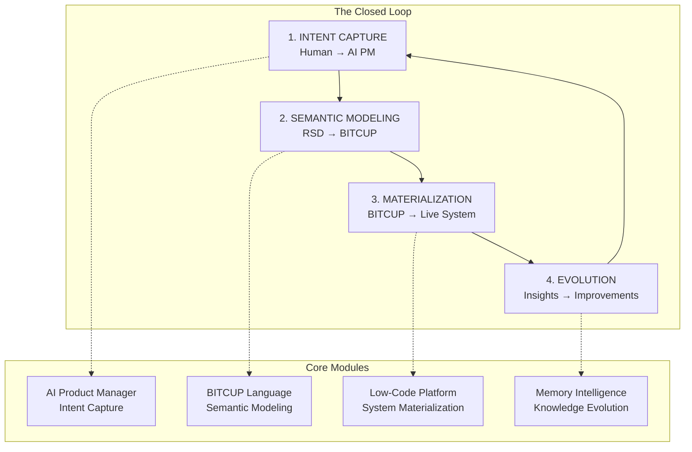
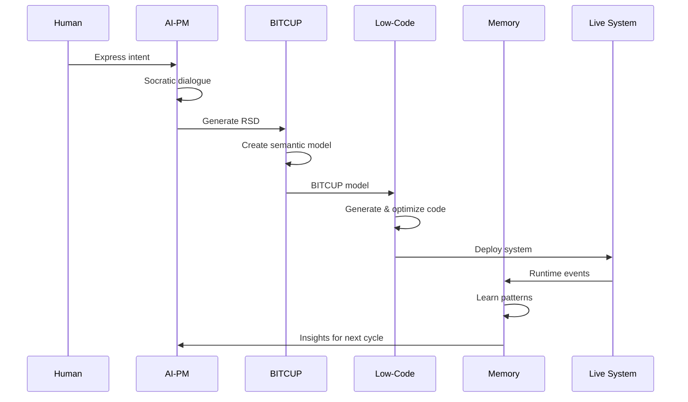
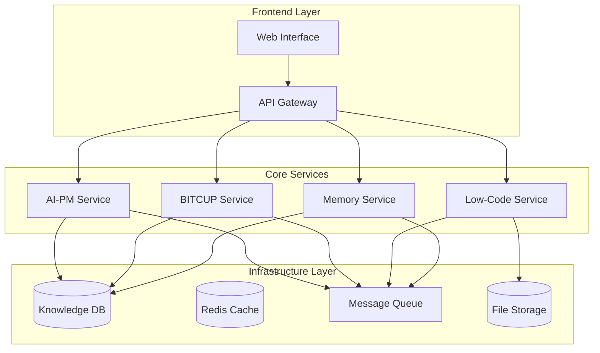
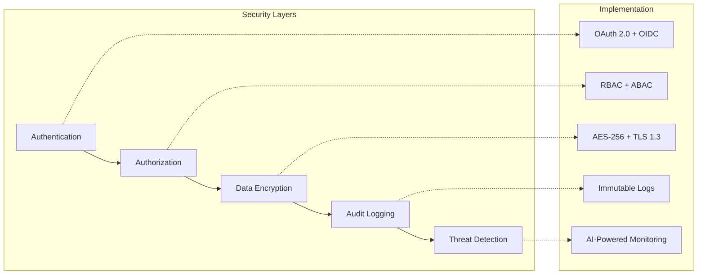
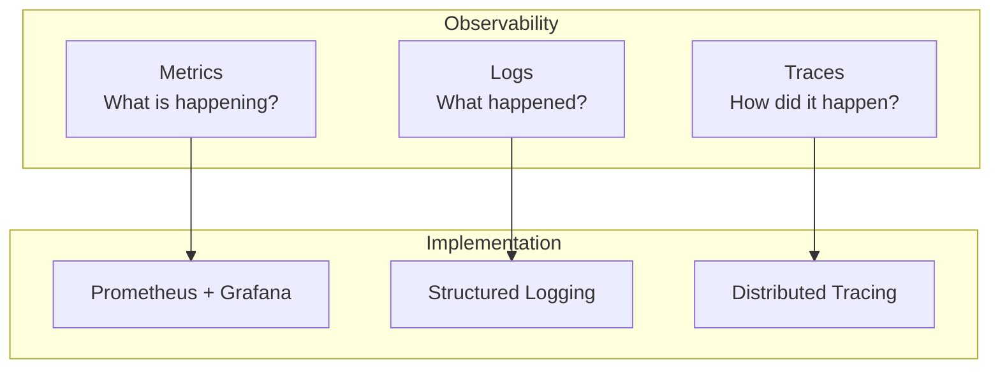

# 🏛️ System Architecture Overview

> **The revolutionary closed-loop architecture that transforms intent into intelligent systems**

## 🎯 Architectural Vision

The 一键升级-uplus platform represents a paradigm shift from traditional software development to **AI-materialized intent**. Our architecture is built on the principle of **Perpetual Intelligence** - a self-evolving system where each component enhances the others in an endless cycle of improvement.

## 🔄 The Closed-Loop Architecture

### Core Principle: The Perpetual Intelligence Cycle



### Why This Architecture is Revolutionary

| Traditional Approach | 一键升级-uplus Approach |
|---------------------|------------------------|
| 🔄 Linear development cycles | 🌀 Continuous closed-loop evolution |
| 📝 Static documentation | 🧠 Living memory system |
| 👥 Human-dependent processes | 🤖 AI-augmented intelligence |
| 🔧 Code-first implementation | 💭 Intent-first materialization |
| 📉 Knowledge decay over time | 📈 Knowledge accumulation and growth |

## 🏗️ System Components

### 1. Intent Capture Layer (AI-PM)
**Purpose**: Transform vague human desires into precise, executable specifications

```yaml
Component: AI Product Manager
Input: Human intent (voice, text, sketches, examples)
Process: Socratic dialogue + multi-modal understanding
Output: Requirements Specification Document (RSD)
Key Innovation: Progressive requirement discovery
```

### 2. Semantic Modeling Layer (BITCUP)
**Purpose**: Universal language that expresses "what" not "how"

```yaml
Component: BITCUP Modeling Language
Input: Requirements Specification Document (RSD)
Process: Declarative semantic transformation
Output: Executable BITCUP model
Key Innovation: Bidirectional transformation
```

### 3. Materialization Layer (Low-Code)
**Purpose**: Transform semantic models into living systems

```yaml
Component: AI Low-Code Platform
Input: BITCUP model
Process: Intelligent code generation + optimization
Output: Deployed, running system
Key Innovation: Understanding-based generation
```

### 4. Evolution Layer (Memory)
**Purpose**: Create immortal organizational intelligence

```yaml
Component: Document Memory Intelligence
Input: System events, decisions, outcomes
Process: Temporal knowledge graph + pattern recognition
Output: Insights, recommendations, predictions
Key Innovation: Active memory with predictive capabilities
```

## 🔗 Integration Patterns

### Data Flow Architecture



### Component Interaction Matrix

| Component | AI-PM | BITCUP | Low-Code | Memory |
|-----------|-------|--------|----------|--------|
| **AI-PM** | ✅ Self-improvement | 📤 Sends RSD | 📊 Receives metrics | 📚 Learns from history |
| **BITCUP** | 📥 Receives RSD | ✅ Model validation | 📤 Sends models | 🔍 Pattern analysis |
| **Low-Code** | 📊 Sends metrics | 📥 Receives models | ✅ Code generation | 📈 Performance data |
| **Memory** | 📚 Provides history | 🔍 Analyzes patterns | 📈 Stores performance | ✅ Knowledge synthesis |

## 🎯 Architectural Principles

### 1. Radical Simplicity
- **Complex Inside, Simple Outside**: Hide complexity behind elegant interfaces
- **One-Click Operations**: Minimize cognitive load for users
- **Intelligence Handles Complexity**: AI manages the difficult parts

### 2. Continuous Evolution
- **Every Interaction Improves**: Each cycle enhances the next
- **Failures as Learning**: Convert problems into knowledge
- **Success Pattern Propagation**: Automatically spread what works

### 3. Human Amplification
- **Augment, Don't Replace**: Enhance human capabilities
- **Preserve Creativity**: Keep human judgment central
- **Eliminate Repetition**: Automate mundane tasks

### 4. Semantic First
- **Meaning Over Syntax**: Understand intent, not just code
- **Concept-Driven**: Work with business concepts
- **Business Language**: Think in domain terms

## 🔧 Technical Architecture

### Microservices Design

```yaml
Architecture Pattern: Event-Driven Microservices
Communication: Async message passing + REST APIs
Data Storage: Polyglot persistence
Deployment: Kubernetes-native
Scaling: Auto-scaling based on demand
```

### Service Topology



## 📊 Quality Attributes

### Performance Requirements

| Metric | Target | Rationale |
|--------|--------|-----------|
| Intent Capture Accuracy | >95% | Critical for user trust |
| Model Generation Success | >99% | Essential for automation |
| Deployment Reliability | >99.9% | Production system requirement |
| Knowledge Retention | 100% | No information loss allowed |
| Evolution Rate | >10% monthly | Continuous improvement mandate |

### Scalability Design

```yaml
Horizontal Scaling:
  - Stateless services
  - Load balancer distribution
  - Auto-scaling policies

Vertical Scaling:
  - Resource optimization
  - Caching strategies
  - Database optimization

Global Scaling:
  - Multi-region deployment
  - CDN integration
  - Edge computing support
```

## 🔒 Security Architecture

### Security by Design



## 🚀 Deployment Architecture

### Cloud-Native Design

```yaml
Container Strategy: Docker + Kubernetes
Orchestration: Helm charts + GitOps
Monitoring: Prometheus + Grafana + Jaeger
Logging: ELK Stack (Elasticsearch, Logstash, Kibana)
CI/CD: GitHub Actions + ArgoCD
```

### Environment Strategy

| Environment | Purpose | Characteristics |
|-------------|---------|-----------------|
| **Development** | Feature development | Rapid iteration, full debugging |
| **Staging** | Integration testing | Production-like, automated testing |
| **Production** | Live system | High availability, monitoring |
| **Sandbox** | Experimentation | Isolated, safe for testing |

## 📈 Monitoring & Observability

### Three Pillars of Observability



## 🎯 Next Steps

1. **[Detailed System Design](system-design.md)** - Deep dive into technical specifications
2. **[Closed-Loop Dynamics](closed-loop-dynamics.md)** - Understanding the perpetual cycle
3. **[Data Flow Patterns](data-flow.md)** - Integration and communication patterns
4. **[Scalability Design](scalability.md)** - Performance and scaling strategies

---

<div align="center">

**🏛️ Architecture Foundation Complete**

*Ready to explore individual modules? Start with [Module Overview](../modules/README.md)*

</div>