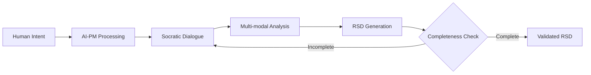
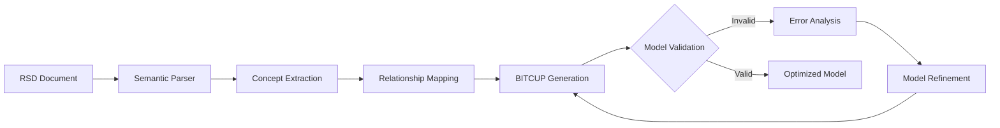
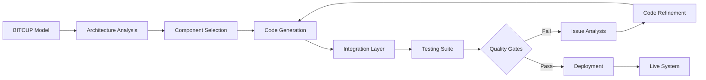
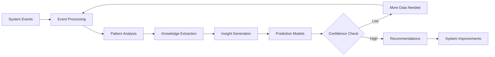
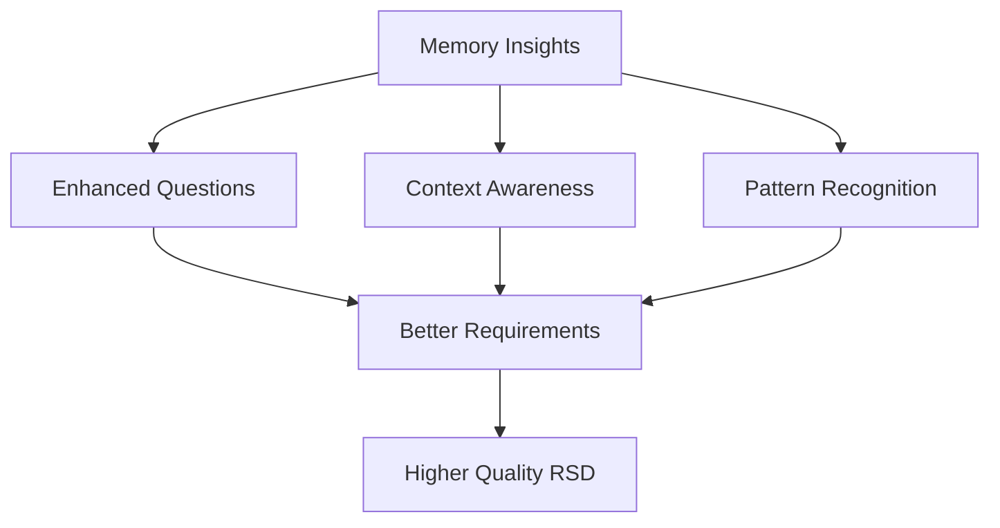
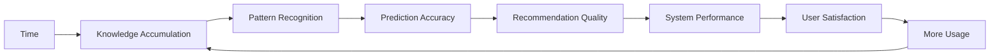
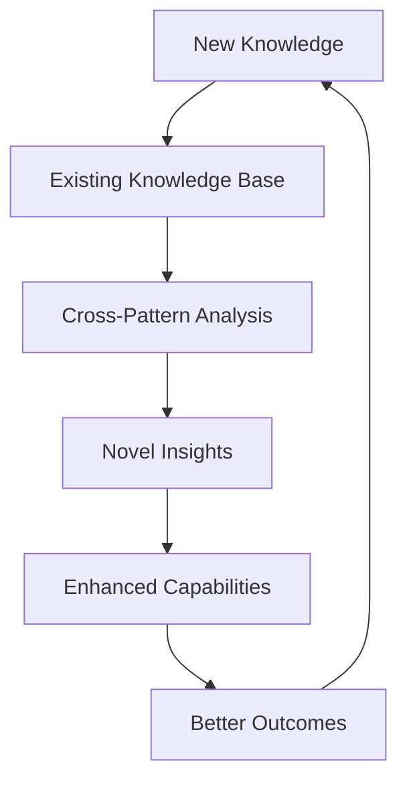
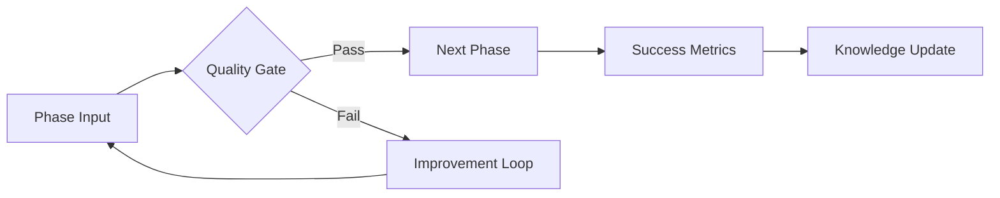

# 🔄 Closed-Loop Dynamics

> **Understanding the perpetual intelligence cycle that makes 一键升级-uplus revolutionary**

## 🎯 The Closed-Loop Philosophy

The 一键升级-uplus platform operates on a fundamental principle: **Perpetual Intelligence**. Unlike traditional linear development processes, our system creates a self-reinforcing cycle where each component continuously improves the others, leading to exponential capability growth.

## 🌀 The Four-Phase Cycle

### Phase 1: Intent Capture
**Human → AI Product Manager → Requirements Specification Document (RSD)**



**Key Dynamics:**
- **Progressive Refinement**: Each interaction deepens understanding
- **Context Accumulation**: Previous conversations inform current dialogue
- **Multi-modal Integration**: Voice, text, sketches, and examples combine
- **Validation Loops**: Continuous verification of requirement completeness

**Feedback Mechanisms:**
```yaml
Internal Feedback:
  - Completeness scoring drives additional questions
  - Consistency checking identifies contradictions
  - Context awareness prevents redundant queries

External Feedback:
  - User satisfaction scores improve dialogue strategies
  - Implementation success rates validate requirement quality
  - Memory insights enhance questioning techniques
```

### Phase 2: Semantic Modeling
**RSD → BITCUP Modeling Language → Executable Model**



**Key Dynamics:**
- **Bidirectional Transformation**: RSD ↔ BITCUP maintains semantic equivalence
- **Incremental Modeling**: Models evolve through iterative refinement
- **Pattern Recognition**: Common patterns accelerate model generation
- **Optimization Cycles**: Performance and clarity improvements

**Feedback Mechanisms:**
```yaml
Internal Feedback:
  - Validation errors trigger model refinement
  - Optimization metrics guide improvement strategies
  - Pattern matching improves generation speed

External Feedback:
  - Code generation success validates model quality
  - Runtime performance informs optimization priorities
  - User feedback on generated systems improves modeling
```

### Phase 3: System Materialization
**BITCUP Model → AI Low-Code Platform → Live System**



**Key Dynamics:**
- **Intelligent Generation**: Understanding-based, not template-based creation
- **Adaptive Architecture**: Optimal patterns selected for each use case
- **Quality Assurance**: Automated testing ensures reliability
- **Continuous Deployment**: Seamless transition from code to running system

**Feedback Mechanisms:**
```yaml
Internal Feedback:
  - Test failures drive code improvements
  - Performance metrics guide optimization
  - Security scans ensure compliance

External Feedback:
  - User experience metrics improve interface generation
  - System performance data optimizes architecture choices
  - Error patterns enhance error handling generation
```

### Phase 4: Knowledge Evolution
**Live System → Document Memory Intelligence → Insights & Improvements**



**Key Dynamics:**
- **Temporal Reasoning**: Understanding cause-and-effect over time
- **Pattern Detection**: Identifying successful and problematic patterns
- **Predictive Intelligence**: Anticipating issues before they occur
- **Continuous Learning**: Every event enhances the knowledge base

**Feedback Mechanisms:**
```yaml
Internal Feedback:
  - Prediction accuracy improves models
  - Pattern confidence guides recommendation strength
  - Knowledge graph completeness drives data collection

External Feedback:
  - Recommendation adoption rates validate insights
  - Prevented issues confirm prediction accuracy
  - User feedback improves insight relevance
```

## 🔗 Inter-Phase Connections

### Connection 1: Memory → Intent Capture
**How past knowledge improves requirement gathering**



**Specific Improvements:**
- **Historical Context**: "Similar projects had issues with X, should we address it?"
- **Success Patterns**: "Projects like this succeeded when they included Y"
- **Risk Awareness**: "This approach failed in 3 previous projects"
- **Best Practices**: "Teams found Z approach most effective"

### Connection 2: Memory → Semantic Modeling
**How insights improve model generation**

```yaml
Pattern Library Enhancement:
  - Successful model patterns are preserved and reused
  - Failed patterns are avoided or improved
  - Performance optimizations are automatically applied
  - Security patterns are enforced based on past vulnerabilities

Optimization Intelligence:
  - Resource usage patterns guide architecture decisions
  - Performance bottlenecks inform model structure
  - Scalability requirements shape component design
  - Integration patterns reduce complexity
```

### Connection 3: Memory → System Materialization
**How knowledge improves code generation**

```yaml
Code Quality Improvements:
  - Bug patterns are automatically prevented
  - Performance optimizations are built-in
  - Security best practices are enforced
  - Testing strategies are enhanced

Architecture Evolution:
  - Successful architectures are preferred
  - Problematic patterns are avoided
  - Resource optimization is automatic
  - Deployment strategies are refined
```

## 🚀 Emergent Properties

### 1. Accelerating Intelligence
**The system gets smarter faster over time**



**Mathematical Model:**
```
Intelligence(t) = Base_Intelligence + ∑(Learning_Rate × Experience(i))
where Experience(i) = successful_patterns + failed_patterns + user_feedback
```

### 2. Self-Healing Capabilities
**The system automatically fixes and improves itself**

```yaml
Automatic Improvements:
  - Bug detection and prevention
  - Performance optimization
  - Security vulnerability patching
  - User experience enhancement

Self-Diagnosis:
  - System health monitoring
  - Anomaly detection
  - Root cause analysis
  - Predictive maintenance
```

### 3. Knowledge Compound Interest
**Each piece of knowledge multiplies the value of all other knowledge**



## 📊 Measuring Loop Effectiveness

### Key Performance Indicators (KPIs)

| Phase | Primary Metric | Target | Measurement Method |
|-------|---------------|--------|-------------------|
| **Intent Capture** | Requirement Completeness | >95% | Automated analysis + user validation |
| **Semantic Modeling** | Model Accuracy | >99% | Code generation success rate |
| **Materialization** | System Quality | >99.9% | Automated testing + runtime metrics |
| **Evolution** | Learning Rate | >10% monthly | Improvement in all other metrics |

### Loop Health Metrics

```yaml
Cycle Time Metrics:
  - Intent to RSD: < 2 hours
  - RSD to Model: < 30 minutes
  - Model to System: < 1 hour
  - System to Insights: < 24 hours

Quality Metrics:
  - Requirement accuracy improvement: 5% per cycle
  - Model generation success rate: >99%
  - Deployment success rate: >99.9%
  - Insight relevance score: >90%

Efficiency Metrics:
  - Reduced manual intervention: 10% per month
  - Faster problem resolution: 20% per month
  - Increased automation: 15% per month
```

## 🔧 Loop Optimization Strategies

### 1. Feedback Amplification
**Maximizing the learning from each cycle**

```yaml
Strategies:
  - Multi-source feedback collection
  - Real-time feedback processing
  - Weighted feedback based on source reliability
  - Feedback correlation analysis

Implementation:
  - User satisfaction surveys
  - System performance monitoring
  - Error pattern analysis
  - Success metric tracking
```

### 2. Knowledge Synthesis
**Combining insights across all phases**

```yaml
Techniques:
  - Cross-phase pattern analysis
  - Temporal correlation detection
  - Causal relationship mapping
  - Predictive model training

Benefits:
  - Holistic system understanding
  - Proactive problem prevention
  - Optimized resource allocation
  - Enhanced user experience
```

### 3. Adaptive Learning Rates
**Adjusting learning speed based on confidence and impact**

```python
def calculate_learning_rate(confidence, impact, historical_accuracy):
    base_rate = 0.1
    confidence_multiplier = confidence ** 2
    impact_multiplier = min(impact, 2.0)
    accuracy_multiplier = historical_accuracy
    
    return base_rate * confidence_multiplier * impact_multiplier * accuracy_multiplier
```

## 🎯 Breaking the Loop (When Necessary)

### Circuit Breakers
**Preventing infinite loops and degradation**

```yaml
Conditions for Breaking:
  - Confidence below threshold (< 70%)
  - Repeated failures (> 3 consecutive)
  - Resource exhaustion
  - User intervention required

Recovery Strategies:
  - Fallback to previous stable state
  - Human expert consultation
  - Alternative approach selection
  - System reset with preserved knowledge
```

### Quality Gates
**Ensuring each phase meets standards before proceeding**



## 🚀 Future Evolution

### Planned Enhancements

```yaml
Phase 1 Improvements:
  - Multi-language support
  - Advanced voice processing
  - Emotional intelligence
  - Cultural context awareness

Phase 2 Improvements:
  - Domain-specific languages
  - Visual modeling tools
  - Collaborative modeling
  - Version control integration

Phase 3 Improvements:
  - Multi-platform generation
  - Advanced optimization
  - Real-time adaptation
  - Self-modifying code

Phase 4 Improvements:
  - Quantum computing integration
  - Advanced AI reasoning
  - Cross-organization learning
  - Predictive system evolution
```

## 📋 Implementation Checklist

### Core Loop Implementation

- [ ] **Intent Capture Loop**
  - [ ] Socratic dialogue engine
  - [ ] Multi-modal input processing
  - [ ] Completeness validation
  - [ ] Context preservation

- [ ] **Modeling Loop**
  - [ ] RSD to BITCUP transformation
  - [ ] Model validation engine
  - [ ] Optimization algorithms
  - [ ] Pattern recognition

- [ ] **Materialization Loop**
  - [ ] Code generation engine
  - [ ] Quality assurance automation
  - [ ] Deployment pipeline
  - [ ] Runtime monitoring

- [ ] **Evolution Loop**
  - [ ] Event processing system
  - [ ] Pattern analysis engine
  - [ ] Insight generation
  - [ ] Recommendation system

### Integration Points

- [ ] **Cross-Phase Communication**
  - [ ] Event-driven messaging
  - [ ] State synchronization
  - [ ] Error propagation
  - [ ] Performance monitoring

- [ ] **Feedback Mechanisms**
  - [ ] User feedback collection
  - [ ] System metric gathering
  - [ ] Quality measurement
  - [ ] Learning rate adaptation

---

<div align="center">

**🔄 Closed-Loop Dynamics Mastered**

*Ready to understand data flows? Continue with [Data Flow Patterns](data-flow.md)*

</div>