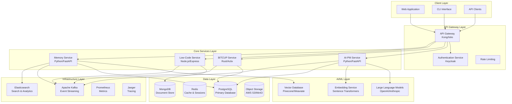
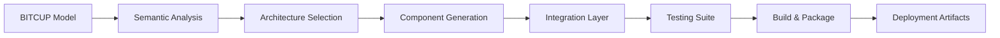
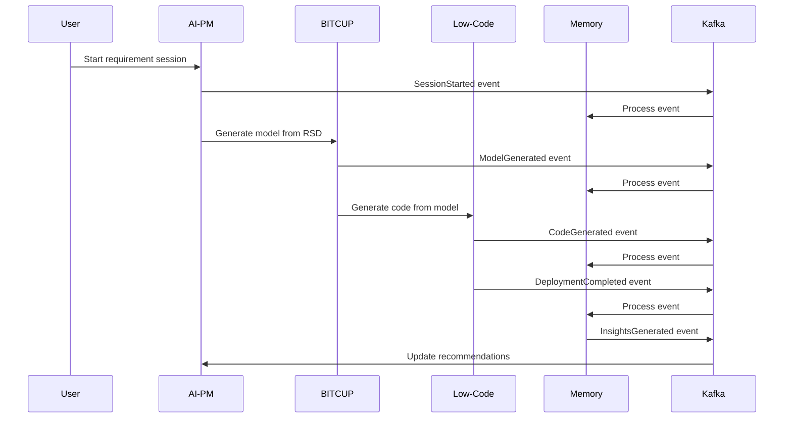

# 🏗️ Detailed System Design

> **Technical specifications for the revolutionary closed-loop AI software engineering platform**

## 🎯 System Design Overview

The 一键升级-uplus platform is architected as a **distributed, event-driven system** with four core modules operating in a perpetual intelligence cycle. This document provides the detailed technical specifications needed for implementation.

## 🏛️ High-Level Architecture

### System Topology



## 🔧 Core Service Specifications

### 1. AI Product Manager Service

**Technology Stack**: Python 3.11+ with FastAPI

```yaml
Service Name: ai-pm-service
Port: 8001
Database: PostgreSQL (primary), Redis (cache)
External APIs: OpenAI GPT-4, Anthropic Claude
Message Queue: Kafka (producer/consumer)

Key Components:
  - Intent Parser: NLP processing of user input
  - Dialogue Manager: Socratic questioning engine
  - RSD Generator: Structured document creation
  - Validation Engine: Requirement completeness checking
```

**API Endpoints**:
```yaml
POST /api/v1/sessions
  Description: Create new requirement gathering session
  Input: { user_id, project_context }
  Output: { session_id, initial_questions }

POST /api/v1/sessions/{session_id}/interact
  Description: Process user input and continue dialogue
  Input: { message, attachments?, voice_data? }
  Output: { response, questions, completion_status }

GET /api/v1/sessions/{session_id}/rsd
  Description: Generate Requirements Specification Document
  Output: { rsd_document, completeness_score, validation_results }

POST /api/v1/rsd/validate
  Description: Validate RSD completeness and consistency
  Input: { rsd_document }
  Output: { is_valid, issues[], suggestions[] }
```

**Data Models**:
```python
class RequirementSession:
    id: UUID
    user_id: UUID
    project_id: UUID
    status: SessionStatus
    context: Dict[str, Any]
    dialogue_history: List[DialogueEntry]
    created_at: datetime
    updated_at: datetime

class RSDDocument:
    id: UUID
    session_id: UUID
    functional_requirements: List[FunctionalRequirement]
    non_functional_requirements: NonFunctionalRequirements
    constraints: List[Constraint]
    success_criteria: List[SuccessCriterion]
    completeness_score: float
    version: int
```

### 2. BITCUP Modeling Service

**Technology Stack**: Rust with Actix-web

```yaml
Service Name: bitcup-service
Port: 8002
Database: PostgreSQL (models), Redis (cache)
Message Queue: Kafka (producer/consumer)

Key Components:
  - RSD Parser: Convert RSD to intermediate representation
  - Semantic Analyzer: Extract business concepts and relationships
  - Model Generator: Create BITCUP model from semantics
  - Validator: Ensure model completeness and consistency
  - Optimizer: Optimize model for execution
```

**API Endpoints**:
```yaml
POST /api/v1/models/generate
  Description: Generate BITCUP model from RSD
  Input: { rsd_document, generation_options }
  Output: { bitcup_model, generation_metadata }

POST /api/v1/models/validate
  Description: Validate BITCUP model
  Input: { bitcup_model }
  Output: { is_valid, errors[], warnings[] }

POST /api/v1/models/optimize
  Description: Optimize BITCUP model for execution
  Input: { bitcup_model, optimization_targets }
  Output: { optimized_model, optimization_report }

GET /api/v1/models/{model_id}/export
  Description: Export model in various formats
  Query: format=[json|yaml|graphql|openapi]
  Output: { exported_model, format_metadata }
```

**BITCUP Language Specification**:
```yaml
# Core BITCUP Constructs
Entities:
  - Business objects with properties and behaviors
  - Relationships between entities
  - Lifecycle management

Behaviors:
  - Actions that can be performed
  - Business rules and validations
  - Event triggers and handlers

Flows:
  - Process definitions
  - State transitions
  - Decision points

Views:
  - User interface definitions
  - Data presentation rules
  - Interaction patterns

Events:
  - System events and triggers
  - External integrations
  - Notification rules
```

### 3. AI Low-Code Platform Service

**Technology Stack**: Node.js 18+ with Express.js

```yaml
Service Name: lowcode-service
Port: 8003
Database: MongoDB (generated code), S3 (artifacts)
Message Queue: Kafka (producer/consumer)

Key Components:
  - Code Generator: Transform BITCUP to executable code
  - Template Engine: Manage code generation templates
  - Build System: Compile and package generated applications
  - Deployment Engine: Deploy to target environments
  - Runtime Manager: Monitor and manage deployed systems
```

**API Endpoints**:
```yaml
POST /api/v1/generate
  Description: Generate application from BITCUP model
  Input: { bitcup_model, target_platform, generation_options }
  Output: { generation_job_id, estimated_completion }

GET /api/v1/jobs/{job_id}
  Description: Get generation job status
  Output: { status, progress, artifacts[], logs[] }

POST /api/v1/deploy
  Description: Deploy generated application
  Input: { artifact_id, deployment_target, configuration }
  Output: { deployment_id, deployment_url, status }

GET /api/v1/deployments/{deployment_id}/status
  Description: Get deployment status and health
  Output: { status, health_metrics, logs[] }
```

**Code Generation Pipeline**:


### 4. Document Memory Intelligence Service

**Technology Stack**: Python 3.11+ with FastAPI

```yaml
Service Name: memory-service
Port: 8004
Database: PostgreSQL (metadata), Vector DB (embeddings)
Message Queue: Kafka (consumer)
Search Engine: Elasticsearch

Key Components:
  - Event Processor: Capture and process system events
  - Knowledge Extractor: Extract insights from events
  - Pattern Analyzer: Identify recurring patterns
  - Prediction Engine: Predict outcomes and issues
  - Recommendation System: Suggest improvements
```

**API Endpoints**:
```yaml
POST /api/v1/events
  Description: Record system event
  Input: { event_type, context, metadata, timestamp }
  Output: { event_id, processing_status }

GET /api/v1/insights
  Description: Get insights for a project or context
  Query: project_id, context_type, time_range
  Output: { insights[], patterns[], recommendations[] }

POST /api/v1/query
  Description: Query knowledge base
  Input: { query, context, filters }
  Output: { results[], related_insights[], confidence_scores[] }

GET /api/v1/predictions/{context_id}
  Description: Get predictions for a specific context
  Output: { predictions[], confidence_levels[], risk_factors[] }
```

## 🔄 Event-Driven Architecture

### Event Flow Design



### Event Schema

```yaml
Event Schema:
  event_id: UUID
  event_type: string
  source_service: string
  timestamp: ISO8601
  correlation_id: UUID
  user_id: UUID
  project_id: UUID
  payload: object
  metadata: object

Event Types:
  - session.started
  - session.completed
  - rsd.generated
  - rsd.validated
  - model.generated
  - model.validated
  - code.generated
  - deployment.started
  - deployment.completed
  - system.error
  - insight.generated
```

## 💾 Data Architecture

### Database Design

**PostgreSQL Schema**:
```sql
-- Core entities
CREATE TABLE users (
    id UUID PRIMARY KEY,
    email VARCHAR(255) UNIQUE NOT NULL,
    name VARCHAR(255) NOT NULL,
    created_at TIMESTAMP DEFAULT NOW()
);

CREATE TABLE projects (
    id UUID PRIMARY KEY,
    name VARCHAR(255) NOT NULL,
    description TEXT,
    owner_id UUID REFERENCES users(id),
    created_at TIMESTAMP DEFAULT NOW()
);

CREATE TABLE requirement_sessions (
    id UUID PRIMARY KEY,
    project_id UUID REFERENCES projects(id),
    user_id UUID REFERENCES users(id),
    status VARCHAR(50) NOT NULL,
    context JSONB,
    created_at TIMESTAMP DEFAULT NOW()
);

CREATE TABLE rsd_documents (
    id UUID PRIMARY KEY,
    session_id UUID REFERENCES requirement_sessions(id),
    content JSONB NOT NULL,
    version INTEGER DEFAULT 1,
    created_at TIMESTAMP DEFAULT NOW()
);

CREATE TABLE bitcup_models (
    id UUID PRIMARY KEY,
    rsd_id UUID REFERENCES rsd_documents(id),
    model_content JSONB NOT NULL,
    validation_status VARCHAR(50),
    created_at TIMESTAMP DEFAULT NOW()
);

CREATE TABLE generated_applications (
    id UUID PRIMARY KEY,
    model_id UUID REFERENCES bitcup_models(id),
    target_platform VARCHAR(100),
    artifact_location TEXT,
    deployment_status VARCHAR(50),
    created_at TIMESTAMP DEFAULT NOW()
);

CREATE TABLE system_events (
    id UUID PRIMARY KEY,
    event_type VARCHAR(100) NOT NULL,
    source_service VARCHAR(100) NOT NULL,
    correlation_id UUID,
    payload JSONB,
    created_at TIMESTAMP DEFAULT NOW()
);
```

### Caching Strategy

```yaml
Redis Cache Layers:
  Session Cache:
    - Active requirement sessions
    - User context and preferences
    - TTL: 24 hours
    
  Model Cache:
    - Validated BITCUP models
    - Generation templates
    - TTL: 7 days
    
  Application Cache:
    - Generated code artifacts
    - Deployment configurations
    - TTL: 30 days
    
  Insight Cache:
    - Computed insights and patterns
    - Recommendation results
    - TTL: 1 hour
```

## 🔒 Security Design

### Authentication & Authorization

```yaml
Authentication:
  Provider: Keycloak (OAuth 2.0 + OIDC)
  Token Type: JWT with RS256 signing
  Token Expiry: 15 minutes (access), 7 days (refresh)
  
Authorization:
  Model: RBAC + ABAC hybrid
  Roles: [admin, project_owner, developer, viewer]
  Permissions: Resource-based with context evaluation
  
API Security:
  - Rate limiting: 1000 req/min per user
  - Input validation: JSON schema validation
  - Output sanitization: XSS prevention
  - CORS: Configurable origins
```

### Data Protection

```yaml
Encryption:
  At Rest: AES-256 encryption for sensitive data
  In Transit: TLS 1.3 for all communications
  Key Management: HashiCorp Vault
  
Privacy:
  - PII encryption in database
  - Audit logging for data access
  - GDPR compliance features
  - Data retention policies
```

## 📊 Monitoring & Observability

### Metrics Collection

```yaml
Application Metrics:
  - Request latency and throughput
  - Error rates and types
  - Business metrics (sessions, models, deployments)
  - Resource utilization
  
Infrastructure Metrics:
  - CPU, memory, disk usage
  - Network performance
  - Database performance
  - Cache hit rates
  
Custom Metrics:
  - Intent capture accuracy
  - Model generation success rate
  - Deployment reliability
  - Knowledge retention rate
```

### Logging Strategy

```yaml
Log Levels: ERROR, WARN, INFO, DEBUG
Log Format: Structured JSON with correlation IDs
Log Aggregation: ELK Stack (Elasticsearch, Logstash, Kibana)
Log Retention: 90 days for application logs, 1 year for audit logs

Log Categories:
  - Application logs: Business logic and errors
  - Access logs: API requests and responses
  - Audit logs: Security and compliance events
  - Performance logs: Timing and resource usage
```

## 🚀 Deployment Architecture

### Container Strategy

```yaml
Container Runtime: Docker
Orchestration: Kubernetes
Package Manager: Helm
Image Registry: Harbor or AWS ECR

Container Images:
  - ai-pm-service: Python 3.11 + FastAPI
  - bitcup-service: Rust + Actix-web
  - lowcode-service: Node.js 18 + Express
  - memory-service: Python 3.11 + FastAPI
```

### Kubernetes Manifests

```yaml
# Example deployment for AI-PM service
apiVersion: apps/v1
kind: Deployment
metadata:
  name: ai-pm-service
spec:
  replicas: 3
  selector:
    matchLabels:
      app: ai-pm-service
  template:
    metadata:
      labels:
        app: ai-pm-service
    spec:
      containers:
      - name: ai-pm-service
        image: uplus/ai-pm-service:latest
        ports:
        - containerPort: 8001
        env:
        - name: DATABASE_URL
          valueFrom:
            secretKeyRef:
              name: database-secret
              key: url
        resources:
          requests:
            memory: "512Mi"
            cpu: "250m"
          limits:
            memory: "1Gi"
            cpu: "500m"
```

## 🎯 Performance Requirements

### Service Level Objectives (SLOs)

| Service | Availability | Latency (P95) | Throughput |
|---------|-------------|---------------|------------|
| AI-PM | 99.9% | < 2s | 100 req/s |
| BITCUP | 99.95% | < 500ms | 200 req/s |
| Low-Code | 99.9% | < 5s | 50 req/s |
| Memory | 99.9% | < 1s | 500 req/s |

### Scaling Strategy

```yaml
Horizontal Pod Autoscaler:
  - CPU threshold: 70%
  - Memory threshold: 80%
  - Min replicas: 2
  - Max replicas: 10
  
Vertical Pod Autoscaler:
  - Enabled for development environments
  - Resource recommendation mode
  
Cluster Autoscaler:
  - Node scaling based on pod resource requests
  - Cost optimization with spot instances
```

## 🔧 Development Environment

### Local Development Setup

```yaml
Prerequisites:
  - Docker Desktop
  - kubectl
  - Helm
  - Skaffold (for development workflow)
  
Local Services:
  - PostgreSQL (Docker container)
  - Redis (Docker container)
  - Kafka (Docker container)
  - MinIO (S3-compatible storage)
  
Development Tools:
  - Hot reloading for all services
  - Local debugging support
  - Integration test environment
```

## 📋 Next Steps

1. **[Closed-Loop Dynamics](closed-loop-dynamics.md)** - Understanding the perpetual intelligence cycle
2. **[Data Flow Patterns](data-flow.md)** - Detailed integration patterns
3. **[Scalability Design](scalability.md)** - Performance and scaling strategies
4. **[Module Specifications](../modules/README.md)** - Individual module deep dives

---

<div align="center">

**🏗️ System Design Complete**

*Ready for implementation? Check out the [Implementation Roadmap](../implementation/README.md)*

</div>