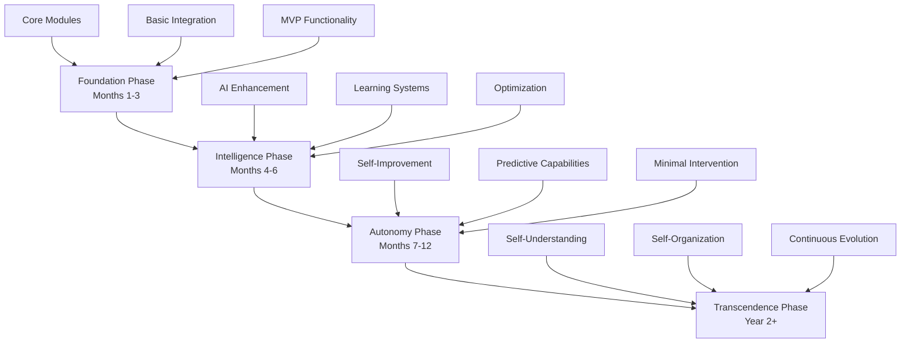

# 🚀 Implementation Planning

> **Comprehensive roadmap for building the revolutionary 一键升级-uplus platform**

## 🎯 Implementation Philosophy

The implementation of 一键升级-uplus follows our core principle of **Semantic First** development - we build understanding before code, concepts before implementation, and intelligence before automation. This approach ensures that every line of code serves the greater vision of transforming small teams into self-evolving development organizations.

## 📋 Implementation Overview

### Strategic Approach


### Implementation Principles

| Principle | Description | Implementation Impact |
|-----------|-------------|----------------------|
| **Semantic First** | Understand meaning before syntax | Requirements → Models → Code |
| **Closed-Loop Driven** | Every component improves others | Continuous feedback integration |
| **Quality Over Speed** | Excellence in every iteration | Comprehensive testing and validation |
| **Human Amplification** | Augment, don't replace | User-centric design and interfaces |
| **Radical Simplicity** | Complex inside, simple outside | Clean APIs and elegant UX |

## 🏗️ Technical Foundation

### Development Environment Setup

```yaml
Core Technologies:
  Languages: Python 3.11+, Rust, Node.js 18+, TypeScript
  Frameworks: FastAPI, Actix-web, Express.js, React
  Databases: PostgreSQL, Redis, MongoDB, Vector DB
  Message Queue: Apache Kafka
  Container: Docker + Kubernetes
  CI/CD: GitHub Actions + ArgoCD

Development Tools:
  IDE: VS Code with extensions
  Version Control: Git with conventional commits
  Code Quality: Pre-commit hooks, static analysis
  Testing: pytest, Jest, Rust test framework
  Documentation: MkDocs, OpenAPI, Mermaid

Infrastructure:
  Cloud Provider: AWS/GCP/Azure (multi-cloud ready)
  Orchestration: Kubernetes with Helm
  Monitoring: Prometheus + Grafana + Jaeger
  Logging: ELK Stack
  Security: HashiCorp Vault, Keycloak
```

### Repository Structure

```
uplus/
├── 📁 services/                    # Microservices
│   ├── ai-pm/                     # AI Product Manager service
│   ├── bitcup/                    # BITCUP modeling service
│   ├── low-code/                  # Low-code platform service
│   └── memory/                    # Memory intelligence service
├── 📁 shared/                     # Shared libraries and utilities
│   ├── common/                    # Common utilities
│   ├── schemas/                   # Data schemas and models
│   └── clients/                   # Service clients
├── 📁 infrastructure/             # Infrastructure as Code
│   ├── kubernetes/                # K8s manifests
│   ├── helm/                      # Helm charts
│   └── terraform/                 # Cloud infrastructure
├── 📁 frontend/                   # Web application
│   ├── web-app/                   # React application
│   └── cli/                       # Command-line interface
├── 📁 docs/                       # Documentation (this directory)
├── 📁 tests/                      # Integration and E2E tests
├── 📁 scripts/                    # Development and deployment scripts
└── 📁 tools/                      # Development tools and utilities
```

## 📅 Detailed Implementation Roadmap

### Phase 1: Foundation (Months 1-3)

#### Month 1: Core Infrastructure
```yaml
Week 1-2: Development Environment
  - Repository setup and structure
  - Development environment configuration
  - CI/CD pipeline establishment
  - Basic monitoring and logging

Week 3-4: Database and Messaging
  - PostgreSQL cluster setup
  - Redis configuration
  - Kafka cluster deployment
  - Basic security implementation

Deliverables:
  - ✅ Complete development environment
  - ✅ CI/CD pipeline operational
  - ✅ Database schemas defined
  - ✅ Message queue infrastructure
```

#### Month 2: Core Services
```yaml
Week 1: AI-PM Service Foundation
  - FastAPI service structure
  - Basic intent parsing
  - Simple dialogue management
  - PostgreSQL integration

Week 2: BITCUP Service Foundation
  - Rust service structure
  - RSD parsing capabilities
  - Basic model generation
  - Validation framework

Week 3: Low-Code Service Foundation
  - Node.js service structure
  - Template-based generation
  - Basic deployment pipeline
  - Artifact management

Week 4: Memory Service Foundation
  - Event collection system
  - Basic storage and retrieval
  - Simple pattern recognition
  - Knowledge graph foundation

Deliverables:
  - ✅ All four core services operational
  - ✅ Basic functionality implemented
  - ✅ Service-to-service communication
  - ✅ Initial API documentation
```

#### Month 3: Integration and MVP
```yaml
Week 1-2: Service Integration
  - API gateway implementation
  - Authentication and authorization
  - Inter-service communication
  - Error handling and resilience

Week 3-4: MVP Development
  - Basic web interface
  - End-to-end workflow
  - Initial testing and validation
  - Performance optimization

Deliverables:
  - ✅ Working MVP system
  - ✅ Basic web interface
  - ✅ End-to-end functionality
  - ✅ Initial user testing
```

### Phase 2: Intelligence (Months 4-6)

#### Month 4: AI Enhancement
```yaml
Week 1: Advanced AI Integration
  - OpenAI GPT-4 integration
  - Anthropic Claude integration
  - Custom model fine-tuning
  - Multi-modal processing

Week 2: Socratic Intelligence
  - Advanced question generation
  - Context-aware dialogue
  - Progressive requirement discovery
  - Validation enhancement

Week 3: Semantic Modeling
  - Bidirectional transformation
  - Advanced validation
  - Optimization algorithms
  - Pattern recognition

Week 4: Code Generation Intelligence
  - Understanding-based generation
  - Architecture selection
  - Quality optimization
  - Testing automation

Deliverables:
  - ✅ Advanced AI capabilities
  - ✅ Intelligent dialogue system
  - ✅ Smart code generation
  - ✅ Enhanced validation
```

#### Month 5: Learning Systems
```yaml
Week 1-2: Memory Intelligence
  - Temporal reasoning
  - Pattern analysis
  - Insight generation
  - Predictive capabilities

Week 3-4: Closed-Loop Learning
  - Feedback integration
  - Continuous improvement
  - Cross-module learning
  - Performance optimization

Deliverables:
  - ✅ Intelligent memory system
  - ✅ Learning capabilities
  - ✅ Feedback loops operational
  - ✅ Performance improvements
```

#### Month 6: Optimization and Polish
```yaml
Week 1-2: Performance Optimization
  - Response time improvements
  - Scalability enhancements
  - Resource optimization
  - Caching strategies

Week 3-4: User Experience
  - Interface improvements
  - Workflow optimization
  - Error handling enhancement
  - Documentation completion

Deliverables:
  - ✅ Optimized performance
  - ✅ Enhanced user experience
  - ✅ Comprehensive documentation
  - ✅ Production readiness
```

### Phase 3: Autonomy (Months 7-12)

#### Months 7-9: Self-Improvement
```yaml
Advanced Capabilities:
  - Self-modifying algorithms
  - Autonomous optimization
  - Predictive maintenance
  - Advanced pattern recognition

Quality Enhancement:
  - Self-testing capabilities
  - Automatic bug detection
  - Performance self-tuning
  - Security self-assessment

Deliverables:
  - ✅ Self-improving system
  - ✅ Autonomous optimization
  - ✅ Predictive capabilities
  - ✅ Advanced intelligence
```

#### Months 10-12: Minimal Intervention
```yaml
Autonomous Operations:
  - Self-deployment capabilities
  - Automatic scaling
  - Self-healing systems
  - Proactive problem resolution

Advanced Intelligence:
  - Cross-project learning
  - Industry pattern recognition
  - Predictive system evolution
  - Autonomous decision making

Deliverables:
  - ✅ Fully autonomous system
  - ✅ Minimal human intervention
  - ✅ Advanced intelligence
  - ✅ Continuous evolution
```

## 🎯 Milestone Definitions

### Major Milestones

| Milestone | Timeline | Success Criteria | Validation Method |
|-----------|----------|------------------|-------------------|
| **M1: Infrastructure Ready** | Month 1 | All services deployable | Automated deployment test |
| **M2: Core Services Operational** | Month 2 | Basic functionality working | Integration tests pass |
| **M3: MVP Complete** | Month 3 | End-to-end workflow functional | User acceptance testing |
| **M4: AI Intelligence Active** | Month 4 | Advanced AI features working | Performance benchmarks |
| **M5: Learning Systems Online** | Month 5 | Feedback loops operational | Learning metrics validation |
| **M6: Production Ready** | Month 6 | System ready for production | Load testing and security audit |
| **M7: Self-Improvement Active** | Month 9 | System improves autonomously | Improvement metrics tracking |
| **M8: Autonomous Operations** | Month 12 | Minimal human intervention | Operational metrics validation |

### Quality Gates

```yaml
Code Quality Gates:
  - Test coverage >95%
  - Static analysis score >9.0/10
  - Security scan pass rate 100%
  - Performance benchmarks met

Integration Quality Gates:
  - All integration tests pass
  - API compatibility maintained
  - Data consistency validated
  - Error handling verified

System Quality Gates:
  - End-to-end tests pass
  - Performance SLOs met
  - Security requirements satisfied
  - User acceptance criteria met
```

## 📊 Success Metrics and KPIs

### Development Metrics

| Category | Metric | Target | Measurement |
|----------|--------|--------|-------------|
| **Velocity** | Story points per sprint | 50+ | Sprint tracking |
| **Quality** | Bug escape rate | <2% | Production monitoring |
| **Performance** | Build time | <10 minutes | CI/CD metrics |
| **Coverage** | Test coverage | >95% | Automated reporting |

### System Metrics

| Category | Metric | Target | Measurement |
|----------|--------|--------|-------------|
| **Availability** | System uptime | >99.9% | Monitoring tools |
| **Performance** | Response time (P95) | <2s | APM tools |
| **Accuracy** | Intent capture accuracy | >95% | User validation |
| **Learning** | Improvement rate | >10% monthly | Analytics dashboard |

### Business Metrics

| Category | Metric | Target | Measurement |
|----------|--------|--------|-------------|
| **Productivity** | Time to production | -80% vs traditional | Project tracking |
| **Team Size** | Required team size | -90% vs traditional | Resource analysis |
| **Quality** | System quality score | +200% vs traditional | Quality assessments |
| **Knowledge** | Knowledge retention | 100% | Memory system metrics |

## 🔧 Technical Implementation Guidelines

### Development Standards

```yaml
Code Standards:
  - Follow language-specific style guides
  - Use type hints/annotations
  - Comprehensive error handling
  - Extensive logging and monitoring

Testing Standards:
  - Unit tests for all functions
  - Integration tests for all APIs
  - End-to-end tests for workflows
  - Performance tests for critical paths

Documentation Standards:
  - API documentation (OpenAPI)
  - Architecture decision records
  - Code comments for complex logic
  - User guides and tutorials

Security Standards:
  - Input validation and sanitization
  - Authentication and authorization
  - Data encryption and protection
  - Regular security assessments
```

### Deployment Strategy

```yaml
Environment Strategy:
  Development:
    - Local development environment
    - Feature branch deployments
    - Rapid iteration and testing
    
  Staging:
    - Production-like environment
    - Integration testing
    - Performance validation
    
  Production:
    - High availability setup
    - Blue-green deployments
    - Comprehensive monitoring

Deployment Process:
  1. Code review and approval
  2. Automated testing validation
  3. Security scan completion
  4. Staging environment deployment
  5. Integration testing execution
  6. Production deployment approval
  7. Blue-green deployment execution
  8. Health check validation
  9. Monitoring and alerting setup
```

## 🎯 Risk Management

### Technical Risks

| Risk | Probability | Impact | Mitigation Strategy |
|------|-------------|--------|-------------------|
| **AI API Rate Limits** | Medium | High | Multiple provider integration + caching |
| **Scalability Issues** | Low | High | Load testing + auto-scaling |
| **Data Loss** | Low | Critical | Backup strategies + replication |
| **Security Breaches** | Medium | Critical | Security audits + monitoring |

### Business Risks

| Risk | Probability | Impact | Mitigation Strategy |
|------|-------------|--------|-------------------|
| **Market Competition** | High | Medium | Rapid innovation + unique features |
| **Technology Changes** | Medium | Medium | Flexible architecture + adaptability |
| **Team Scaling** | Medium | High | Documentation + knowledge sharing |
| **User Adoption** | Medium | High | User research + iterative improvement |

## 📋 Next Steps

### Immediate Actions (Week 1)
1. **[Set up development environment](technical-solutions.md#development-environment)**
2. **[Initialize repository structure](technical-solutions.md#repository-setup)**
3. **[Configure CI/CD pipeline](technical-solutions.md#cicd-setup)**
4. **[Establish monitoring and logging](technical-solutions.md#monitoring-setup)**

### Short-term Goals (Month 1)
1. **[Complete infrastructure setup](milestones.md#milestone-1-infrastructure)**
2. **[Implement core service foundations](milestones.md#milestone-2-core-services)**
3. **[Establish inter-service communication](technical-solutions.md#service-communication)**
4. **[Create basic web interface](technical-solutions.md#frontend-development)**

### Medium-term Objectives (Months 2-3)
1. **[Develop MVP functionality](milestones.md#milestone-3-mvp)**
2. **[Implement AI integration](technical-solutions.md#ai-integration)**
3. **[Create closed-loop workflows](technical-solutions.md#workflow-implementation)**
4. **[Conduct user testing](milestones.md#user-acceptance-testing)**

---

<div align="center">

**🚀 Implementation Foundation Complete**

*Ready to dive deeper? Explore [Detailed Milestones](milestones.md) or [Technical Solutions](technical-solutions.md)*

</div>