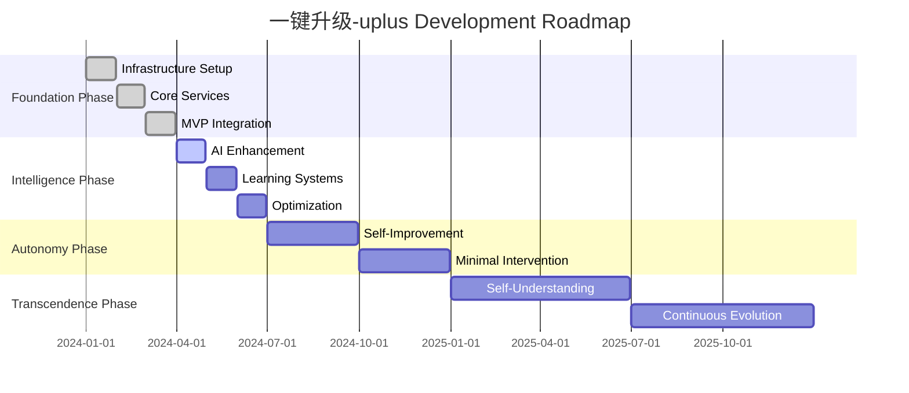
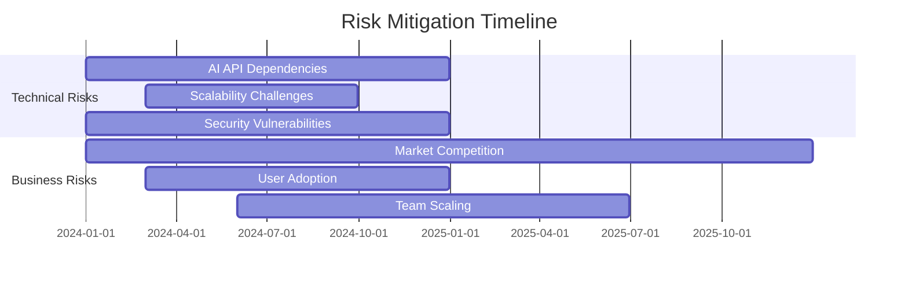

# 📅 Development Roadmap

> **Strategic timeline for building the revolutionary 一键升级-uplus platform**

## 🎯 Roadmap Philosophy

Our development roadmap follows the **Closed-Loop Evolution** principle - each phase builds upon the previous while establishing feedback mechanisms that improve all subsequent development. We prioritize **semantic understanding** over feature quantity, ensuring each milestone delivers meaningful capability advancement.

## 🗺️ Strategic Timeline Overview



## 🏗️ Phase 1: Foundation (Months 1-3)

### Strategic Objectives
- Establish robust technical foundation
- Implement core module functionality
- Create basic closed-loop workflow
- Validate fundamental architecture

### Month 1: Infrastructure & Core Setup

#### Week 1-2: Development Foundation
```yaml
Infrastructure Setup:
  ✅ Repository structure and conventions
  ✅ Development environment configuration
  ✅ CI/CD pipeline with GitHub Actions
  ✅ Container orchestration with Kubernetes
  ✅ Monitoring and logging infrastructure

Database Architecture:
  ✅ PostgreSQL cluster for primary data
  ✅ Redis for caching and sessions
  ✅ Vector database for embeddings
  ✅ MongoDB for document storage

Security Foundation:
  ✅ Authentication service (Keycloak)
  ✅ API gateway with rate limiting
  ✅ TLS/SSL certificate management
  ✅ Secret management with Vault

Deliverables:
  - Complete development environment
  - Automated deployment pipeline
  - Security infrastructure
  - Monitoring dashboards
```

#### Week 3-4: Message Queue & Communication
```yaml
Event-Driven Architecture:
  ✅ Apache Kafka cluster deployment
  ✅ Topic design and partitioning strategy
  ✅ Schema registry for event schemas
  ✅ Dead letter queue handling

Service Communication:
  ✅ REST API standards and conventions
  ✅ Event sourcing patterns
  ✅ Circuit breaker implementation
  ✅ Distributed tracing setup

Quality Assurance:
  ✅ Automated testing framework
  ✅ Code quality gates
  ✅ Performance benchmarking
  ✅ Security scanning

Deliverables:
  - Event-driven messaging system
  - Service communication patterns
  - Quality assurance framework
  - Performance baseline metrics
```

### Month 2: Core Service Implementation

#### Week 1: AI Product Manager Service
```yaml
Core Functionality:
  ✅ FastAPI service structure
  ✅ Multi-modal input processing
  ✅ Basic intent parsing with NLP
  ✅ Simple dialogue management

Database Integration:
  ✅ Session management
  ✅ Conversation history storage
  ✅ Context preservation
  ✅ User preference tracking

AI Integration:
  ✅ OpenAI API integration
  ✅ Basic prompt engineering
  ✅ Response generation
  ✅ Error handling and fallbacks

Deliverables:
  - Functional AI-PM service
  - Basic requirement gathering
  - Session management
  - Initial AI integration
```

#### Week 2: BITCUP Modeling Service
```yaml
Core Functionality:
  ✅ Rust service with Actix-web
  ✅ RSD parsing and validation
  ✅ Basic BITCUP model generation
  ✅ Model validation framework

Language Design:
  ✅ BITCUP syntax specification
  ✅ Semantic validation rules
  ✅ Model optimization algorithms
  ✅ Export format support

Integration:
  ✅ RSD input processing
  ✅ Model output generation
  ✅ Validation reporting
  ✅ Performance optimization

Deliverables:
  - BITCUP modeling service
  - Language specification
  - Model validation
  - Basic optimization
```

#### Week 3: Low-Code Platform Service
```yaml
Core Functionality:
  ✅ Node.js service with Express
  ✅ BITCUP model processing
  ✅ Template-based code generation
  ✅ Basic deployment pipeline

Code Generation:
  ✅ Template engine setup
  ✅ Multi-platform support
  ✅ Quality assurance integration
  ✅ Artifact management

Deployment:
  ✅ Container image building
  ✅ Kubernetes deployment
  ✅ Health check implementation
  ✅ Rollback capabilities

Deliverables:
  - Low-code platform service
  - Code generation engine
  - Deployment automation
  - Quality assurance
```

#### Week 4: Memory Intelligence Service
```yaml
Core Functionality:
  ✅ Python service with FastAPI
  ✅ Event collection and processing
  ✅ Basic pattern recognition
  ✅ Knowledge graph foundation

Data Processing:
  ✅ Event stream processing
  ✅ Pattern analysis algorithms
  ✅ Insight generation
  ✅ Knowledge storage

Intelligence:
  ✅ Basic learning algorithms
  ✅ Pattern matching
  ✅ Recommendation generation
  ✅ Feedback processing

Deliverables:
  - Memory intelligence service
  - Event processing pipeline
  - Basic learning capabilities
  - Knowledge management
```

### Month 3: Integration & MVP

#### Week 1-2: Service Integration
```yaml
API Gateway:
  ✅ Kong/Istio gateway setup
  ✅ Service routing and load balancing
  ✅ Authentication integration
  ✅ Rate limiting and throttling

Inter-Service Communication:
  ✅ REST API integration
  ✅ Event-driven messaging
  ✅ Error handling and resilience
  ✅ Distributed transaction support

Monitoring:
  ✅ Service health monitoring
  ✅ Performance metrics collection
  ✅ Error tracking and alerting
  ✅ Distributed tracing

Deliverables:
  - Integrated service ecosystem
  - API gateway operational
  - Comprehensive monitoring
  - Error handling framework
```

#### Week 3-4: MVP Development
```yaml
Web Interface:
  ✅ React-based frontend
  ✅ User authentication
  ✅ Basic workflow interface
  ✅ Real-time updates

End-to-End Workflow:
  ✅ Requirement gathering flow
  ✅ Model generation process
  ✅ Code generation and deployment
  ✅ Feedback collection

Testing & Validation:
  ✅ Integration testing suite
  ✅ End-to-end testing
  ✅ Performance validation
  ✅ User acceptance testing

Deliverables:
  - Working MVP system
  - Web interface
  - Complete workflow
  - Validation results
```

## 🧠 Phase 2: Intelligence (Months 4-6)

### Strategic Objectives
- Implement advanced AI capabilities
- Create learning and adaptation systems
- Optimize performance and user experience
- Establish production readiness

### Month 4: AI Enhancement

#### Week 1: Advanced AI Integration
```yaml
Multi-Model AI:
  🔄 GPT-4 Turbo integration
  🔄 Anthropic Claude 3 integration
  🔄 Custom model fine-tuning
  🔄 Model selection algorithms

Multi-Modal Processing:
  🔄 Voice input processing
  🔄 Image and sketch analysis
  🔄 Document understanding
  🔄 Context integration

Performance Optimization:
  🔄 Response time optimization
  🔄 Caching strategies
  🔄 Batch processing
  🔄 Resource management

Deliverables:
  - Advanced AI capabilities
  - Multi-modal processing
  - Optimized performance
  - Enhanced accuracy
```

#### Week 2: Socratic Intelligence
```yaml
Advanced Dialogue:
  🔄 Context-aware questioning
  🔄 Progressive requirement discovery
  🔄 Contradiction resolution
  🔄 Completeness validation

Question Generation:
  🔄 Intelligent question selection
  🔄 Personalized questioning style
  🔄 Domain-specific questions
  🔄 Learning from interactions

Validation Enhancement:
  🔄 Real-time completeness checking
  🔄 Consistency validation
  🔄 Quality scoring
  🔄 Recommendation generation

Deliverables:
  - Socratic dialogue system
  - Intelligent questioning
  - Enhanced validation
  - Quality improvements
```

#### Week 3: Semantic Modeling Enhancement
```yaml
Bidirectional Transformation:
  🔄 RSD to BITCUP conversion
  🔄 BITCUP to RSD conversion
  🔄 Semantic equivalence validation
  🔄 Transformation optimization

Advanced Validation:
  🔄 Semantic consistency checking
  🔄 Business rule validation
  🔄 Performance impact analysis
  🔄 Security requirement validation

Pattern Recognition:
  🔄 Common pattern identification
  🔄 Anti-pattern detection
  🔄 Optimization suggestions
  🔄 Best practice recommendations

Deliverables:
  - Bidirectional transformation
  - Advanced validation
  - Pattern recognition
  - Optimization engine
```

#### Week 4: Code Generation Intelligence
```yaml
Understanding-Based Generation:
  🔄 Semantic code generation
  🔄 Architecture pattern selection
  🔄 Technology stack optimization
  🔄 Performance optimization

Quality Assurance:
  🔄 Automated testing generation
  🔄 Security best practices
  🔄 Performance optimization
  🔄 Code quality validation

Adaptive Generation:
  🔄 Learning from feedback
  🔄 Pattern adaptation
  🔄 Continuous improvement
  🔄 Personalization

Deliverables:
  - Intelligent code generation
  - Quality assurance automation
  - Adaptive algorithms
  - Performance optimization
```

### Month 5: Learning Systems

#### Week 1-2: Memory Intelligence Enhancement
```yaml
Temporal Reasoning:
  🔄 Time-based pattern analysis
  🔄 Causal relationship detection
  🔄 Historical context integration
  🔄 Predictive modeling

Advanced Analytics:
  🔄 Cross-project pattern analysis
  🔄 Success factor identification
  🔄 Risk prediction
  🔄 Optimization recommendations

Knowledge Graph:
  🔄 Entity relationship modeling
  🔄 Semantic search capabilities
  🔄 Knowledge inference
  🔄 Graph-based insights

Deliverables:
  - Temporal reasoning system
  - Advanced analytics
  - Knowledge graph
  - Predictive capabilities
```

#### Week 3-4: Closed-Loop Learning
```yaml
Feedback Integration:
  🔄 Multi-source feedback collection
  🔄 Feedback quality assessment
  🔄 Learning rate adaptation
  🔄 Continuous improvement

Cross-Module Learning:
  🔄 Shared knowledge base
  🔄 Cross-module insights
  🔄 Collaborative improvement
  🔄 System-wide optimization

Performance Monitoring:
  🔄 Real-time performance tracking
  🔄 Quality metric monitoring
  🔄 User satisfaction measurement
  🔄 Improvement validation

Deliverables:
  - Feedback integration system
  - Cross-module learning
  - Performance monitoring
  - Continuous improvement
```

### Month 6: Optimization & Production Readiness

#### Week 1-2: Performance Optimization
```yaml
System Performance:
  🔄 Response time optimization
  🔄 Throughput improvement
  🔄 Resource utilization optimization
  🔄 Scalability enhancement

Caching Strategies:
  🔄 Multi-level caching
  🔄 Intelligent cache invalidation
  🔄 Cache warming strategies
  🔄 Performance monitoring

Load Balancing:
  🔄 Intelligent load distribution
  🔄 Auto-scaling implementation
  🔄 Resource optimization
  🔄 Fault tolerance

Deliverables:
  - Optimized performance
  - Scalability improvements
  - Enhanced reliability
  - Resource efficiency
```

#### Week 3-4: Production Readiness
```yaml
Security Hardening:
  🔄 Security audit completion
  🔄 Vulnerability remediation
  🔄 Compliance validation
  🔄 Security monitoring

Operational Excellence:
  🔄 Monitoring and alerting
  🔄 Backup and recovery
  🔄 Disaster recovery planning
  🔄 Operational runbooks

Documentation:
  🔄 Complete API documentation
  🔄 Deployment guides
  🔄 Troubleshooting guides
  🔄 User documentation

Deliverables:
  - Production-ready system
  - Security compliance
  - Operational procedures
  - Complete documentation
```

## 🤖 Phase 3: Autonomy (Months 7-12)

### Strategic Objectives
- Implement self-improvement capabilities
- Minimize human intervention requirements
- Achieve autonomous operation
- Establish continuous evolution

### Months 7-9: Self-Improvement

#### Advanced Capabilities Development
```yaml
Self-Modifying Algorithms:
  ⏳ Algorithm adaptation based on performance
  ⏳ Self-optimizing parameters
  ⏳ Autonomous feature enhancement
  ⏳ Intelligent resource allocation

Autonomous Quality Assurance:
  ⏳ Self-testing capabilities
  ⏳ Automatic bug detection and fixing
  ⏳ Performance self-tuning
  ⏳ Security self-assessment

Predictive Maintenance:
  ⏳ System health prediction
  ⏳ Proactive issue resolution
  ⏳ Automatic scaling decisions
  ⏳ Resource optimization

Deliverables:
  - Self-improving algorithms
  - Autonomous quality assurance
  - Predictive maintenance
  - Advanced intelligence
```

### Months 10-12: Minimal Intervention

#### Autonomous Operations
```yaml
Self-Deployment:
  ⏳ Autonomous deployment decisions
  ⏳ Environment optimization
  ⏳ Rollback automation
  ⏳ Configuration management

Self-Healing:
  ⏳ Automatic error recovery
  ⏳ System repair capabilities
  ⏳ Performance restoration
  ⏳ Data integrity maintenance

Advanced Intelligence:
  ⏳ Cross-project learning
  ⏳ Industry pattern recognition
  ⏳ Predictive system evolution
  ⏳ Autonomous decision making

Deliverables:
  - Fully autonomous system
  - Self-healing capabilities
  - Advanced intelligence
  - Minimal human intervention
```

## 🌟 Phase 4: Transcendence (Year 2+)

### Strategic Objectives
- Achieve system self-understanding
- Implement self-organizing architectures
- Establish continuous self-optimization
- Create truly intelligent systems

### Year 2: Self-Understanding
```yaml
System Self-Awareness:
  🔮 Understanding of own capabilities
  🔮 Self-assessment and improvement
  🔮 Goal-oriented behavior
  🔮 Autonomous learning objectives

Self-Organizing Architecture:
  🔮 Dynamic system restructuring
  🔮 Optimal component arrangement
  🔮 Adaptive communication patterns
  🔮 Emergent system behaviors

Continuous Evolution:
  🔮 Perpetual self-improvement
  🔮 Adaptive goal setting
  🔮 Autonomous innovation
  🔮 Transcendent capabilities
```

## 📊 Roadmap Metrics & Validation

### Phase Completion Criteria

| Phase | Completion Criteria | Validation Method |
|-------|-------------------|-------------------|
| **Foundation** | MVP operational, basic workflow complete | User acceptance testing |
| **Intelligence** | AI features active, learning systems online | Performance benchmarks |
| **Autonomy** | Self-improvement active, minimal intervention | Operational metrics |
| **Transcendence** | Self-understanding, continuous evolution | Advanced capability assessment |

### Success Metrics by Phase

```yaml
Foundation Phase Metrics:
  - System availability: >99%
  - Basic functionality: 100% operational
  - Integration success: >95%
  - User satisfaction: >4.0/5

Intelligence Phase Metrics:
  - AI accuracy: >95%
  - Learning rate: >10% monthly improvement
  - Performance optimization: >50% improvement
  - User satisfaction: >4.5/5

Autonomy Phase Metrics:
  - Autonomous operations: >90%
  - Self-improvement rate: >15% monthly
  - Human intervention: <10% of operations
  - System reliability: >99.9%

Transcendence Phase Metrics:
  - Self-understanding: Measurable self-assessment
  - Continuous evolution: Ongoing capability growth
  - Innovation rate: Novel solution generation
  - Transcendent capabilities: Beyond human design
```

## 🎯 Risk Mitigation Timeline

### Critical Risk Monitoring



### Mitigation Strategies

| Risk Category | Mitigation Approach | Timeline |
|---------------|-------------------|----------|
| **Technical** | Multiple providers, robust testing, security audits | Ongoing |
| **Business** | User research, competitive analysis, team development | Ongoing |
| **Operational** | Monitoring, automation, documentation | Ongoing |

---

<div align="center">

**📅 Roadmap Foundation Complete**

*Ready for detailed planning? Explore [Milestones](milestones.md) or [Technical Solutions](technical-solutions.md)*

</div>