# 🔧 Core Module Specifications

> **Detailed specifications for the four revolutionary modules that power the 一键升级-uplus platform**

## 🎯 Module Architecture Overview

The 一键升级-uplus platform consists of four precisely orchestrated modules that form a perfect closed-loop system. Each module has a **singular purpose** and operates with **radical simplicity** while maintaining **semantic intelligence**.

```mermaid
graph TB
    subgraph "The Four Modules"
        A[🧠 AI Product Manager<br/>Intent Capture]
        B[🔤 BITCUP Language<br/>Semantic Modeling]
        C[⚡ Low-Code Platform<br/>System Materialization]
        D[🧠 Memory Intelligence<br/>Knowledge Evolution]
    end
    
    A -->|RSD| B
    B -->|Model| C
    C -->|Events| D
    D -->|Insights| A
    
    style A fill:#e1f5fe
    style B fill:#f3e5f5
    style C fill:#e8f5e8
    style D fill:#fff3e0
```



## 📋 Module Summary

| Module | Purpose | Input | Output | Key Innovation |
|--------|---------|-------|--------|----------------|
| **[AI-PM](ai-pm/)** | Transform vague human desires into precise specifications | Human intent | Requirements Specification Document | Socratic Intelligence |
| **[BITCUP](bitcup/)** | Universal semantic language for business intent | RSD | Executable model | Bidirectional transformation |
| **[Low-Code](low-code/)** | Materialize models into living systems | BITCUP model | Deployed application | Understanding-based generation |
| **[Memory](memory/)** | Create immortal organizational intelligence | System events | Insights & predictions | Active memory with temporal reasoning |

## 🧠 Module 1: AI Product Manager (AI-PM)

### Core Philosophy
**"From vague desires to precise specifications through intelligent dialogue"**

### Key Capabilities
- **Socratic Intelligence**: Progressive questioning to uncover hidden requirements
- **Multi-modal Understanding**: Voice, text, sketches, examples, and context
- **Requirement Completeness**: Ensures 100% capture of user intent
- **Context Preservation**: Remembers all previous interactions

### Technical Specifications
```yaml
Technology Stack: Python 3.11+ with FastAPI
Primary Database: PostgreSQL
Cache Layer: Redis
AI Integration: OpenAI GPT-4, Anthropic Claude
Message Queue: Apache Kafka

Core Components:
  - Intent Parser: NLP processing engine
  - Dialogue Manager: Socratic questioning system
  - RSD Generator: Structured document creator
  - Validation Engine: Completeness checker
  - Context Manager: Conversation memory
```

### [📖 Detailed AI-PM Specification →](ai-pm/)

---

## 🔤 Module 2: BITCUP Modeling Language

### Core Philosophy
**"Universal semantic language that expresses 'what' not 'how'"**

### Key Capabilities
- **Declarative Semantics**: Business intent without technical implementation
- **Platform Agnostic**: Technology-independent modeling
- **Formally Verifiable**: Mathematically sound and consistent
- **Bidirectional**: RSD ↔ BITCUP transformation

### Language Structure
```yaml
BITCUP = Business + Intent + Technology + Constraints + User + Process

Core Constructs:
  - Entities: Business objects and their properties
  - Behaviors: Actions and business rules
  - Flows: Process definitions and state transitions
  - Views: User interface and interaction patterns
  - Events: Triggers and system responses
  - Rules: Constraints and validations
```

### [📖 Detailed BITCUP Specification →](bitcup/)

---

## ⚡ Module 3: AI Low-Code Platform

### Core Philosophy
**"Intelligent materialization that creates optimal implementations"**

### Key Capabilities
- **Understanding-based Generation**: Not template-based, but comprehension-driven
- **Adaptive Architecture**: Self-assembling optimal patterns
- **Zero-touch Deployment**: Automated configuration and deployment
- **Quality Assurance**: Built-in testing and optimization

### Generation Pipeline


### [📖 Detailed Low-Code Specification →](low-code/)

---

## 🧠 Module 4: Document Memory Intelligence

### Core Philosophy
**"Immortal organizational brain that learns and predicts"**

### Key Capabilities
- **Temporal Knowledge Graph**: Decisions linked to context and outcomes
- **Active Memory**: Proactive information surfacing
- **Pattern Recognition**: Identifying trends before humans notice
- **Predictive Intelligence**: Anticipating problems and opportunities

### Intelligence Architecture
```yaml
Memory Layers:
  - Event Layer: Raw system events and interactions
  - Pattern Layer: Recognized patterns and relationships
  - Insight Layer: Generated insights and recommendations
  - Prediction Layer: Future state predictions

Reasoning Capabilities:
  - Temporal: "Why did we make this decision?"
  - Impact: "What happens if we change this?"
  - Pattern: "This is similar to previous solutions"
  - Predictive: "This approach may fail based on history"
```

### [📖 Detailed Memory Specification →](memory/)

---

## 🔗 Inter-Module Communication

### Communication Patterns


### Data Flow Specifications

| Source | Target | Data Type | Protocol | Frequency |
|--------|--------|-----------|----------|-----------|
| AI-PM | BITCUP | RSD Document | REST API | On completion |
| BITCUP | Low-Code | BITCUP Model | REST API | On validation |
| Low-Code | Memory | System Events | Kafka | Real-time |
| Memory | AI-PM | Insights | REST API | On request |
| Memory | BITCUP | Patterns | REST API | On request |
| Memory | Low-Code | Optimizations | REST API | On request |

## 🎯 Module Quality Standards

### Performance Requirements

| Module | Availability | Response Time | Throughput | Accuracy |
|--------|-------------|---------------|------------|----------|
| **AI-PM** | 99.9% | < 2s (P95) | 100 req/s | >95% intent capture |
| **BITCUP** | 99.95% | < 500ms (P95) | 200 req/s | >99% model validity |
| **Low-Code** | 99.9% | < 5s (P95) | 50 req/s | >99.9% deployment success |
| **Memory** | 99.9% | < 1s (P95) | 500 req/s | 100% knowledge retention |

### Security Standards

```yaml
Authentication:
  - OAuth 2.0 + OIDC for all modules
  - JWT tokens with RS256 signing
  - Role-based access control (RBAC)

Data Protection:
  - AES-256 encryption at rest
  - TLS 1.3 for data in transit
  - PII encryption and anonymization
  - GDPR compliance features

API Security:
  - Rate limiting per user/IP
  - Input validation and sanitization
  - Output encoding and CORS protection
  - Comprehensive audit logging
```

## 🚀 Development Priorities

### Phase 1: Foundation (Months 1-3)
```yaml
AI-PM Module:
  - Basic intent capture and dialogue
  - RSD generation engine
  - PostgreSQL integration
  - REST API implementation

BITCUP Module:
  - Core language specification
  - RSD to BITCUP transformer
  - Model validation engine
  - Basic optimization

Low-Code Module:
  - Simple code generation
  - Template-based approach
  - Basic deployment pipeline
  - Quality gates

Memory Module:
  - Event collection system
  - Basic pattern recognition
  - Simple insight generation
  - Knowledge storage
```

### Phase 2: Intelligence (Months 4-6)
```yaml
AI-PM Module:
  - Advanced multi-modal processing
  - Context-aware dialogue
  - Improved requirement validation
  - Integration with Memory insights

BITCUP Module:
  - Advanced semantic analysis
  - Bidirectional transformation
  - Performance optimization
  - Domain-specific extensions

Low-Code Module:
  - Understanding-based generation
  - Adaptive architecture selection
  - Advanced testing automation
  - Performance optimization

Memory Module:
  - Temporal reasoning capabilities
  - Advanced pattern recognition
  - Predictive analytics
  - Cross-project insights
```

### Phase 3: Autonomy (Months 7-12)
```yaml
All Modules:
  - Self-improving algorithms
  - Autonomous optimization
  - Predictive maintenance
  - Advanced AI integration
  - Cross-module learning
  - Minimal human intervention
```

## 📊 Success Metrics

### Module-Specific KPIs

```yaml
AI-PM Success Metrics:
  - Intent capture accuracy: >95%
  - Requirement completeness: >98%
  - User satisfaction: >4.5/5
  - Time to RSD: <2 hours

BITCUP Success Metrics:
  - Model generation success: >99%
  - Semantic accuracy: >98%
  - Transformation speed: <30 seconds
  - Model optimization: >20% improvement

Low-Code Success Metrics:
  - Code generation success: >99.9%
  - Deployment reliability: >99.9%
  - Performance optimization: >50% improvement
  - Test coverage: >95%

Memory Success Metrics:
  - Knowledge retention: 100%
  - Insight relevance: >90%
  - Prediction accuracy: >85%
  - Learning rate: >10% monthly improvement
```

## 🔧 Implementation Guidelines

### Development Standards
- **Code Quality**: 100% test coverage, static analysis, peer review
- **Documentation**: Comprehensive API docs, inline comments, examples
- **Performance**: Profiling, optimization, load testing
- **Security**: Security scanning, penetration testing, compliance

### Integration Testing
```yaml
Test Categories:
  - Unit Tests: Individual module functionality
  - Integration Tests: Module-to-module communication
  - End-to-End Tests: Complete workflow validation
  - Performance Tests: Load and stress testing
  - Security Tests: Vulnerability and compliance testing

Test Automation:
  - Continuous Integration: GitHub Actions
  - Test Environment: Docker containers
  - Test Data: Synthetic and anonymized real data
  - Test Reporting: Comprehensive dashboards
```

## 📋 Next Steps

### For Module Developers
1. Choose your module: [AI-PM](ai-pm/), [BITCUP](bitcup/), [Low-Code](low-code/), or [Memory](memory/)
2. Study the detailed specification
3. Review the [Implementation Roadmap](../implementation/README.md)
4. Follow the [Development Standards](../standards/README.md)

### For System Architects
1. Understand [Inter-Module Communication](#inter-module-communication)
2. Review [Quality Standards](#module-quality-standards)
3. Plan [Development Priorities](#development-priorities)
4. Set up [Success Metrics](#success-metrics)

---

<div align="center">

**🔧 Module Foundation Complete**

*Ready to dive deep? Choose your module or explore [Implementation Planning](../implementation/README.md)*

</div>