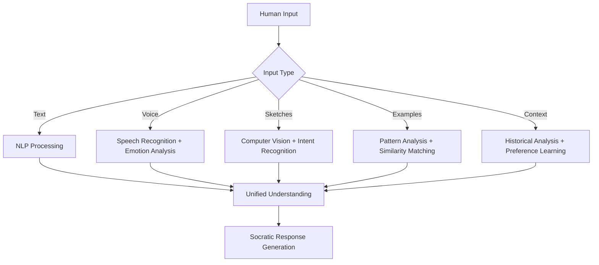
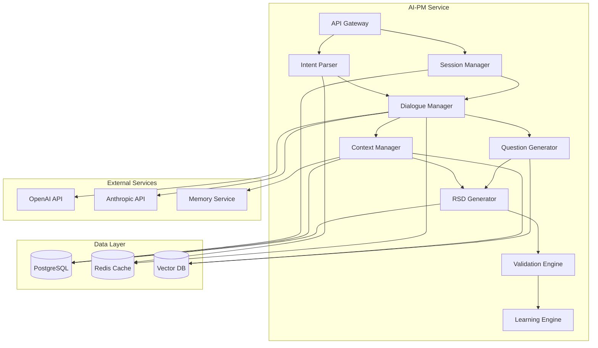
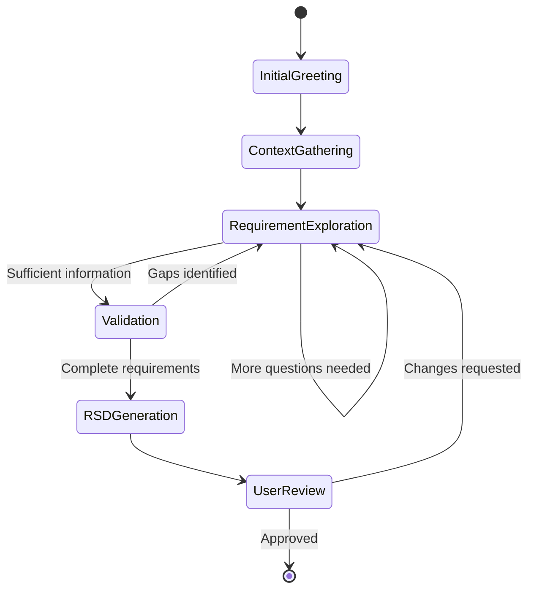

# 🧠 AI Product Manager Module

> **Transform vague human desires into precise, executable specifications through Socratic Intelligence**

## 🎯 Module Mission

The AI Product Manager (AI-PM) module serves as the **intelligent bridge between human intent and machine understanding**. It transforms ambiguous, incomplete, or contradictory human desires into comprehensive, precise Requirements Specification Documents (RSD) that can be reliably processed by downstream modules.

## 🧠 Core Philosophy: Socratic Intelligence

### The Socratic Method in AI
Unlike traditional requirement gathering that relies on forms or templates, AI-PM employs **Socratic Intelligence** - a progressive questioning approach that:

- **Uncovers Hidden Requirements**: Asks questions users didn't know they needed to answer
- **Resolves Contradictions**: Identifies and helps resolve conflicting requirements
- **Builds Mental Models**: Constructs comprehensive understanding through dialogue
- **Preserves Context**: Maintains conversation history and project context

### Multi-Modal Understanding


## 🏗️ Technical Architecture

### System Components

```yaml
Core Components:
  1. Intent Parser: Multi-modal input processing
  2. Dialogue Manager: Socratic questioning engine
  3. Context Manager: Conversation and project memory
  4. RSD Generator: Structured document creation
  5. Validation Engine: Completeness and consistency checking
  6. Learning Engine: Continuous improvement from interactions

Technology Stack:
  - Runtime: Python 3.11+
  - Framework: FastAPI with async support
  - AI Integration: OpenAI GPT-4, Anthropic Claude
  - Database: PostgreSQL (primary), Redis (cache)
  - Message Queue: Apache Kafka
  - Vector Database: Pinecone/Weaviate for embeddings
```

### Service Architecture



## 🔧 Core Functionality

### 1. Intent Capture Pipeline

```python
class IntentCaptureFlow:
    """
    Multi-stage intent capture with progressive refinement
    """
    
    async def process_input(self, user_input: UserInput) -> DialogueResponse:
        # Stage 1: Parse and understand input
        parsed_intent = await self.intent_parser.parse(user_input)
        
        # Stage 2: Update context with new information
        context = await self.context_manager.update_context(
            session_id=user_input.session_id,
            new_intent=parsed_intent
        )
        
        # Stage 3: Identify gaps and generate questions
        questions = await self.question_generator.generate_questions(
            context=context,
            current_intent=parsed_intent
        )
        
        # Stage 4: Check if requirements are complete
        completeness = await self.validation_engine.check_completeness(context)
        
        if completeness.is_complete:
            # Generate RSD if requirements are sufficient
            rsd = await self.rsd_generator.generate(context)
            return DialogueResponse(
                type="rsd_ready",
                rsd_document=rsd,
                message="Requirements are complete. Here's your specification."
            )
        else:
            # Continue dialogue with intelligent questions
            return DialogueResponse(
                type="continue_dialogue",
                questions=questions,
                message=self._generate_response_message(questions, context)
            )
```

### 2. Socratic Question Generation

```yaml
Question Categories:
  Clarification Questions:
    - "When you say 'fast', what specific response time do you need?"
    - "Can you describe what 'user-friendly' means in your context?"
    
  Exploration Questions:
    - "What happens if a user tries to do X?"
    - "How should the system behave when Y occurs?"
    
  Constraint Questions:
    - "What's your budget range for this project?"
    - "Are there any regulatory requirements we need to consider?"
    
  Priority Questions:
    - "If you could only have three features, which would they be?"
    - "What's the most critical success factor for this system?"
    
  Edge Case Questions:
    - "What should happen if the system is offline?"
    - "How should we handle data corruption scenarios?"

Question Selection Algorithm:
  1. Analyze current context completeness
  2. Identify highest-impact missing information
  3. Consider user expertise level and communication style
  4. Select questions that maximize information gain
  5. Ensure questions are contextually relevant and clear
```

### 3. Requirements Specification Document (RSD) Structure

```yaml
RSD Schema:
  metadata:
    project_id: UUID
    session_id: UUID
    version: string
    created_at: timestamp
    completeness_score: float (0.0-1.0)
    
  functional_requirements:
    user_stories:
      - id: string
        title: string
        description: string
        acceptance_criteria: string[]
        priority: enum [critical, high, medium, low]
        
    use_cases:
      - id: string
        name: string
        actors: string[]
        preconditions: string[]
        main_flow: string[]
        alternative_flows: string[]
        postconditions: string[]
        
    business_rules:
      - id: string
        rule: string
        rationale: string
        exceptions: string[]
        
  non_functional_requirements:
    performance:
      response_time: string
      throughput: string
      scalability: string
      
    security:
      authentication: string
      authorization: string
      data_protection: string
      compliance: string[]
      
    usability:
      user_experience: string
      accessibility: string
      internationalization: string
      
    reliability:
      availability: string
      fault_tolerance: string
      backup_recovery: string
      
  constraints:
    technical:
      - constraint: string
        rationale: string
        
    business:
      - constraint: string
        impact: string
        
    regulatory:
      - requirement: string
        compliance_level: string
        
  success_criteria:
    metrics:
      - name: string
        target_value: string
        measurement_method: string
        
    acceptance_tests:
      - scenario: string
        expected_outcome: string
        test_method: string
```

## 🔄 Dialogue Management

### Conversation Flow Engine



### Context Management

```python
class ContextManager:
    """
    Manages conversation context and project memory
    """
    
    def __init__(self):
        self.conversation_history = []
        self.project_context = {}
        self.user_preferences = {}
        self.domain_knowledge = {}
    
    async def update_context(self, session_id: str, new_intent: ParsedIntent):
        """Update context with new information from user input"""
        
        # Update conversation history
        self.conversation_history.append({
            'timestamp': datetime.now(),
            'user_input': new_intent.raw_input,
            'parsed_intent': new_intent.structured_data,
            'confidence': new_intent.confidence_score
        })
        
        # Extract and update project context
        project_updates = self._extract_project_context(new_intent)
        self.project_context.update(project_updates)
        
        # Learn user preferences
        preference_updates = self._extract_user_preferences(new_intent)
        self.user_preferences.update(preference_updates)
        
        # Update domain knowledge
        domain_updates = self._extract_domain_knowledge(new_intent)
        self.domain_knowledge.update(domain_updates)
        
        # Persist to database
        await self._persist_context(session_id)
        
        return self._build_unified_context()
```

## 🎯 Quality Assurance

### Completeness Validation

```python
class CompletenessValidator:
    """
    Validates requirement completeness using multiple criteria
    """
    
    COMPLETENESS_CRITERIA = {
        'functional_coverage': 0.25,  # 25% weight
        'non_functional_coverage': 0.20,  # 20% weight
        'constraint_identification': 0.15,  # 15% weight
        'success_criteria_definition': 0.15,  # 15% weight
        'stakeholder_coverage': 0.10,  # 10% weight
        'edge_case_coverage': 0.10,  # 10% weight
        'integration_requirements': 0.05   # 5% weight
    }
    
    async def calculate_completeness(self, context: ProjectContext) -> CompletenessScore:
        scores = {}
        
        # Functional coverage
        scores['functional_coverage'] = self._assess_functional_coverage(context)
        
        # Non-functional coverage
        scores['non_functional_coverage'] = self._assess_nfr_coverage(context)
        
        # Constraint identification
        scores['constraint_identification'] = self._assess_constraints(context)
        
        # Success criteria definition
        scores['success_criteria_definition'] = self._assess_success_criteria(context)
        
        # Stakeholder coverage
        scores['stakeholder_coverage'] = self._assess_stakeholders(context)
        
        # Edge case coverage
        scores['edge_case_coverage'] = self._assess_edge_cases(context)
        
        # Integration requirements
        scores['integration_requirements'] = self._assess_integrations(context)
        
        # Calculate weighted score
        total_score = sum(
            score * self.COMPLETENESS_CRITERIA[criterion]
            for criterion, score in scores.items()
        )
        
        return CompletenessScore(
            overall_score=total_score,
            criterion_scores=scores,
            missing_areas=self._identify_missing_areas(scores),
            recommendations=self._generate_recommendations(scores)
        )
```

### Consistency Checking

```yaml
Consistency Rules:
  Logical Consistency:
    - No contradictory requirements
    - Compatible non-functional requirements
    - Achievable success criteria
    
  Stakeholder Consistency:
    - Aligned stakeholder expectations
    - Consistent priority assignments
    - Compatible user stories
    
  Technical Consistency:
    - Compatible technology constraints
    - Feasible performance requirements
    - Realistic timeline expectations
    
  Business Consistency:
    - Aligned business objectives
    - Compatible business rules
    - Consistent value propositions
```

## 📊 Performance Metrics

### Key Performance Indicators

| Metric | Target | Measurement Method |
|--------|--------|-------------------|
| **Intent Capture Accuracy** | >95% | User validation + downstream success |
| **Requirement Completeness** | >98% | Automated analysis + expert review |
| **Dialogue Efficiency** | <20 questions | Average questions to completion |
| **User Satisfaction** | >4.5/5 | Post-session surveys |
| **Response Time** | <2s (P95) | API response time monitoring |
| **Context Retention** | 100% | No information loss validation |

### Quality Gates

```yaml
Quality Gates:
  Input Validation:
    - Multi-modal input parsing accuracy >95%
    - Context extraction completeness >90%
    - Intent classification confidence >80%
    
  Dialogue Quality:
    - Question relevance score >85%
    - Information gain per question >70%
    - User engagement maintenance >90%
    
  RSD Quality:
    - Completeness score >95%
    - Consistency validation pass rate >99%
    - Downstream processing success >98%
```

## 🔌 API Specification

### Core Endpoints

```yaml
POST /api/v1/sessions
  Description: Create new requirement gathering session
  Request:
    user_id: UUID
    project_context: object
    preferences: object
  Response:
    session_id: UUID
    initial_questions: string[]
    estimated_duration: string

POST /api/v1/sessions/{session_id}/interact
  Description: Process user input and continue dialogue
  Request:
    message: string
    attachments: file[]
    voice_data: base64
    metadata: object
  Response:
    response: string
    questions: string[]
    completion_status: float
    next_steps: string[]

GET /api/v1/sessions/{session_id}/context
  Description: Get current session context
  Response:
    project_context: object
    conversation_history: object[]
    completeness_score: float
    identified_requirements: object

POST /api/v1/sessions/{session_id}/rsd
  Description: Generate Requirements Specification Document
  Response:
    rsd_document: object
    completeness_score: float
    validation_results: object
    recommendations: string[]

POST /api/v1/rsd/validate
  Description: Validate RSD completeness and consistency
  Request:
    rsd_document: object
    validation_level: enum [basic, comprehensive]
  Response:
    is_valid: boolean
    completeness_score: float
    issues: object[]
    suggestions: string[]
```

## 🚀 Implementation Roadmap

### Phase 1: Foundation (Month 1-2)
```yaml
Core Infrastructure:
  - FastAPI service setup
  - PostgreSQL database schema
  - Redis caching layer
  - Basic authentication

Basic Functionality:
  - Text-based intent parsing
  - Simple dialogue management
  - Basic RSD generation
  - Completeness validation

Integration:
  - OpenAI API integration
  - Kafka message publishing
  - Basic monitoring setup
```

### Phase 2: Intelligence (Month 3-4)
```yaml
Advanced Features:
  - Multi-modal input processing
  - Socratic question generation
  - Context-aware dialogue
  - Advanced validation

AI Enhancement:
  - Custom model fine-tuning
  - Embedding-based similarity
  - Pattern recognition
  - Learning from interactions

Quality Improvements:
  - Comprehensive testing
  - Performance optimization
  - Error handling
  - User experience polish
```

### Phase 3: Optimization (Month 5-6)
```yaml
Performance:
  - Response time optimization
  - Scalability improvements
  - Caching strategies
  - Load balancing

Intelligence:
  - Predictive questioning
  - Personalized dialogue
  - Domain expertise
  - Cross-project learning

Integration:
  - Memory service integration
  - Advanced analytics
  - Real-time feedback
  - Continuous improvement
```

## 📋 Development Guidelines

### Code Quality Standards
```yaml
Testing:
  - Unit test coverage: >95%
  - Integration test coverage: >90%
  - End-to-end test scenarios: >50 cases
  - Performance test benchmarks

Code Quality:
  - Type hints for all functions
  - Comprehensive docstrings
  - Static analysis (mypy, pylint)
  - Code formatting (black, isort)

Documentation:
  - API documentation (OpenAPI)
  - Architecture decision records
  - Deployment guides
  - Troubleshooting guides
```

### Security Requirements
```yaml
Authentication:
  - OAuth 2.0 + OIDC integration
  - JWT token validation
  - Role-based access control

Data Protection:
  - Input sanitization and validation
  - Output encoding and filtering
  - PII encryption and anonymization
  - Audit logging for all interactions

API Security:
  - Rate limiting per user/IP
  - Request size limitations
  - CORS configuration
  - Security headers
```

---

<div align="center">

**🧠 AI Product Manager Module Complete**

*Ready for the next module? Explore [BITCUP Modeling Language](../bitcup/)*

</div>