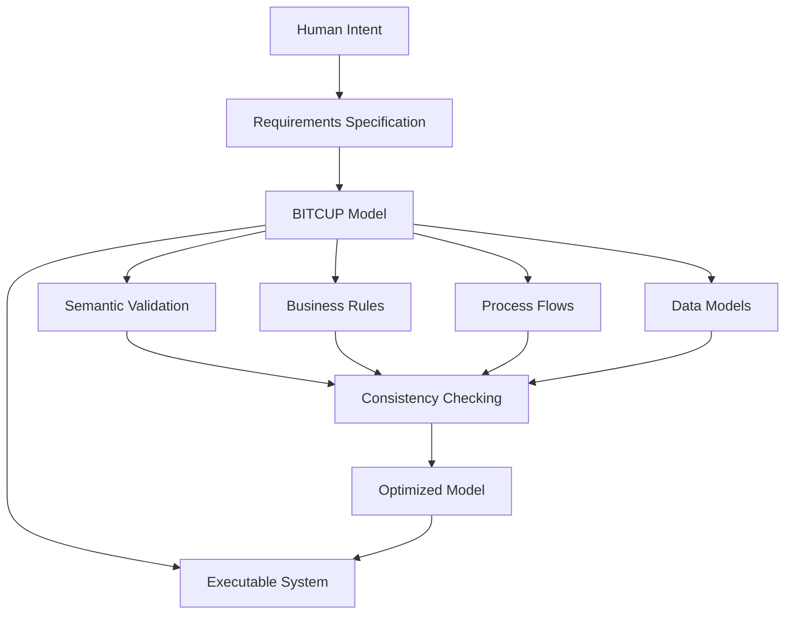
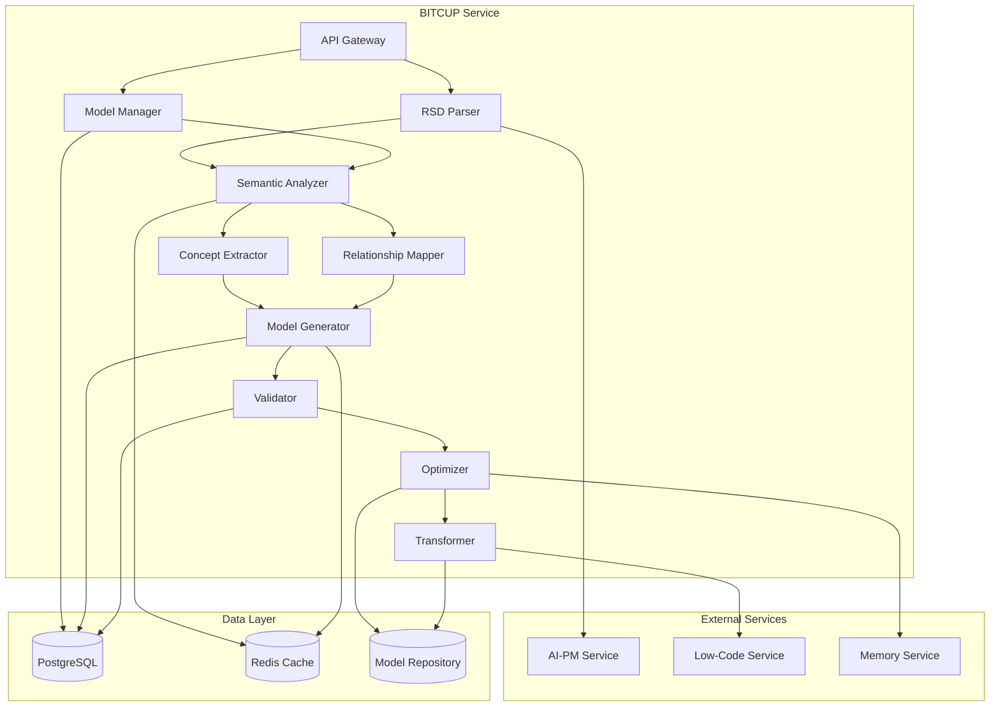

# 🔤 BITCUP Modeling Language Module

> **Universal semantic language that expresses 'what' not 'how' - the bridge between human intent and machine execution**

## 🎯 Module Mission

The BITCUP (Business + Intent + Technology + Constraints + User + Process) Modeling Language module serves as the **semantic heart** of the 一键升级-uplus platform. It transforms Requirements Specification Documents (RSD) into executable, platform-agnostic models that capture pure business intent without technical implementation details.

## 🧠 Core Philosophy: Declarative Semantics

### The BITCUP Paradigm
BITCUP represents a fundamental shift from **imperative programming** to **declarative modeling**:

- **What, Not How**: Describes desired outcomes, not implementation steps
- **Business-First**: Uses domain language, not technical jargon
- **Platform-Agnostic**: Independent of technology choices
- **Formally Verifiable**: Mathematically sound and consistent
- **Bidirectional**: Seamless transformation between RSD ↔ BITCUP

### Language Philosophy


## 🏗️ Technical Architecture

### System Components

```yaml
Core Components:
  1. RSD Parser: Converts RSD to intermediate representation
  2. Semantic Analyzer: Extracts business concepts and relationships
  3. Model Generator: Creates BITCUP model from semantics
  4. Validator: Ensures model completeness and consistency
  5. Optimizer: Optimizes model for execution efficiency
  6. Transformer: Bidirectional RSD ↔ BITCUP conversion

Technology Stack:
  - Runtime: Rust (performance and safety)
  - Framework: Actix-web for HTTP services
  - Database: PostgreSQL (models), Redis (cache)
  - Message Queue: Apache Kafka
  - Parsing: Custom parser with LALRPOP
  - Validation: Custom semantic validation engine
```

### Service Architecture



## 🔤 BITCUP Language Specification

### Core Language Constructs

#### 1. Entities (Business Objects)
```bitcup
entity User {
    properties {
        id: UUID @primary @immutable
        email: Email @unique @required
        name: Text @required @length(1..100)
        created_at: Timestamp @immutable @default(now)
        status: UserStatus @default(active)
    }
    
    behaviors {
        register(email: Email, name: Text) -> Result<User, ValidationError>
        authenticate(credentials: Credentials) -> Result<Session, AuthError>
        update_profile(updates: ProfileUpdates) -> Result<User, ValidationError>
        deactivate() -> Result<Void, BusinessError>
    }
    
    rules {
        email_must_be_unique: unique(email)
        name_cannot_be_empty: not_empty(name)
        active_users_can_login: status == active implies can_authenticate
    }
    
    lifecycle {
        states: [pending, active, suspended, deactivated]
        transitions {
            pending -> active: on register_complete
            active -> suspended: on policy_violation
            suspended -> active: on review_complete
            active -> deactivated: on user_request
        }
    }
}
```

#### 2. Behaviors (Actions and Operations)
```bitcup
behavior CreateProject {
    input {
        name: Text @required @length(1..200)
        description: Text @optional @length(0..1000)
        owner: User @required
        template: ProjectTemplate @optional
    }
    
    output {
        project: Project
        initial_session: RequirementSession
    }
    
    preconditions {
        owner.status == active
        owner.has_permission("project:create")
        name.is_unique_for_user(owner)
    }
    
    process {
        1. validate_input(input)
        2. create_project_entity(name, description, owner)
        3. apply_template_if_provided(template)
        4. initialize_requirement_session()
        5. notify_stakeholders(project, owner)
        6. return (project, initial_session)
    }
    
    postconditions {
        project.owner == owner
        project.status == active
        initial_session.project == project
        audit_log.contains(project_created_event)
    }
    
    error_handling {
        ValidationError -> return validation_details
        PermissionError -> return access_denied
        DuplicateError -> return name_already_exists
        SystemError -> rollback_and_retry
    }
}
```

#### 3. Flows (Process Definitions)
```bitcup
flow RequirementGathering {
    participants {
        user: User @role(project_owner)
        ai_pm: AIProductManager @role(facilitator)
        system: System @role(processor)
    }
    
    stages {
        initiation {
            trigger: user.starts_session()
            actions {
                ai_pm.greet_user(user)
                ai_pm.gather_context(user.project)
                ai_pm.ask_initial_questions()
            }
            next: dialogue
        }
        
        dialogue {
            trigger: user.provides_input() OR ai_pm.asks_question()
            actions {
                ai_pm.process_user_input(input)
                ai_pm.update_context(new_information)
                ai_pm.validate_completeness()
                
                if completeness < threshold {
                    ai_pm.generate_follow_up_questions()
                    continue dialogue
                } else {
                    proceed to validation
                }
            }
            next: validation OR continue_dialogue
        }
        
        validation {
            trigger: completeness >= threshold
            actions {
                system.generate_rsd_draft(context)
                ai_pm.present_summary(user)
                user.review_and_approve()
                
                if approved {
                    proceed to completion
                } else {
                    return to dialogue with feedback
                }
            }
            next: completion OR dialogue
        }
        
        completion {
            trigger: user.approves_rsd()
            actions {
                system.finalize_rsd(approved_content)
                system.trigger_bitcup_generation()
                ai_pm.thank_user()
                system.notify_next_stage()
            }
            next: end
        }
    }
    
    error_handling {
        user_disconnection -> save_state_and_pause
        ai_service_failure -> fallback_to_human_pm
        validation_failure -> return_to_dialogue_with_errors
    }
    
    quality_gates {
        completeness_score >= 0.95
        consistency_validation == passed
        user_satisfaction >= 4.0
    }
}
```

#### 4. Views (User Interface Patterns)
```bitcup
view ProjectDashboard {
    layout: dashboard_grid
    
    components {
        header {
            type: navigation_bar
            content {
                title: project.name
                breadcrumbs: [home, projects, project.name]
                actions: [edit, share, archive]
            }
            permissions: project.can_view(current_user)
        }
        
        metrics_panel {
            type: metrics_grid
            content {
                progress: project.completion_percentage
                quality_score: project.quality_metrics.overall
                team_size: project.team.count
                last_activity: project.last_updated
            }
            refresh_interval: 30_seconds
        }
        
        requirement_status {
            type: status_card
            content {
                current_phase: project.current_phase
                rsd_status: project.rsd.status
                model_status: project.bitcup_model.status
                deployment_status: project.deployment.status
            }
            actions {
                if project.can_edit(current_user) {
                    [edit_requirements, regenerate_model, redeploy]
                }
            }
        }
        
        activity_feed {
            type: timeline
            content: project.recent_activities.limit(10)
            filters: [all, requirements, development, deployment]
            pagination: infinite_scroll
        }
    }
    
    interactions {
        on_metric_click -> navigate_to_detail_view
        on_status_click -> show_status_details
        on_activity_click -> show_activity_details
        on_edit_action -> open_edit_modal
    }
    
    responsive_behavior {
        mobile: stack_components_vertically
        tablet: two_column_layout
        desktop: full_grid_layout
    }
}
```

#### 5. Events (System Triggers)
```bitcup
event RequirementSessionCompleted {
    source: ai_pm_service
    timestamp: Timestamp @required
    
    payload {
        session_id: UUID @required
        user_id: UUID @required
        project_id: UUID @required
        rsd_document: RSDDocument @required
        completeness_score: Float @range(0.0..1.0)
        duration_minutes: Integer @positive
        interaction_count: Integer @positive
    }
    
    triggers {
        bitcup_model_generation {
            service: bitcup_service
            action: generate_model_from_rsd
            input: payload.rsd_document
            priority: high
        }
        
        memory_learning {
            service: memory_service
            action: record_session_patterns
            input: payload
            priority: normal
        }
        
        user_notification {
            service: notification_service
            action: notify_session_completion
            input: {user_id: payload.user_id, session_id: payload.session_id}
            priority: normal
        }
    }
    
    routing {
        if payload.completeness_score >= 0.95 {
            route_to: [bitcup_service, memory_service, notification_service]
        } else {
            route_to: [memory_service] // Learn from incomplete sessions
            schedule_retry: after 24_hours
        }
    }
}
```

#### 6. Rules (Constraints and Validations)
```bitcup
rules BusinessLogic {
    data_integrity {
        user_email_uniqueness: forall u1, u2 in User where u1 != u2 => u1.email != u2.email
        project_owner_active: forall p in Project => p.owner.status == active
        session_project_consistency: forall s in RequirementSession => s.project.owner == s.user
    }
    
    business_constraints {
        max_projects_per_user: forall u in User => count(u.projects) <= u.subscription.project_limit
        session_timeout: forall s in RequirementSession => s.last_activity + 24_hours > now() OR s.status == completed
        rsd_completeness: forall r in RSDDocument => r.completeness_score >= 0.95 OR r.status != approved
    }
    
    security_rules {
        data_access: forall u in User, d in Data => u.can_access(d) iff u.has_permission(d.required_permission)
        session_ownership: forall s in RequirementSession => s.user.can_modify(s) iff s.user == current_user
        project_visibility: forall p in Project => p.visible_to(u) iff p.owner == u OR p.collaborators.contains(u)
    }
    
    performance_constraints {
        response_time: forall api_call => api_call.duration <= 2_seconds OR api_call.type == long_running
        concurrent_sessions: count(active_sessions_per_user) <= 3
        model_generation_time: forall m in BitcupModel => m.generation_time <= 30_seconds
    }
}
```

## 🔄 Bidirectional Transformation

### RSD to BITCUP Transformation

```rust
pub struct RsdToBitcupTransformer {
    semantic_analyzer: SemanticAnalyzer,
    concept_extractor: ConceptExtractor,
    relationship_mapper: RelationshipMapper,
    model_generator: ModelGenerator,
}

impl RsdToBitcupTransformer {
    pub async fn transform(&self, rsd: &RsdDocument) -> Result<BitcupModel> {
        // Stage 1: Parse and analyze RSD structure
        let parsed_rsd = self.parse_rsd_structure(rsd)?;
        
        // Stage 2: Extract semantic concepts
        let concepts = self.semantic_analyzer.extract_concepts(&parsed_rsd).await?;
        
        // Stage 3: Map relationships between concepts
        let relationships = self.relationship_mapper.map_relationships(&concepts)?;
        
        // Stage 4: Generate BITCUP constructs
        let entities = self.generate_entities(&concepts, &relationships)?;
        let behaviors = self.generate_behaviors(&parsed_rsd.use_cases)?;
        let flows = self.generate_flows(&parsed_rsd.business_processes)?;
        let views = self.generate_views(&parsed_rsd.ui_requirements)?;
        let events = self.generate_events(&parsed_rsd.integration_points)?;
        let rules = self.generate_rules(&parsed_rsd.business_rules)?;
        
        // Stage 5: Assemble complete model
        let model = BitcupModel {
            entities,
            behaviors,
            flows,
            views,
            events,
            rules,
            metadata: self.generate_metadata(rsd)?,
        };
        
        // Stage 6: Validate semantic consistency
        self.validate_model_semantics(&model)?;
        
        Ok(model)
    }
    
    fn generate_entities(
        &self,
        concepts: &[Concept],
        relationships: &[Relationship]
    ) -> Result<Vec<Entity>> {
        let mut entities = Vec::new();
        
        for concept in concepts.iter().filter(|c| c.is_entity()) {
            let entity = Entity {
                name: concept.name.clone(),
                properties: self.extract_properties(concept)?,
                behaviors: self.extract_entity_behaviors(concept, relationships)?,
                rules: self.extract_entity_rules(concept)?,
                lifecycle: self.extract_lifecycle(concept)?,
            };
            
            entities.push(entity);
        }
        
        Ok(entities)
    }
}
```

### BITCUP to RSD Transformation

```rust
pub struct BitcupToRsdTransformer {
    rsd_generator: RsdGenerator,
    natural_language_generator: NaturalLanguageGenerator,
    requirement_synthesizer: RequirementSynthesizer,
}

impl BitcupToRsdTransformer {
    pub async fn transform(&self, model: &BitcupModel) -> Result<RsdDocument> {
        // Stage 1: Analyze BITCUP model structure
        let model_analysis = self.analyze_model_structure(model)?;
        
        // Stage 2: Generate functional requirements
        let functional_requirements = self.generate_functional_requirements(
            &model.entities,
            &model.behaviors,
            &model.flows
        ).await?;
        
        // Stage 3: Generate non-functional requirements
        let non_functional_requirements = self.generate_non_functional_requirements(
            &model.rules,
            &model_analysis.performance_constraints
        )?;
        
        // Stage 4: Extract constraints
        let constraints = self.extract_constraints(&model.rules)?;
        
        // Stage 5: Generate success criteria
        let success_criteria = self.generate_success_criteria(
            &model.rules,
            &model_analysis.quality_gates
        )?;
        
        // Stage 6: Assemble RSD document
        let rsd = RsdDocument {
            functional_requirements,
            non_functional_requirements,
            constraints,
            success_criteria,
            metadata: self.generate_rsd_metadata(model)?,
        };
        
        // Stage 7: Validate RSD completeness
        self.validate_rsd_completeness(&rsd)?;
        
        Ok(rsd)
    }
}
```

## ✅ Semantic Validation Engine

### Validation Framework

```rust
pub struct SemanticValidator {
    consistency_checker: ConsistencyChecker,
    completeness_analyzer: CompletenessAnalyzer,
    performance_validator: PerformanceValidator,
    security_validator: SecurityValidator,
}

impl SemanticValidator {
    pub fn validate_model(&self, model: &BitcupModel) -> ValidationResult {
        let mut errors = Vec::new();
        let mut warnings = Vec::new();
        
        // Consistency validation
        if let Err(consistency_errors) = self.consistency_checker.validate(model) {
            errors.extend(consistency_errors);
        }
        
        // Completeness validation
        let completeness_score = self.completeness_analyzer.calculate_score(model);
        if completeness_score < 0.95 {
            warnings.push(format!("Model completeness below threshold: {:.2}", completeness_score));
        }
        
        // Performance validation
        if let Err(performance_warnings) = self.performance_validator.validate(model) {
            warnings.extend(performance_warnings);
        }
        
        // Security validation
        if let Err(security_errors) = self.security_validator.validate(model) {
            errors.extend(security_errors);
        }
        
        ValidationResult {
            is_valid: errors.is_empty(),
            errors,
            warnings,
            completeness_score,
            quality_metrics: self.calculate_quality_metrics(model),
        }
    }
}

pub struct ConsistencyChecker;

impl ConsistencyChecker {
    pub fn validate(&self, model: &BitcupModel) -> Result<(), Vec<String>> {
        let mut errors = Vec::new();
        
        // Entity consistency
        self.validate_entity_consistency(&model.entities, &mut errors);
        
        // Behavior consistency
        self.validate_behavior_consistency(&model.behaviors, &model.entities, &mut errors);
        
        // Flow consistency
        self.validate_flow_consistency(&model.flows, &model.behaviors, &mut errors);
        
        // Rule consistency
        self.validate_rule_consistency(&model.rules, &model.entities, &mut errors);
        
        if errors.is_empty() {
            Ok(())
        } else {
            Err(errors)
        }
    }
    
    fn validate_entity_consistency(&self, entities: &[Entity], errors: &mut Vec<String>) {
        // Check for duplicate entity names
        let mut names = std::collections::HashSet::new();
        for entity in entities {
            if !names.insert(&entity.name) {
                errors.push(format!("Duplicate entity name: {}", entity.name));
            }
        }
        
        // Check property type consistency
        for entity in entities {
            for property in &entity.properties {
                if !self.is_valid_property_type(&property.property_type) {
                    errors.push(format!(
                        "Invalid property type '{}' in entity '{}'",
                        property.property_type, entity.name
                    ));
                }
            }
        }
        
        // Check relationship consistency
        for entity in entities {
            for behavior in &entity.behaviors {
                self.validate_behavior_references(behavior, entities, errors);
            }
        }
    }
}
```

## 🚀 Performance Optimization

### Model Optimization Engine

```rust
pub struct ModelOptimizer {
    pattern_analyzer: PatternAnalyzer,
    performance_predictor: PerformancePredictor,
    optimization_engine: OptimizationEngine,
}

impl ModelOptimizer {
    pub async fn optimize(&self, model: &BitcupModel) -> Result<OptimizedBitcupModel> {
        // Stage 1: Analyze current model patterns
        let patterns = self.pattern_analyzer.analyze(model).await?;
        
        // Stage 2: Predict performance characteristics
        let performance_prediction = self.performance_predictor.predict(model, &patterns)?;
        
        // Stage 3: Identify optimization opportunities
        let optimizations = self.identify_optimizations(model, &performance_prediction)?;
        
        // Stage 4: Apply optimizations
        let optimized_model = self.optimization_engine.apply_optimizations(
            model,
            &optimizations
        )?;
        
        // Stage 5: Validate optimization results
        self.validate_optimization_results(&optimized_model, model)?;
        
        Ok(optimized_model)
    }
    
    fn identify_optimizations(
        &self,
        model: &BitcupModel,
        prediction: &PerformancePrediction
    ) -> Result<Vec<Optimization>> {
        let mut optimizations = Vec::new();
        
        // Entity optimizations
        for entity in &model.entities {
            if prediction.entity_access_frequency[&entity.name] > 1000.0 {
                optimizations.push(Optimization::AddCaching {
                    entity: entity.name.clone(),
                    strategy: CachingStrategy::WriteThrough,
                });
            }
            
            if entity.properties.len() > 20 {
                optimizations.push(Optimization::SplitEntity {
                    entity: entity.name.clone(),
                    strategy: self.suggest_split_strategy(entity),
                });
            }
        }
        
        // Behavior optimizations
        for behavior in &model.behaviors {
            if prediction.behavior_complexity[&behavior.name] > 10.0 {
                optimizations.push(Optimization::OptimizeBehavior {
                    behavior: behavior.name.clone(),
                    strategy: OptimizationStrategy::Parallelize,
                });
            }
        }
        
        // Flow optimizations
        for flow in &model.flows {
            if prediction.flow_bottlenecks.contains_key(&flow.name) {
                optimizations.push(Optimization::OptimizeFlow {
                    flow: flow.name.clone(),
                    bottleneck: prediction.flow_bottlenecks[&flow.name].clone(),
                });
            }
        }
        
        Ok(optimizations)
    }
}
```

## 📊 Quality Metrics

### Model Quality Assessment

```yaml
Quality Dimensions:
  Semantic Correctness:
    - Consistency validation: 100% pass rate
    - Type safety: No type errors
    - Reference integrity: All references valid
    - Rule compliance: All business rules satisfied
    
  Completeness:
    - Entity coverage: >95% of domain concepts
    - Behavior coverage: >90% of use cases
    - Flow coverage: >85% of business processes
    - Rule coverage: >95% of business constraints
    
  Maintainability:
    - Complexity score: <7.0 average
    - Coupling index: <0.3
    - Cohesion index: >0.8
    - Documentation coverage: >90%
    
  Performance:
    - Model size: <10MB for typical projects
    - Validation time: <5 seconds
    - Transformation time: <30 seconds
    - Memory usage: <500MB during processing

Quality Gates:
  - Semantic validation: 100% pass
  - Completeness score: >95%
  - Performance benchmarks: All met
  - Security validation: 100% pass
```

## 🔌 API Specification

### Core Endpoints

```yaml
POST /api/v1/models/generate
  Description: Generate BITCUP model from RSD
  Request:
    rsd_document: RSDDocument
    options: GenerationOptions
  Response:
    model: BitcupModel
    validation_result: ValidationResult
    generation_metadata: GenerationMetadata

POST /api/v1/models/validate
  Description: Validate BITCUP model
  Request:
    model: BitcupModel
    validation_level: ValidationLevel
  Response:
    validation_result: ValidationResult
    suggestions: Suggestion[]

POST /api/v1/models/optimize
  Description: Optimize BITCUP model
  Request:
    model: BitcupModel
    optimization_targets: OptimizationTarget[]
  Response:
    optimized_model: BitcupModel
    optimization_report: OptimizationReport

POST /api/v1/models/transform
  Description: Transform between RSD and BITCUP
  Request:
    source: RSDDocument | BitcupModel
    target_format: "rsd" | "bitcup"
  Response:
    transformed_document: RSDDocument | BitcupModel
    transformation_metadata: TransformationMetadata
```

## 📋 Implementation Roadmap

### Phase 1: Foundation (Month 1-2)
```yaml
Core Infrastructure:
  - Rust service setup with Actix-web
  - PostgreSQL schema for model storage
  - Redis caching layer
  - Basic BITCUP parser

Language Foundation:
  - Core language grammar definition
  - Basic entity and behavior parsing
  - Simple validation framework
  - Model serialization/deserialization

Integration:
  - RSD input processing
  - Basic model generation
  - Kafka event publishing
  - API endpoint implementation
```

### Phase 2: Intelligence (Month 3-4)
```yaml
Advanced Features:
  - Bidirectional transformation
  - Semantic validation engine
  - Model optimization algorithms
  - Pattern recognition

Quality Enhancement:
  - Comprehensive validation rules
  - Performance optimization
  - Error handling and recovery
  - Monitoring and metrics

Integration Enhancement:
  - Memory service integration
  - Advanced caching strategies
  - Real-time model updates
  - Cross-service communication
```

---

<div align="center">

**🔤 BITCUP Module Complete**

*Ready for the next module? Explore [AI Low-Code Platform](../low-code/)*

</div>