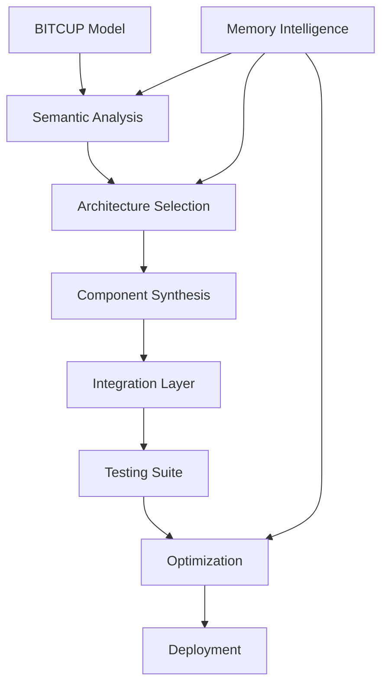
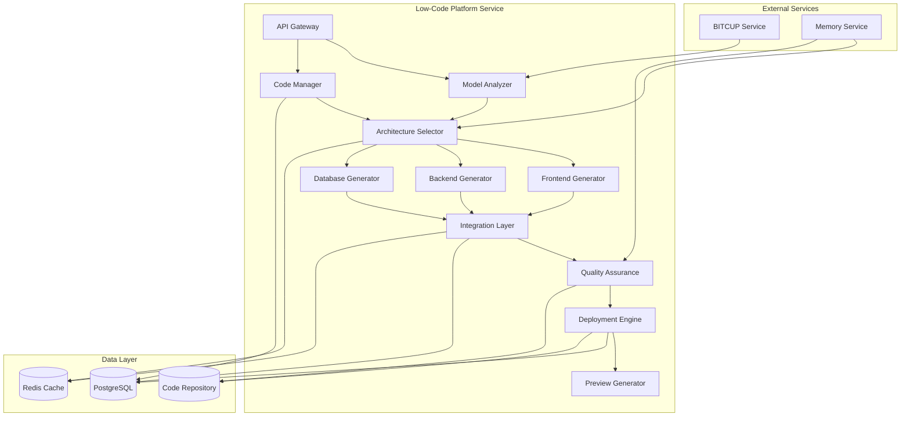

# ⚡ AI Low-Code Platform Module

> **Intelligent materialization that creates optimal implementations from BITCUP models**

## 🎯 Module Mission

The AI Low-Code Platform module serves as the **materialization engine** of the 一键升级-uplus platform. It transforms BITCUP semantic models into fully functional, deployed applications using intelligent code generation that understands the business intent rather than simply filling templates.

## 🧠 Core Philosophy: Understanding-Based Generation

### The Low-Code Paradigm
The AI Low-Code Platform represents a fundamental shift from **template-based generation** to **understanding-based materialization**:

- **Semantic Understanding**: Comprehends the business intent behind the model
- **Adaptive Architecture**: Selects optimal patterns based on requirements
- **Quality-First**: Generates code with built-in best practices
- **Zero-Touch Deployment**: Automates the entire deployment pipeline
- **Continuous Optimization**: Learns from feedback to improve future generations

### Generation Philosophy


## 🏗️ Technical Architecture

### System Components

```yaml
Core Components:
  1. Model Analyzer: Extracts implementation requirements from BITCUP model
  2. Architecture Selector: Determines optimal architecture patterns
  3. Code Generator: Creates code for all application layers
  4. Quality Assurance: Validates generated code against standards
  5. Deployment Engine: Automates deployment to target environments
  6. Preview Generator: Creates visual previews of applications

Technology Stack:
  - Runtime: Node.js with TypeScript
  - Framework: Express for HTTP services
  - Database: PostgreSQL (models), Redis (cache)
  - Code Generation: Custom generation engine with AI assistance
  - Deployment: Docker, Kubernetes, and cloud providers
  - Testing: Automated test generation and validation
```

### Service Architecture



## ⚡ Code Generation Pipeline

### Generation Process

#### 1. Semantic Analysis
The first step is to deeply understand the BITCUP model's intent:

```typescript
async function analyzeModel(bitcupModel: BitcupModel): Promise<ImplementationSpec> {
  // Extract entities and their relationships
  const entities = extractEntities(bitcupModel.entities);
  
  // Analyze behaviors to determine API endpoints
  const apiEndpoints = analyzeBehaviors(bitcupModel.behaviors);
  
  // Extract UI requirements from views
  const uiComponents = analyzeViews(bitcupModel.views);
  
  // Determine workflow and business processes
  const workflows = analyzeFlows(bitcupModel.flows);
  
  // Extract business rules and constraints
  const businessRules = analyzeRules(bitcupModel.rules);
  
  return {
    dataModel: entities,
    apiSpecification: apiEndpoints,
    userInterface: uiComponents,
    businessLogic: {
      workflows,
      businessRules
    },
    constraints: bitcupModel.constraints
  };
}
```

#### 2. Architecture Selection
Based on the implementation requirements, select the optimal architecture:

```typescript
async function selectArchitecture(
  implementationSpec: ImplementationSpec,
  techStack: TechStack
): Promise<ArchitectureSpec> {
  // Determine application complexity
  const complexity = calculateComplexity(implementationSpec);
  
  // Select appropriate architecture patterns
  const patterns = selectPatterns(complexity, techStack);
  
  // Determine component structure
  const componentStructure = designComponentStructure(
    implementationSpec,
    patterns
  );
  
  // Optimize for selected tech stack
  const optimizedStructure = optimizeForTechStack(
    componentStructure,
    techStack
  );
  
  return {
    patterns,
    structure: optimizedStructure,
    layers: determineLayers(complexity, techStack),
    dataFlow: designDataFlow(implementationSpec)
  };
}
```

#### 3. Code Generation
Generate code for each layer of the application:

```typescript
async function generateCode(
  implementationSpec: ImplementationSpec,
  architectureSpec: ArchitectureSpec,
  techStack: TechStack
): Promise<GeneratedCode> {
  // Generate frontend code
  const frontendCode = await generateFrontendCode(
    implementationSpec.userInterface,
    architectureSpec,
    techStack.frontend
  );
  
  // Generate backend code
  const backendCode = await generateBackendCode(
    implementationSpec.apiSpecification,
    implementationSpec.businessLogic,
    architectureSpec,
    techStack.backend
  );
  
  // Generate database code
  const databaseCode = await generateDatabaseCode(
    implementationSpec.dataModel,
    techStack.database
  );
  
  // Generate deployment configuration
  const deploymentConfig = generateDeploymentConfig(
    techStack,
    architectureSpec
  );
  
  return {
    frontend: frontendCode,
    backend: backendCode,
    database: databaseCode,
    deployment: deploymentConfig
  };
}
```

#### 4. Quality Assurance
Validate the generated code against quality standards:

```typescript
async function validateCode(
  generatedCode: GeneratedCode,
  implementationSpec: ImplementationSpec
): Promise<ValidationResult> {
  // Validate code against quality standards
  const codeQuality = validateCodeQuality(generatedCode);
  
  // Validate against business requirements
  const requirementsCoverage = validateRequirementsCoverage(
    generatedCode,
    implementationSpec
  );
  
  // Generate test cases
  const testCases = generateTestCases(implementationSpec);
  
  // Run tests against generated code
  const testResults = await runTests(generatedCode, testCases);
  
  return {
    quality: codeQuality,
    coverage: requirementsCoverage,
    tests: testResults,
    issues: identifyIssues(codeQuality, requirementsCoverage, testResults)
  };
}
```

#### 5. Deployment
Deploy the application to the target environment:

```typescript
async function deployApplication(
  generatedCode: GeneratedCode,
  environment: Environment
): Promise<DeploymentResult> {
  // Prepare deployment artifacts
  const artifacts = prepareArtifacts(generatedCode, environment);
  
  // Set up infrastructure
  const infrastructure = await setupInfrastructure(
    environment,
    generatedCode.deployment
  );
  
  // Deploy application components
  const deploymentStatus = await deployComponents(
    artifacts,
    infrastructure
  );
  
  // Configure monitoring and logging
  const monitoring = setupMonitoring(deploymentStatus, environment);
  
  return {
    status: deploymentStatus.status,
    url: deploymentStatus.url,
    environment: environment,
    timestamp: new Date().toISOString(),
    monitoring
  };
}
```

## 🔧 Supported Technology Stacks

### Frontend Frameworks
- **Vue.js**: Modern, component-based framework with excellent performance
- **React**: Popular library for building interactive UIs
- **Angular**: Full-featured framework for enterprise applications

### Backend Frameworks
- **FastAPI**: Modern, high-performance Python framework
- **Express**: Minimal and flexible Node.js framework
- **Django**: Full-featured Python web framework
- **Spring Boot**: Java-based framework for enterprise applications

### Database Technologies
- **PostgreSQL**: Advanced open-source relational database
- **MongoDB**: Document-oriented NoSQL database
- **MySQL**: Popular open-source relational database
- **SQLite**: Lightweight file-based database

## 🚀 Deployment Options

### Local Development
- **Docker Compose**: Multi-container local development
- **Local Kubernetes**: Minikube or kind for local K8s development

### Cloud Deployment
- **Kubernetes**: Container orchestration for any cloud
- **AWS**: Amazon Web Services deployment
- **Azure**: Microsoft Azure deployment
- **GCP**: Google Cloud Platform deployment

### Serverless Options
- **AWS Lambda**: Function-as-a-Service on AWS
- **Azure Functions**: Serverless compute on Azure
- **Google Cloud Functions**: Event-driven serverless compute

## 📊 Quality Assurance

### Code Quality Standards
- **Linting**: Enforced code style and best practices
- **Static Analysis**: Identify potential issues before runtime
- **Complexity Analysis**: Ensure maintainable code
- **Security Scanning**: Identify security vulnerabilities

### Testing Strategy
- **Unit Tests**: Test individual components
- **Integration Tests**: Test component interactions
- **End-to-End Tests**: Test complete workflows
- **Performance Tests**: Ensure performance requirements are met

### Security Measures
- **Input Validation**: Prevent injection attacks
- **Authentication**: Secure user authentication
- **Authorization**: Proper access control
- **Data Protection**: Encryption and secure storage

## 🔄 Continuous Improvement

### Learning from Deployments
- **Success Metrics**: Track deployment success rates
- **Performance Metrics**: Monitor application performance
- **User Feedback**: Collect and analyze user feedback
- **Issue Tracking**: Track and resolve issues

### Optimization Strategies
- **Performance Optimization**: Improve application speed
- **Code Optimization**: Reduce complexity and improve maintainability
- **Resource Optimization**: Reduce resource usage
- **User Experience Optimization**: Improve usability

## 🎯 Success Metrics

### Key Performance Indicators
- **Code Generation Success Rate**: >99%
- **Deployment Success Rate**: >99.5%
- **Code Quality Score**: >8.5/10
- **Test Coverage**: >90%
- **User Satisfaction**: >4.5/5

### Continuous Improvement Targets
- **Monthly Improvement Rate**: >5%
- **Issue Resolution Time**: <24 hours
- **Learning Rate**: >10% knowledge increase per month

## 📋 Implementation Roadmap

### Phase 1: Foundation
- Basic code generation from templates
- Support for Vue.js, FastAPI, and PostgreSQL
- Simple deployment to Docker containers
- Basic quality assurance

### Phase 2: Intelligence
- Understanding-based generation
- Adaptive architecture selection
- Advanced testing automation
- Performance optimization

### Phase 3: Autonomy
- Self-improving generation algorithms
- Autonomous optimization
- Predictive maintenance
- Minimal human intervention

## 🔗 Integration with Other Modules

### BITCUP Integration
- Receive BITCUP models for code generation
- Transform implementation models into code
- Provide feedback on model quality

### Memory Intelligence Integration
- Learn from successful code patterns
- Apply insights to improve generation
- Track deployment outcomes for learning

### AI-PM Integration
- Receive requirements context
- Provide implementation feedback
- Support iterative development

## 📚 API Reference

### Code Generation API
- `POST /api/v1/lowcode/generate-code`: Generate code from BITCUP model
- `GET /api/v1/lowcode/tech-stacks`: Get available technology stacks
- `GET /api/v1/lowcode/code/{code_id}`: Get generated code by ID
- `GET /api/v1/lowcode/codes/{bitcup_id}`: Get all generated code for a BITCUP model

### Preview API
- `POST /api/v1/lowcode/preview`: Generate application preview

### Deployment API
- `POST /api/v1/lowcode/deploy`: Deploy application to environment

## 🎯 Next Steps

1. **Enhance Code Generation**: Improve the quality and flexibility of generated code
2. **Expand Tech Stack Support**: Add support for more frameworks and technologies
3. **Improve Deployment Options**: Add more deployment targets and configurations
4. **Enhance Quality Assurance**: Improve testing and validation capabilities
5. **Integrate with Memory Intelligence**: Leverage learning for better generation

---

<div align="center">

**⚡ Low-Code Platform Module Specification Complete**

*Ready to transform semantic models into living systems*

</div>