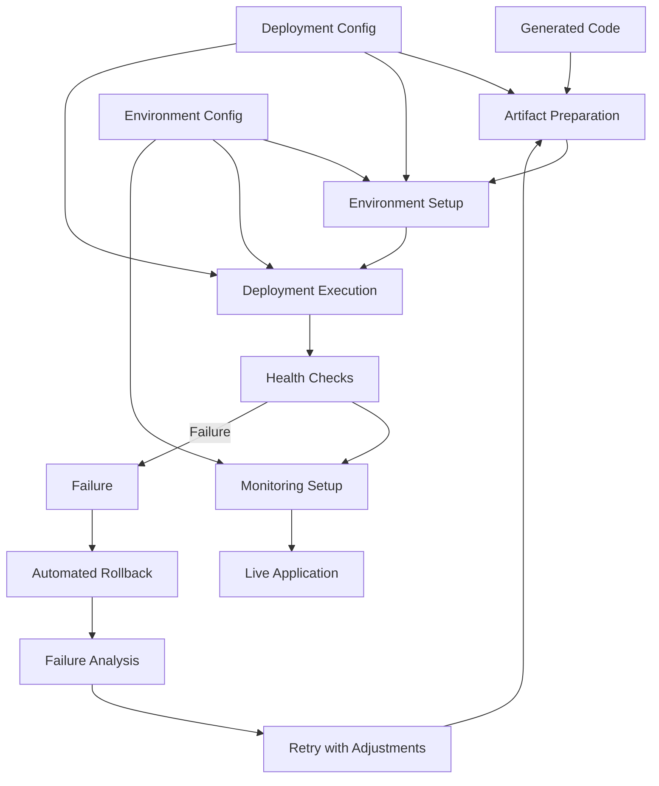

# 🚀 Automated Deployment Engine

> **Zero-touch deployment system that automates the entire deployment lifecycle**

## 🎯 Overview

The Deployment Engine is a critical component of the AI Low-Code Platform, responsible for automating the entire deployment lifecycle from code generation to production deployment. It provides a seamless, zero-touch deployment experience that eliminates manual steps and ensures consistent, reliable deployments across environments.

## 🧠 Deployment Philosophy

### Zero-Touch Deployment

Traditional deployment processes require significant manual intervention, leading to inconsistency, errors, and delays. Our approach is fundamentally different:

| Traditional Deployment | 一键升级-uplus Zero-Touch Deployment |
|------------------------|-------------------------------------|
| 🔄 Manual configuration | 🤖 Automated configuration generation |
| 📋 Complex deployment steps | 🎯 One-click deployment |
| 🔧 Environment-specific setup | 🌐 Environment abstraction |
| 📉 Inconsistent deployments | 📈 Consistent, repeatable deployments |
| 🔒 Limited rollback capabilities | 🔄 Automated rollback on failure |

### The Deployment Process



## 🏗️ Technical Architecture

### System Components

```yaml
Core Components:
  1. Artifact Builder: Prepares deployment artifacts from generated code
  2. Environment Manager: Sets up and configures deployment environments
  3. Deployment Executor: Executes the deployment process
  4. Health Monitor: Verifies deployment success and monitors health
  5. Rollback Manager: Handles automated rollback on failure
  6. Configuration Manager: Manages environment-specific configurations
  7. Secret Manager: Securely manages sensitive information
```

### Deployment Pipeline

The deployment pipeline consists of several stages that transform generated code into a running application:

1. **Artifact Preparation**: Build deployment artifacts from generated code
2. **Environment Setup**: Configure the target environment
3. **Deployment Execution**: Deploy the application to the target environment
4. **Health Checks**: Verify deployment success and application health
5. **Monitoring Setup**: Configure monitoring and alerting
6. **Rollback (if needed)**: Automatically roll back on failure

## 🚀 Deployment Capabilities

### Artifact Preparation

The system prepares deployment artifacts with the following capabilities:

#### Docker Image Building

```dockerfile
# Example of a generated Dockerfile for frontend
FROM node:18-alpine as build

WORKDIR /app

# Copy package files
COPY package.json package-lock.json ./

# Install dependencies
RUN npm ci

# Copy source code
COPY . .

# Build the application
RUN npm run build

# Production stage
FROM nginx:alpine

# Copy built files from build stage
COPY --from=build /app/dist /usr/share/nginx/html

# Copy nginx configuration
COPY nginx.conf /etc/nginx/conf.d/default.conf

# Expose port
EXPOSE 80

# Start nginx
CMD ["nginx", "-g", "daemon off;"]
```

```dockerfile
# Example of a generated Dockerfile for backend
FROM python:3.11-slim

WORKDIR /app

# Copy requirements file
COPY requirements.txt .

# Install dependencies
RUN pip install --no-cache-dir -r requirements.txt

# Copy source code
COPY . .

# Expose port
EXPOSE 8000

# Start the application
CMD ["uvicorn", "app.main:app", "--host", "0.0.0.0", "--port", "8000"]
```

#### Build Scripts

```bash
#!/bin/bash
# Example of a generated build script

set -e

# Build frontend
echo "Building frontend..."
cd frontend
npm install
npm run build
cd ..

# Build backend
echo "Building backend..."
cd backend
python -m pip install -r requirements.txt
cd ..

# Build Docker images
echo "Building Docker images..."
docker build -t app-frontend:latest ./frontend
docker build -t app-backend:latest ./backend

echo "Build completed successfully!"
```

### Environment Setup

The system sets up deployment environments with the following capabilities:

#### Environment Configuration

```yaml
# Example of a generated environment configuration
environments:
  development:
    domain: dev.example.com
    replicas:
      frontend: 1
      backend: 1
    resources:
      frontend:
        cpu: 0.2
        memory: 256Mi
      backend:
        cpu: 0.5
        memory: 512Mi
    database:
      type: postgresql
      version: 14
      storage: 5Gi
    features:
      debug: true
      monitoring: true
      logging: true
  
  staging:
    domain: staging.example.com
    replicas:
      frontend: 2
      backend: 2
    resources:
      frontend:
        cpu: 0.5
        memory: 512Mi
      backend:
        cpu: 1
        memory: 1Gi
    database:
      type: postgresql
      version: 14
      storage: 10Gi
    features:
      debug: false
      monitoring: true
      logging: true
  
  production:
    domain: example.com
    replicas:
      frontend: 3
      backend: 5
    resources:
      frontend:
        cpu: 1
        memory: 1Gi
      backend:
        cpu: 2
        memory: 2Gi
    database:
      type: postgresql
      version: 14
      storage: 50Gi
      replicas: 3
    features:
      debug: false
      monitoring: true
      logging: true
      cdn: true
      ssl: true
```

#### Infrastructure as Code

```terraform
# Example of generated Terraform configuration
provider "aws" {
  region = var.aws_region
}

# VPC
resource "aws_vpc" "main" {
  cidr_block = "10.0.0.0/16"
  
  tags = {
    Name = "${var.project_name}-vpc"
    Environment = var.environment
  }
}

# Subnets
resource "aws_subnet" "public" {
  count = length(var.availability_zones)
  
  vpc_id            = aws_vpc.main.id
  cidr_block        = "10.0.${count.index}.0/24"
  availability_zone = var.availability_zones[count.index]
  
  tags = {
    Name = "${var.project_name}-public-${count.index}"
    Environment = var.environment
  }
}

resource "aws_subnet" "private" {
  count = length(var.availability_zones)
  
  vpc_id            = aws_vpc.main.id
  cidr_block        = "10.0.${count.index + 100}.0/24"
  availability_zone = var.availability_zones[count.index]
  
  tags = {
    Name = "${var.project_name}-private-${count.index}"
    Environment = var.environment
  }
}

# ECS Cluster
resource "aws_ecs_cluster" "main" {
  name = "${var.project_name}-cluster"
  
  setting {
    name  = "containerInsights"
    value = "enabled"
  }
  
  tags = {
    Name = "${var.project_name}-cluster"
    Environment = var.environment
  }
}

# Frontend Service
resource "aws_ecs_task_definition" "frontend" {
  family                   = "${var.project_name}-frontend"
  network_mode             = "awsvpc"
  requires_compatibilities = ["FARGATE"]
  cpu                      = var.frontend_cpu
  memory                   = var.frontend_memory
  execution_role_arn       = aws_iam_role.ecs_execution_role.arn
  task_role_arn            = aws_iam_role.ecs_task_role.arn
  
  container_definitions = jsonencode([
    {
      name      = "frontend"
      image     = "${var.ecr_repository_url}/frontend:${var.image_tag}"
      essential = true
      
      portMappings = [
        {
          containerPort = 80
          hostPort      = 80
          protocol      = "tcp"
        }
      ]
      
      environment = [
        {
          name  = "API_URL"
          value = "https://${aws_lb.api.dns_name}"
        }
      ]
      
      logConfiguration = {
        logDriver = "awslogs"
        options = {
          "awslogs-group"         = "/ecs/${var.project_name}-frontend"
          "awslogs-region"        = var.aws_region
          "awslogs-stream-prefix" = "ecs"
        }
      }
    }
  ])
  
  tags = {
    Name = "${var.project_name}-frontend-task"
    Environment = var.environment
  }
}

resource "aws_ecs_service" "frontend" {
  name            = "${var.project_name}-frontend"
  cluster         = aws_ecs_cluster.main.id
  task_definition = aws_ecs_task_definition.frontend.arn
  desired_count   = var.frontend_replicas
  launch_type     = "FARGATE"
  
  network_configuration {
    subnets         = aws_subnet.private.*.id
    security_groups = [aws_security_group.frontend.id]
  }
  
  load_balancer {
    target_group_arn = aws_lb_target_group.frontend.arn
    container_name   = "frontend"
    container_port   = 80
  }
  
  depends_on = [
    aws_lb_listener.frontend
  ]
  
  tags = {
    Name = "${var.project_name}-frontend-service"
    Environment = var.environment
  }
}

# Backend Service
resource "aws_ecs_task_definition" "backend" {
  family                   = "${var.project_name}-backend"
  network_mode             = "awsvpc"
  requires_compatibilities = ["FARGATE"]
  cpu                      = var.backend_cpu
  memory                   = var.backend_memory
  execution_role_arn       = aws_iam_role.ecs_execution_role.arn
  task_role_arn            = aws_iam_role.ecs_task_role.arn
  
  container_definitions = jsonencode([
    {
      name      = "backend"
      image     = "${var.ecr_repository_url}/backend:${var.image_tag}"
      essential = true
      
      portMappings = [
        {
          containerPort = 8000
          hostPort      = 8000
          protocol      = "tcp"
        }
      ]
      
      environment = [
        {
          name  = "DATABASE_URL"
          value = "postgresql://${var.db_username}:${var.db_password}@${aws_db_instance.main.endpoint}/${var.db_name}"
        },
        {
          name  = "REDIS_URL"
          value = "redis://${aws_elasticache_cluster.main.cache_nodes.0.address}:6379/0"
        },
        {
          name  = "ENVIRONMENT"
          value = var.environment
        },
        {
          name  = "CORS_ORIGINS"
          value = "https://${var.domain_name}"
        }
      ]
      
      secrets = [
        {
          name      = "SECRET_KEY"
          valueFrom = aws_secretsmanager_secret.secret_key.arn
        }
      ]
      
      logConfiguration = {
        logDriver = "awslogs"
        options = {
          "awslogs-group"         = "/ecs/${var.project_name}-backend"
          "awslogs-region"        = var.aws_region
          "awslogs-stream-prefix" = "ecs"
        }
      }
    }
  ])
  
  tags = {
    Name = "${var.project_name}-backend-task"
    Environment = var.environment
  }
}

resource "aws_ecs_service" "backend" {
  name            = "${var.project_name}-backend"
  cluster         = aws_ecs_cluster.main.id
  task_definition = aws_ecs_task_definition.backend.arn
  desired_count   = var.backend_replicas
  launch_type     = "FARGATE"
  
  network_configuration {
    subnets         = aws_subnet.private.*.id
    security_groups = [aws_security_group.backend.id]
  }
  
  load_balancer {
    target_group_arn = aws_lb_target_group.backend.arn
    container_name   = "backend"
    container_port   = 8000
  }
  
  depends_on = [
    aws_lb_listener.backend
  ]
  
  tags = {
    Name = "${var.project_name}-backend-service"
    Environment = var.environment
  }
}

# Database
resource "aws_db_instance" "main" {
  identifier             = "${var.project_name}-db"
  engine                 = "postgres"
  engine_version         = "14"
  instance_class         = var.db_instance_class
  allocated_storage      = var.db_allocated_storage
  storage_type           = "gp2"
  name                   = var.db_name
  username               = var.db_username
  password               = var.db_password
  parameter_group_name   = "default.postgres14"
  db_subnet_group_name   = aws_db_subnet_group.main.name
  vpc_security_group_ids = [aws_security_group.database.id]
  skip_final_snapshot    = true
  
  tags = {
    Name = "${var.project_name}-db"
    Environment = var.environment
  }
}

# Redis
resource "aws_elasticache_cluster" "main" {
  cluster_id           = "${var.project_name}-redis"
  engine               = "redis"
  node_type            = var.redis_node_type
  num_cache_nodes      = 1
  parameter_group_name = "default.redis7"
  subnet_group_name    = aws_elasticache_subnet_group.main.name
  security_group_ids   = [aws_security_group.redis.id]
  
  tags = {
    Name = "${var.project_name}-redis"
    Environment = var.environment
  }
}

# Load Balancers
resource "aws_lb" "frontend" {
  name               = "${var.project_name}-frontend-lb"
  internal           = false
  load_balancer_type = "application"
  security_groups    = [aws_security_group.frontend_lb.id]
  subnets            = aws_subnet.public.*.id
  
  tags = {
    Name = "${var.project_name}-frontend-lb"
    Environment = var.environment
  }
}

resource "aws_lb" "api" {
  name               = "${var.project_name}-api-lb"
  internal           = false
  load_balancer_type = "application"
  security_groups    = [aws_security_group.backend_lb.id]
  subnets            = aws_subnet.public.*.id
  
  tags = {
    Name = "${var.project_name}-api-lb"
    Environment = var.environment
  }
}

# Route 53
resource "aws_route53_record" "frontend" {
  zone_id = var.route53_zone_id
  name    = var.domain_name
  type    = "A"
  
  alias {
    name                   = aws_lb.frontend.dns_name
    zone_id                = aws_lb.frontend.zone_id
    evaluate_target_health = true
  }
}

resource "aws_route53_record" "api" {
  zone_id = var.route53_zone_id
  name    = "api.${var.domain_name}"
  type    = "A"
  
  alias {
    name                   = aws_lb.api.dns_name
    zone_id                = aws_lb.api.zone_id
    evaluate_target_health = true
  }
}

# Outputs
output "frontend_url" {
  value = "https://${var.domain_name}"
}

output "api_url" {
  value = "https://api.${var.domain_name}"
}

output "database_endpoint" {
  value = aws_db_instance.main.endpoint
}

output "redis_endpoint" {
  value = aws_elasticache_cluster.main.cache_nodes.0.address
}
```

### Deployment Execution

The system executes deployments with the following capabilities:

#### Deployment Scripts

```bash
#!/bin/bash
# Example of a generated deployment script

set -e

# Load environment variables
source .env.${ENVIRONMENT}

echo "Deploying to ${ENVIRONMENT} environment..."

# Push Docker images to registry
echo "Pushing Docker images to registry..."
docker tag app-frontend:latest ${REGISTRY}/app-frontend:${VERSION}
docker tag app-backend:latest ${REGISTRY}/app-backend:${VERSION}
docker push ${REGISTRY}/app-frontend:${VERSION}
docker push ${REGISTRY}/app-backend:${VERSION}

# Deploy infrastructure
echo "Deploying infrastructure..."
cd terraform/${ENVIRONMENT}
terraform init
terraform apply -auto-approve \
  -var="image_tag=${VERSION}" \
  -var="domain_name=${DOMAIN}" \
  -var="db_password=${DB_PASSWORD}" \
  -var="secret_key=${SECRET_KEY}"
cd ../..

# Wait for deployment to complete
echo "Waiting for deployment to complete..."
sleep 30

# Run database migrations
echo "Running database migrations..."
kubectl exec -it $(kubectl get pods -l app=backend -o jsonpath="{.items[0].metadata.name}") -- python -m alembic upgrade head

echo "Deployment completed successfully!"
echo "Frontend URL: https://${DOMAIN}"
echo "API URL: https://api.${DOMAIN}"
```

#### CI/CD Pipeline

```yaml
# Example of a generated GitHub Actions workflow
name: Deploy Application

on:
  push:
    branches: [ main ]
  workflow_dispatch:
    inputs:
      environment:
        description: 'Environment to deploy to'
        required: true
        default: 'development'
        type: choice
        options:
          - development
          - staging
          - production

jobs:
  build:
    runs-on: ubuntu-latest
    steps:
      - name: Checkout code
        uses: actions/checkout@v3
      
      - name: Set up Docker Buildx
        uses: docker/setup-buildx-action@v2
      
      - name: Login to Container Registry
        uses: docker/login-action@v2
        with:
          registry: ${{ secrets.REGISTRY_URL }}
          username: ${{ secrets.REGISTRY_USERNAME }}
          password: ${{ secrets.REGISTRY_PASSWORD }}
      
      - name: Build and push frontend
        uses: docker/build-push-action@v4
        with:
          context: ./frontend
          push: true
          tags: ${{ secrets.REGISTRY_URL }}/app-frontend:${{ github.sha }}
      
      - name: Build and push backend
        uses: docker/build-push-action@v4
        with:
          context: ./backend
          push: true
          tags: ${{ secrets.REGISTRY_URL }}/app-backend:${{ github.sha }}
  
  deploy:
    needs: build
    runs-on: ubuntu-latest
    environment: ${{ github.event.inputs.environment || 'development' }}
    steps:
      - name: Checkout code
        uses: actions/checkout@v3
      
      - name: Set up Terraform
        uses: hashicorp/setup-terraform@v2
        with:
          terraform_version: 1.4.6
      
      - name: Configure AWS credentials
        uses: aws-actions/configure-aws-credentials@v2
        with:
          aws-access-key-id: ${{ secrets.AWS_ACCESS_KEY_ID }}
          aws-secret-access-key: ${{ secrets.AWS_SECRET_ACCESS_KEY }}
          aws-region: ${{ secrets.AWS_REGION }}
      
      - name: Deploy infrastructure
        working-directory: ./terraform/${{ github.event.inputs.environment || 'development' }}
        run: |
          terraform init
          terraform apply -auto-approve \
            -var="image_tag=${{ github.sha }}" \
            -var="domain_name=${{ secrets.DOMAIN_NAME }}" \
            -var="db_password=${{ secrets.DB_PASSWORD }}" \
            -var="secret_key=${{ secrets.SECRET_KEY }}"
      
      - name: Wait for deployment
        run: sleep 60
      
      - name: Run database migrations
        run: |
          aws ecs run-task \
            --cluster app-cluster \
            --task-definition app-migrations \
            --network-configuration "awsvpcConfiguration={subnets=[${{ secrets.SUBNET_ID }}],securityGroups=[${{ secrets.SECURITY_GROUP_ID }}]}" \
            --launch-type FARGATE
      
      - name: Verify deployment
        run: |
          curl -s -o /dev/null -w "%{http_code}" https://${{ secrets.DOMAIN_NAME }} | grep 200
          curl -s -o /dev/null -w "%{http_code}" https://api.${{ secrets.DOMAIN_NAME }}/api/v1/health | grep 200
      
      - name: Notify deployment success
        if: success()
        uses: slackapi/slack-github-action@v1.23.0
        with:
          channel-id: ${{ secrets.SLACK_CHANNEL_ID }}
          slack-message: "✅ Successfully deployed to ${{ github.event.inputs.environment || 'development' }} environment!"
        env:
          SLACK_BOT_TOKEN: ${{ secrets.SLACK_BOT_TOKEN }}
      
      - name: Notify deployment failure
        if: failure()
        uses: slackapi/slack-github-action@v1.23.0
        with:
          channel-id: ${{ secrets.SLACK_CHANNEL_ID }}
          slack-message: "❌ Failed to deploy to ${{ github.event.inputs.environment || 'development' }} environment!"
        env:
          SLACK_BOT_TOKEN: ${{ secrets.SLACK_BOT_TOKEN }}
```

### Health Checks

The system performs health checks with the following capabilities:

#### Health Check Endpoints

```python
# Example of a generated health check endpoint
from fastapi import APIRouter, Depends, HTTPException, status
from sqlalchemy.ext.asyncio import AsyncSession
from app.core.database import get_db
import redis
import os

router = APIRouter()

@router.get("/health", status_code=status.HTTP_200_OK)
async def health_check(db: AsyncSession = Depends(get_db)):
    """
    Health check endpoint for the API
    
    Checks:
    - Database connection
    - Redis connection
    - API functionality
    """
    
    health_status = {
        "status": "healthy",
        "version": os.getenv("VERSION", "unknown"),
        "environment": os.getenv("ENVIRONMENT", "development"),
        "components": {
            "api": {"status": "healthy"},
            "database": {"status": "unknown"},
            "redis": {"status": "unknown"}
        }
    }
    
    # Check database connection
    try:
        result = await db.execute("SELECT 1")
        await result.scalar_one()
        health_status["components"]["database"]["status"] = "healthy"
    except Exception as e:
        health_status["components"]["database"]["status"] = "unhealthy"
        health_status["components"]["database"]["error"] = str(e)
        health_status["status"] = "degraded"
    
    # Check Redis connection
    try:
        redis_url = os.getenv("REDIS_URL", "redis://localhost:6379/0")
        r = redis.from_url(redis_url)
        r.ping()
        health_status["components"]["redis"]["status"] = "healthy"
    except Exception as e:
        health_status["components"]["redis"]["status"] = "unhealthy"
        health_status["components"]["redis"]["error"] = str(e)
        health_status["status"] = "degraded"
    
    # If any component is unhealthy, return 503 Service Unavailable
    if health_status["status"] != "healthy":
        raise HTTPException(
            status_code=status.HTTP_503_SERVICE_UNAVAILABLE,
            detail=health_status
        )
    
    return health_status
```

#### Monitoring Configuration

```yaml
# Example of a generated Prometheus configuration
global:
  scrape_interval: 15s
  evaluation_interval: 15s

scrape_configs:
  - job_name: 'frontend'
    metrics_path: '/metrics'
    static_configs:
      - targets: ['frontend:80']
  
  - job_name: 'backend'
    metrics_path: '/api/v1/metrics'
    static_configs:
      - targets: ['backend:8000']
  
  - job_name: 'database'
    static_configs:
      - targets: ['database-exporter:9187']
  
  - job_name: 'redis'
    static_configs:
      - targets: ['redis-exporter:9121']
  
  - job_name: 'node-exporter'
    static_configs:
      - targets: ['node-exporter:9100']
```

```yaml
# Example of a generated Grafana dashboard
apiVersion: 1

providers:
  - name: 'Default'
    orgId: 1
    folder: ''
    type: file
    disableDeletion: false
    updateIntervalSeconds: 10
    options:
      path: /etc/grafana/provisioning/dashboards

dashboards:
  - name: 'Application Overview'
    uid: 'application-overview'
    title: 'Application Overview'
    tags: ['generated', 'overview']
    timezone: 'browser'
    schemaVersion: 16
    version: 1
    refresh: '10s'
    panels:
      - title: 'API Request Rate'
        type: 'graph'
        gridPos:
          h: 8
          w: 12
          x: 0
          y: 0
        datasource: 'Prometheus'
        targets:
          - expr: 'sum(rate(http_requests_total{job="backend"}[5m])) by (status_code)'
            legendFormat: '{{status_code}}'
      
      - title: 'API Response Time'
        type: 'graph'
        gridPos:
          h: 8
          w: 12
          x: 12
          y: 0
        datasource: 'Prometheus'
        targets:
          - expr: 'histogram_quantile(0.95, sum(rate(http_request_duration_seconds_bucket{job="backend"}[5m])) by (le))'
            legendFormat: '95th percentile'
          - expr: 'histogram_quantile(0.50, sum(rate(http_request_duration_seconds_bucket{job="backend"}[5m])) by (le))'
            legendFormat: '50th percentile'
      
      - title: 'Database Connections'
        type: 'graph'
        gridPos:
          h: 8
          w: 12
          x: 0
          y: 8
        datasource: 'Prometheus'
        targets:
          - expr: 'pg_stat_activity_count{job="database-exporter"}'
            legendFormat: 'Connections'
      
      - title: 'Redis Memory Usage'
        type: 'graph'
        gridPos:
          h: 8
          w: 12
          x: 12
          y: 8
        datasource: 'Prometheus'
        targets:
          - expr: 'redis_memory_used_bytes{job="redis-exporter"}'
            legendFormat: 'Memory Used'
```

### Rollback Management

The system manages rollbacks with the following capabilities:

#### Rollback Scripts

```bash
#!/bin/bash
# Example of a generated rollback script

set -e

# Load environment variables
source .env.${ENVIRONMENT}

echo "Rolling back deployment in ${ENVIRONMENT} environment..."

# Get previous version
PREVIOUS_VERSION=$(aws ssm get-parameter --name "/${PROJECT_NAME}/${ENVIRONMENT}/previous-version" --query "Parameter.Value" --output text)

if [ -z "$PREVIOUS_VERSION" ]; then
  echo "No previous version found. Cannot rollback."
  exit 1
fi

echo "Rolling back to version ${PREVIOUS_VERSION}..."

# Update ECS services to use previous version
aws ecs update-service \
  --cluster ${PROJECT_NAME}-cluster \
  --service ${PROJECT_NAME}-frontend \
  --force-new-deployment \
  --task-definition ${PROJECT_NAME}-frontend:${PREVIOUS_VERSION}

aws ecs update-service \
  --cluster ${PROJECT_NAME}-cluster \
  --service ${PROJECT_NAME}-backend \
  --force-new-deployment \
  --task-definition ${PROJECT_NAME}-backend:${PREVIOUS_VERSION}

# Wait for rollback to complete
echo "Waiting for rollback to complete..."
aws ecs wait services-stable \
  --cluster ${PROJECT_NAME}-cluster \
  --services ${PROJECT_NAME}-frontend ${PROJECT_NAME}-backend

echo "Rollback completed successfully!"
```

#### Rollback Policies

```yaml
# Example of a generated rollback policy
rollback:
  automatic: true
  conditions:
    - type: "HealthCheck"
      threshold: 3
      period: 60
      grace_period: 120
    - type: "ErrorRate"
      threshold: 0.05
      period: 300
    - type: "ResponseTime"
      threshold: 2000
      period: 300
  
  strategies:
    - name: "PreviousVersion"
      priority: 1
      description: "Roll back to the previous known good version"
    - name: "BlueGreen"
      priority: 2
      description: "Switch traffic back to the previous deployment"
    - name: "Canary"
      priority: 3
      description: "Gradually roll back traffic to the previous version"
  
  notifications:
    - type: "Slack"
      channel: "#deployments"
    - type: "Email"
      recipients: ["devops@example.com"]
    - type: "PagerDuty"
      service_id: "P123456"
  
  post_rollback_actions:
    - type: "Incident"
      action: "Create"
      priority: "High"
    - type: "Metrics"
      action: "Collect"
      duration: 3600
    - type: "Logs"
      action: "Analyze"
      duration: 3600
```

## 🌐 Supported Deployment Targets

### Cloud Providers

- **AWS**: Amazon Web Services
  - ECS (Elastic Container Service)
  - EKS (Elastic Kubernetes Service)
  - Lambda (Serverless)
  - Elastic Beanstalk
- **Azure**: Microsoft Azure
  - AKS (Azure Kubernetes Service)
  - App Service
  - Container Instances
  - Functions (Serverless)
- **GCP**: Google Cloud Platform
  - GKE (Google Kubernetes Engine)
  - Cloud Run
  - App Engine
  - Cloud Functions (Serverless)

### Container Orchestration

- **Kubernetes**: Self-managed or managed Kubernetes clusters
- **Docker Swarm**: Docker's native orchestration
- **Nomad**: HashiCorp's workload orchestrator

### On-Premises

- **Bare Metal**: Direct deployment to physical servers
- **Virtual Machines**: Deployment to virtualized environments
- **Private Cloud**: OpenStack, VMware, etc.

## 📊 Deployment Metrics

### Key Performance Indicators

| Metric | Target | Measurement Method |
|--------|--------|-------------------|
| **Deployment Success Rate** | >99.5% | Percentage of successful deployments |
| **Deployment Time** | <10 minutes | Time from start to completion |
| **Rollback Time** | <5 minutes | Time to complete rollback |
| **Downtime** | <30 seconds | Time application is unavailable |
| **Error Rate Post-Deployment** | <0.1% | Error rate after deployment |

### Monitoring Metrics

| Metric | Description | Threshold |
|--------|-------------|-----------|
| **CPU Usage** | CPU utilization | <80% |
| **Memory Usage** | Memory utilization | <80% |
| **Response Time** | API response time | <500ms (P95) |
| **Error Rate** | API error rate | <1% |
| **Database Connections** | Number of active connections | <80% of max |
| **Cache Hit Rate** | Redis cache hit rate | >80% |

## 🔒 Security Measures

### Secure Deployment Practices

- **Secrets Management**: Secure handling of sensitive information
- **Least Privilege**: Minimal permissions for deployment processes
- **Network Security**: Secure network configuration
- **Image Scanning**: Vulnerability scanning of container images
- **Compliance Validation**: Automated compliance checks

### Compliance Support

- **SOC 2**: Service Organization Control 2
- **HIPAA**: Health Insurance Portability and Accountability Act
- **GDPR**: General Data Protection Regulation
- **PCI DSS**: Payment Card Industry Data Security Standard
- **ISO 27001**: Information Security Management

## 🔄 Continuous Improvement

The deployment engine continuously improves through:

- **Deployment Analytics**: Analysis of deployment patterns and performance
- **Failure Analysis**: Root cause analysis of deployment failures
- **Performance Optimization**: Optimization of deployment processes
- **Security Enhancements**: Continuous security improvements
- **Feedback Integration**: Learning from deployment outcomes

## 🎯 Success Metrics

### Key Performance Indicators

- **Deployment Success Rate**: >99.5%
- **Average Deployment Time**: <10 minutes
- **Rollback Success Rate**: >99.9%
- **Zero-Downtime Deployments**: >95%
- **Post-Deployment Stability**: >99.9% uptime

---

<div align="center">

**🚀 Deployment Engine Specification Complete**

*Ready to automate the entire deployment lifecycle*

</div>