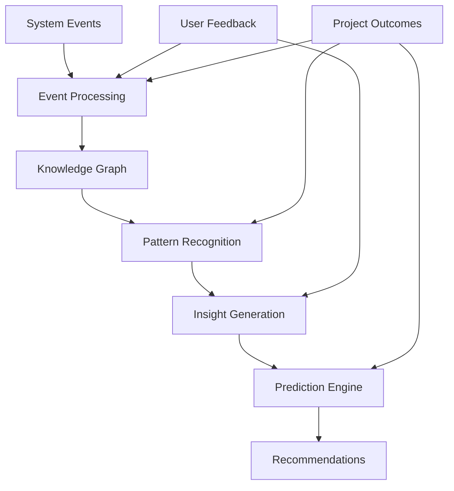
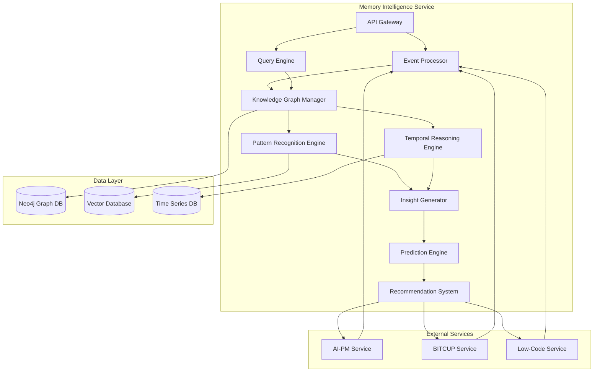

# 🧠 Document Memory Intelligence Module

> **Immortal organizational brain that learns and predicts - the evolution engine of the platform**

## 🎯 Module Mission

The Document Memory Intelligence module serves as the **organizational brain** of the 一键升级-uplus platform. It creates an immortal memory system that captures every decision, its context, and outcomes, enabling the platform to learn from experience, recognize patterns, and provide predictive insights that improve over time.

## 🧠 Core Philosophy: Temporal Intelligence

### The Memory Paradigm
The Document Memory Intelligence represents a fundamental shift from **static documentation** to **living knowledge**:

- **Temporal Knowledge**: Understands how decisions and outcomes evolve over time
- **Causal Reasoning**: Identifies cause-and-effect relationships across projects
- **Pattern Recognition**: Discovers recurring patterns and anti-patterns
- **Predictive Intelligence**: Anticipates outcomes based on historical data
- **Active Memory**: Proactively surfaces relevant insights when needed

### Intelligence Philosophy


## 🏗️ Technical Architecture

### System Components

```yaml
Core Components:
  1. Event Collector: Captures all system events and interactions
  2. Knowledge Graph: Stores interconnected knowledge with temporal relationships
  3. Pattern Recognition: Identifies recurring patterns across projects
  4. Insight Generator: Creates actionable insights from patterns
  5. Prediction Engine: Forecasts outcomes based on historical data
  6. Recommendation System: Provides context-aware recommendations

Technology Stack:
  - Runtime: Python 3.11+ with FastAPI
  - Graph Database: Neo4j for knowledge representation
  - Vector Database: Pinecone for semantic search
  - Machine Learning: PyTorch for pattern recognition
  - Time Series: TimescaleDB for temporal data
  - Streaming: Kafka for event processing
```

### Service Architecture



## 🧠 Memory Intelligence Capabilities

### Knowledge Representation

#### 1. Temporal Knowledge Graph
The core of the memory system is a temporal knowledge graph that captures entities, relationships, and their evolution over time:

```python
class TemporalKnowledgeGraph:
    def __init__(self):
        self.graph = nx.MultiDiGraph()
        self.temporal_index = {}
        self.entity_index = {}
        self.relationship_types = set()
        
    def add_entity(self, entity_id, entity_type, properties, timestamp):
        """Add an entity to the knowledge graph with temporal information"""
        if entity_id not in self.graph:
            self.graph.add_node(entity_id, 
                               type=entity_type, 
                               properties=properties,
                               created_at=timestamp,
                               versions=[])
            
            self.entity_index.setdefault(entity_type, set()).add(entity_id)
            self.temporal_index.setdefault(timestamp.date(), set()).add(entity_id)
        else:
            # Create a new version of the entity
            current = self.graph.nodes[entity_id]
            current['versions'].append({
                'properties': current['properties'],
                'timestamp': timestamp
            })
            current['properties'] = properties
            
    def add_relationship(self, from_id, to_id, rel_type, properties, timestamp):
        """Add a relationship between entities with temporal information"""
        if from_id in self.graph and to_id in self.graph:
            self.graph.add_edge(from_id, to_id, 
                               type=rel_type,
                               properties=properties,
                               created_at=timestamp)
            
            self.relationship_types.add(rel_type)
            self.temporal_index.setdefault(timestamp.date(), set()).add((from_id, to_id))
    
    def query_temporal_slice(self, start_time, end_time):
        """Get a subgraph representing a specific time period"""
        subgraph = nx.MultiDiGraph()
        
        # Get all dates in the range
        current = start_time.date()
        end = end_time.date()
        
        while current <= end:
            if current in self.temporal_index:
                # Add entities created in this time period
                for entity_id in self.temporal_index[current]:
                    if isinstance(entity_id, tuple):  # It's a relationship
                        from_id, to_id = entity_id
                        for edge_data in self.graph.get_edge_data(from_id, to_id).values():
                            if start_time <= edge_data['created_at'] <= end_time:
                                if from_id not in subgraph:
                                    subgraph.add_node(from_id, **self.graph.nodes[from_id])
                                if to_id not in subgraph:
                                    subgraph.add_node(to_id, **self.graph.nodes[to_id])
                                subgraph.add_edge(from_id, to_id, **edge_data)
                    else:  # It's an entity
                        node_data = self.graph.nodes[entity_id]
                        if start_time <= node_data['created_at'] <= end_time:
                            subgraph.add_node(entity_id, **node_data)
            
            current += timedelta(days=1)
            
        return subgraph
```

#### 2. Entity Types
The knowledge graph includes various entity types:

```yaml
Entity Types:
  - Decision: A choice made during development
  - Interaction: A conversation or system interaction
  - Artifact: A document, model, or code
  - Outcome: The result of a decision or action
  - Pattern: A recognized recurring pattern
  - Insight: A generated insight or recommendation
  - Project: A development project
  - User: A system user
```

#### 3. Relationship Types
Entities are connected through meaningful relationships:

```yaml
Relationship Types:
  - CAUSED: Indicates causal relationship
  - PART_OF: Indicates composition
  - FOLLOWED_BY: Indicates temporal sequence
  - SIMILAR_TO: Indicates semantic similarity
  - INFLUENCED: Indicates influence relationship
  - GENERATED: Indicates creation relationship
  - CONTRIBUTED_TO: Indicates contribution
  - CONTRADICTS: Indicates contradiction
```

### Pattern Recognition

#### 1. Pattern Detection Algorithm
The system uses various algorithms to detect patterns in the knowledge graph:

```python
class PatternRecognition:
    def __init__(self):
        self.pattern_detectors = [
            TemporalPatternDetector(),
            CausalPatternDetector(),
            StructuralPatternDetector(),
            SemanticPatternDetector()
        ]
        self.pattern_registry = {}
        
    def detect_patterns(self, knowledge_graph):
        """Detect patterns in the knowledge graph"""
        all_patterns = []
        
        for detector in self.pattern_detectors:
            patterns = detector.detect(knowledge_graph)
            all_patterns.extend(patterns)
            
        # Deduplicate and merge similar patterns
        merged_patterns = self._merge_similar_patterns(all_patterns)
        
        # Register new patterns
        for pattern in merged_patterns:
            if pattern.id not in self.pattern_registry:
                self.pattern_registry[pattern.id] = pattern
            else:
                # Update existing pattern
                self.pattern_registry[pattern.id].update(pattern)
                
        return merged_patterns
    
    def _merge_similar_patterns(self, patterns):
        """Merge similar patterns to avoid duplication"""
        if not patterns:
            return []
            
        merged = []
        clusters = self._cluster_patterns(patterns)
        
        for cluster in clusters:
            if len(cluster) == 1:
                merged.append(cluster[0])
            else:
                merged.append(self._merge_pattern_cluster(cluster))
                
        return merged
    
    def _cluster_patterns(self, patterns):
        """Cluster similar patterns together"""
        clusters = []
        
        for pattern in patterns:
            added = False
            for cluster in clusters:
                if self._patterns_similar(pattern, cluster[0]):
                    cluster.append(pattern)
                    added = True
                    break
                    
            if not added:
                clusters.append([pattern])
                
        return clusters
    
    def _patterns_similar(self, pattern1, pattern2):
        """Determine if two patterns are similar"""
        # Check if patterns have the same type
        if pattern1.type != pattern2.type:
            return False
            
        # Check structural similarity
        structure_similarity = self._calculate_structure_similarity(
            pattern1.structure, pattern2.structure)
            
        # Check semantic similarity
        semantic_similarity = self._calculate_semantic_similarity(
            pattern1.description, pattern2.description)
            
        # Patterns are similar if both similarities are above threshold
        return (structure_similarity > 0.7 and semantic_similarity > 0.8)
```

#### 2. Pattern Types
The system recognizes various pattern types:

```yaml
Pattern Types:
  - Temporal Patterns: Sequences of events that occur in a specific order
  - Causal Patterns: Cause-and-effect relationships between events
  - Structural Patterns: Recurring structures in the knowledge graph
  - Semantic Patterns: Patterns based on meaning and context
  - Anti-Patterns: Patterns that lead to negative outcomes
  - Success Patterns: Patterns that lead to positive outcomes
```

### Insight Generation

#### 1. Insight Generator
The system generates actionable insights from detected patterns:

```python
class InsightGenerator:
    def __init__(self):
        self.insight_types = {
            'recommendation': RecommendationInsight,
            'warning': WarningInsight,
            'observation': ObservationInsight,
            'prediction': PredictionInsight
        }
        self.insight_registry = {}
        
    def generate_insights(self, patterns, context):
        """Generate insights from patterns based on current context"""
        insights = []
        
        for pattern in patterns:
            # Determine relevance to current context
            relevance = self._calculate_relevance(pattern, context)
            
            if relevance > 0.5:  # Only generate insights for relevant patterns
                # Determine insight type
                insight_type = self._determine_insight_type(pattern, context)
                
                # Create insight
                insight_class = self.insight_types.get(insight_type, ObservationInsight)
                insight = insight_class.from_pattern(pattern, context, relevance)
                
                insights.append(insight)
                
        # Deduplicate and prioritize insights
        prioritized = self._prioritize_insights(insights)
        
        # Register new insights
        for insight in prioritized:
            self.insight_registry[insight.id] = insight
            
        return prioritized
    
    def _calculate_relevance(self, pattern, context):
        """Calculate how relevant a pattern is to the current context"""
        # Context matching
        context_match = self._match_context(pattern.context, context)
        
        # Recency factor - more recent patterns are more relevant
        recency = self._calculate_recency(pattern.last_observed)
        
        # Confidence factor - more confident patterns are more relevant
        confidence = pattern.confidence
        
        # Combine factors with appropriate weights
        return (0.5 * context_match + 0.3 * recency + 0.2 * confidence)
    
    def _determine_insight_type(self, pattern, context):
        """Determine the type of insight to generate"""
        if pattern.type == 'anti_pattern':
            return 'warning'
        elif pattern.type == 'success_pattern':
            return 'recommendation'
        elif pattern.predictive_power > 0.7:
            return 'prediction'
        else:
            return 'observation'
    
    def _prioritize_insights(self, insights):
        """Prioritize insights based on relevance, actionability, and novelty"""
        if not insights:
            return []
            
        # Sort by combined score
        return sorted(insights, key=lambda x: (
            x.relevance * 0.4 +  # Relevance
            x.actionability * 0.4 +  # Actionability
            x.novelty * 0.2  # Novelty
        ), reverse=True)
```

#### 2. Insight Types
The system generates various types of insights:

```yaml
Insight Types:
  - Recommendations: Actionable suggestions for improvement
  - Warnings: Alerts about potential issues
  - Observations: Neutral observations about patterns
  - Predictions: Forecasts about future outcomes
```

### Predictive Intelligence

#### 1. Prediction Engine
The system predicts future outcomes based on historical patterns:

```python
class PredictionEngine:
    def __init__(self):
        self.models = {}
        self.prediction_registry = {}
        
    def train_models(self, knowledge_graph):
        """Train prediction models based on historical data"""
        # Extract training data from knowledge graph
        training_data = self._extract_training_data(knowledge_graph)
        
        # Train different types of models
        self.models['decision_outcome'] = self._train_decision_outcome_model(
            training_data['decisions'], training_data['outcomes'])
            
        self.models['project_success'] = self._train_project_success_model(
            training_data['projects'], training_data['success_metrics'])
            
        self.models['time_estimation'] = self._train_time_estimation_model(
            training_data['tasks'], training_data['durations'])
    
    def predict(self, scenario, prediction_type):
        """Generate predictions for a given scenario"""
        if prediction_type not in self.models:
            raise ValueError(f"No model available for {prediction_type}")
            
        # Prepare scenario data
        scenario_data = self._prepare_scenario_data(scenario, prediction_type)
        
        # Generate prediction
        model = self.models[prediction_type]
        prediction = model.predict(scenario_data)
        
        # Calculate confidence
        confidence = model.confidence(scenario_data, prediction)
        
        # Create prediction object
        prediction_obj = Prediction(
            id=str(uuid.uuid4()),
            type=prediction_type,
            scenario=scenario,
            prediction=prediction,
            confidence=confidence,
            timestamp=datetime.now(),
            explanation=model.explain(scenario_data, prediction)
        )
        
        # Register prediction for later validation
        self.prediction_registry[prediction_obj.id] = prediction_obj
        
        return prediction_obj
    
    def validate_prediction(self, prediction_id, actual_outcome):
        """Validate a prediction against actual outcome"""
        if prediction_id not in self.prediction_registry:
            raise ValueError(f"Prediction {prediction_id} not found")
            
        prediction = self.prediction_registry[prediction_id]
        
        # Calculate accuracy
        accuracy = self._calculate_prediction_accuracy(
            prediction.prediction, actual_outcome)
            
        # Update prediction with actual outcome
        prediction.actual_outcome = actual_outcome
        prediction.accuracy = accuracy
        prediction.validated_at = datetime.now()
        
        # Use this feedback to improve the model
        model = self.models[prediction.type]
        model.update(prediction.scenario, actual_outcome)
        
        return accuracy
```

#### 2. Prediction Types
The system makes various types of predictions:

```yaml
Prediction Types:
  - Decision Outcomes: Predict the outcome of a decision
  - Project Success: Predict the success probability of a project
  - Time Estimation: Predict the time required for a task
  - Resource Needs: Predict the resources required for a project
  - Risk Assessment: Predict potential risks and their likelihood
```

## 🔍 Query Capabilities

### Query Types

#### 1. Temporal Queries
Query the knowledge graph based on time:

```python
async def temporal_query(self, query_params):
    """
    Execute a temporal query against the knowledge graph
    
    Example: "What decisions were made in the last 3 months?"
    """
    time_period = query_params.get('time_period', {})
    start_time = time_period.get('start')
    end_time = time_period.get('end')
    
    # Convert relative time to absolute time if needed
    if isinstance(start_time, str) and start_time.startswith('last_'):
        parts = start_time.split('_')
        if len(parts) == 3 and parts[2] in ['days', 'weeks', 'months', 'years']:
            amount = int(parts[1])
            unit = parts[2]
            end_time = datetime.now()
            if unit == 'days':
                start_time = end_time - timedelta(days=amount)
            elif unit == 'weeks':
                start_time = end_time - timedelta(weeks=amount)
            elif unit == 'months':
                start_time = end_time - relativedelta(months=amount)
            elif unit == 'years':
                start_time = end_time - relativedelta(years=amount)
    
    # Get temporal slice of the knowledge graph
    temporal_slice = self.knowledge_graph.query_temporal_slice(start_time, end_time)
    
    # Apply additional filters
    entity_type = query_params.get('entity_type')
    if entity_type:
        temporal_slice = self._filter_by_entity_type(temporal_slice, entity_type)
    
    # Format results
    results = self._format_query_results(temporal_slice)
    
    return {
        'query_type': 'temporal',
        'time_period': {
            'start': start_time.isoformat(),
            'end': end_time.isoformat()
        },
        'results': results
    }
```

#### 2. Causal Queries
Query the knowledge graph for cause-and-effect relationships:

```python
async def causal_query(self, query_params):
    """
    Execute a causal query against the knowledge graph
    
    Example: "Why did we make this decision?"
    """
    entity_id = query_params.get('entity_id')
    if not entity_id:
        raise ValueError("Entity ID is required for causal queries")
    
    # Get the entity
    entity = self.knowledge_graph.get_entity(entity_id)
    if not entity:
        raise ValueError(f"Entity {entity_id} not found")
    
    # Find causal relationships
    causes = self.knowledge_graph.get_incoming_relationships(entity_id, 'CAUSED')
    effects = self.knowledge_graph.get_outgoing_relationships(entity_id, 'CAUSED')
    
    # Get related entities
    cause_entities = [self.knowledge_graph.get_entity(rel['from_id']) for rel in causes]
    effect_entities = [self.knowledge_graph.get_entity(rel['to_id']) for rel in effects]
    
    return {
        'query_type': 'causal',
        'entity': entity,
        'causes': cause_entities,
        'effects': effect_entities,
        'explanation': self._generate_causal_explanation(entity, cause_entities, effect_entities)
    }
```

#### 3. Pattern Queries
Query the knowledge graph for patterns:

```python
async def pattern_query(self, query_params):
    """
    Execute a pattern query against the knowledge graph
    
    Example: "Have we seen this before?"
    """
    context = query_params.get('context', {})
    if not context:
        raise ValueError("Context is required for pattern queries")
    
    # Find similar patterns
    similar_patterns = []
    for pattern_id, pattern in self.pattern_registry.items():
        similarity = self._calculate_pattern_similarity(pattern, context)
        if similarity > 0.7:  # Threshold for similarity
            similar_patterns.append({
                'pattern': pattern,
                'similarity': similarity
            })
    
    # Sort by similarity
    similar_patterns.sort(key=lambda x: x['similarity'], reverse=True)
    
    return {
        'query_type': 'pattern',
        'context': context,
        'similar_patterns': similar_patterns,
        'has_similar_patterns': len(similar_patterns) > 0
    }
```

#### 4. Predictive Queries
Query the knowledge graph for predictions:

```python
async def predictive_query(self, query_params):
    """
    Execute a predictive query against the knowledge graph
    
    Example: "What's likely to happen if we do X?"
    """
    scenario = query_params.get('scenario', {})
    prediction_type = query_params.get('prediction_type')
    
    if not scenario:
        raise ValueError("Scenario is required for predictive queries")
    if not prediction_type:
        raise ValueError("Prediction type is required for predictive queries")
    
    # Generate prediction
    prediction = self.prediction_engine.predict(scenario, prediction_type)
    
    # Find similar historical scenarios
    similar_scenarios = self._find_similar_scenarios(scenario)
    
    return {
        'query_type': 'predictive',
        'scenario': scenario,
        'prediction': prediction,
        'confidence': prediction.confidence,
        'similar_scenarios': similar_scenarios,
        'explanation': prediction.explanation
    }
```

## 🔄 Learning Mechanisms

### Feedback Integration

#### 1. Learning from Outcomes
The system learns from the outcomes of decisions and actions:

```python
async def learn_from_outcome(self, outcome_data):
    """
    Learn from the outcome of a decision or action
    
    This updates the knowledge graph and improves prediction models
    """
    # Extract outcome information
    outcome_id = outcome_data.get('id', str(uuid.uuid4()))
    related_decisions = outcome_data.get('related_decisions', [])
    success_level = outcome_data.get('success_level', 0.5)
    
    # Add outcome to knowledge graph
    self.knowledge_graph.add_entity(
        entity_id=outcome_id,
        entity_type='outcome',
        properties=outcome_data,
        timestamp=datetime.now()
    )
    
    # Link outcome to related decisions
    for decision_id in related_decisions:
        self.knowledge_graph.add_relationship(
            from_id=decision_id,
            to_id=outcome_id,
            rel_type='RESULTED_IN',
            properties={'strength': 1.0},
            timestamp=datetime.now()
        )
    
    # Update decision impact scores
    for decision_id in related_decisions:
        self._update_decision_impact(decision_id, success_level)
    
    # Update prediction models
    for decision_id in related_decisions:
        decision = self.knowledge_graph.get_entity(decision_id)
        if decision:
            # Validate any predictions related to this decision
            predictions = self._find_related_predictions(decision_id)
            for prediction in predictions:
                self.prediction_engine.validate_prediction(
                    prediction.id, 
                    {'success_level': success_level}
                )
    
    # Detect new patterns based on this outcome
    self.pattern_recognition.detect_patterns(self.knowledge_graph)
    
    return {
        'outcome_id': outcome_id,
        'learning_status': 'success',
        'updated_decisions': related_decisions,
        'updated_predictions': len(self._find_related_predictions(related_decisions))
    }
```

#### 2. Continuous Improvement
The system continuously improves its models and algorithms:

```python
async def improve_models(self):
    """
    Continuously improve prediction models and pattern recognition
    
    This is run periodically to enhance system intelligence
    """
    # Retrain prediction models with latest data
    self.prediction_engine.train_models(self.knowledge_graph)
    
    # Evaluate model performance
    model_performance = self._evaluate_model_performance()
    
    # Refine pattern recognition algorithms
    pattern_performance = self._evaluate_pattern_recognition()
    
    # Adjust algorithm parameters based on performance
    self._adjust_algorithm_parameters(model_performance, pattern_performance)
    
    return {
        'model_performance': model_performance,
        'pattern_performance': pattern_performance,
        'improvements_made': self._summarize_improvements()
    }
```

## 📊 Performance Metrics

### Intelligence Metrics

| Metric | Target | Measurement Method |
|--------|--------|-------------------|
| **Knowledge Retention** | 100% | Audit of stored interactions and decisions |
| **Pattern Recognition Accuracy** | >85% | Validation against expert assessment |
| **Prediction Accuracy** | >80% | Comparison of predictions with actual outcomes |
| **Insight Relevance** | >90% | User feedback on provided insights |
| **Learning Rate** | >10% monthly | Improvement in prediction accuracy over time |

### System Performance

| Metric | Target | Measurement Method |
|--------|--------|-------------------|
| **Query Response Time** | <1s (P95) | Performance monitoring |
| **Event Processing Rate** | >500 events/s | Load testing |
| **Storage Efficiency** | <10KB per interaction | Database size monitoring |
| **Scalability** | Linear scaling to 10M+ nodes | Performance testing |

## 🔗 Integration with Other Modules

### AI-PM Integration
- Provide historical context for requirements gathering
- Suggest improvements based on past projects
- Predict potential issues in requirements

### BITCUP Integration
- Learn from model transformations
- Suggest optimal modeling patterns
- Predict model quality and completeness

### Low-Code Integration
- Learn from code generation outcomes
- Suggest optimal architecture patterns
- Predict deployment success and performance

## 📚 API Reference

### Event Collection API
- `POST /api/v1/memory/store-interaction`: Store an interaction in the knowledge graph
- `POST /api/v1/memory/store-decision`: Store a decision with context and rationale
- `POST /api/v1/memory/store-outcome`: Store an outcome and link to related decisions

### Query API
- `POST /api/v1/memory/query`: Execute a query against the knowledge graph
- `POST /api/v1/memory/get-insights`: Get relevant insights for current context
- `POST /api/v1/memory/predict-outcomes`: Predict likely outcomes for a scenario

### Learning API
- `POST /api/v1/memory/learn-from-feedback`: Incorporate user feedback
- `POST /api/v1/memory/improve-models`: Trigger model improvement process

## 🎯 Next Steps

1. **Enhance Pattern Recognition**: Improve the accuracy and depth of pattern recognition
2. **Expand Prediction Capabilities**: Add more prediction types and improve accuracy
3. **Improve Temporal Reasoning**: Enhance understanding of time-based relationships
4. **Develop Cross-Project Learning**: Enable learning across multiple projects
5. **Implement Active Memory**: Proactively surface relevant insights

---

<div align="center">

**🧠 Memory Intelligence Module Specification Complete**

*Ready to create an immortal organizational brain*

</div>