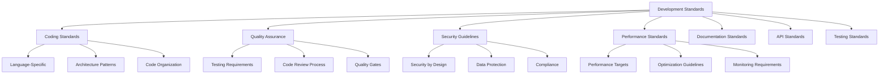

# 📏 Development Standards & Guidelines

> **Comprehensive standards ensuring excellence, consistency, and quality across the 一键升级-uplus platform**

## 🎯 Standards Philosophy

Our development standards embody the core principles of **Semantic First** development and **Radical Simplicity**. Every standard serves the greater vision of creating an AI-native platform that transforms small teams into self-evolving development organizations.

### Core Principles

| Principle | Description | Implementation |
|-----------|-------------|----------------|
| **Semantic First** | Understand meaning before syntax | Requirements → Models → Code |
| **Radical Simplicity** | Complex inside, simple outside | Clean APIs, elegant interfaces |
| **Quality Excellence** | No compromises on system quality | Comprehensive testing, validation |
| **Human Amplification** | Augment, don't replace human capability | User-centric design |
| **Continuous Evolution** | Every interaction improves the system | Feedback loops, learning |

## 📋 Standards Overview



## 🔧 Coding Standards

### Language-Specific Guidelines

#### Python Standards (AI-PM, Memory Services)
```python
"""
Python Coding Standards for 一键升级-uplus
Following PEP 8 with project-specific enhancements
"""

# Type hints are mandatory for all functions
from typing import Optional, List, Dict, Any
from datetime import datetime
from uuid import UUID

class RequirementSession:
    """
    Represents a requirement gathering session.
    
    Attributes:
        id: Unique session identifier
        user_id: User who owns the session
        project_id: Associated project identifier
        status: Current session status
        created_at: Session creation timestamp
    """
    
    def __init__(
        self,
        id: UUID,
        user_id: UUID,
        project_id: UUID,
        status: str,
        created_at: Optional[datetime] = None
    ) -> None:
        self.id = id
        self.user_id = user_id
        self.project_id = project_id
        self.status = status
        self.created_at = created_at or datetime.now()
    
    async def process_input(
        self,
        user_input: str,
        context: Dict[str, Any]
    ) -> Dict[str, Any]:
        """
        Process user input and generate response.
        
        Args:
            user_input: Raw user input text
            context: Current conversation context
            
        Returns:
            Dictionary containing response and updated context
            
        Raises:
            ValidationError: If input is invalid
            ProcessingError: If processing fails
        """
        # Implementation with comprehensive error handling
        try:
            # Process input with validation
            validated_input = self._validate_input(user_input)
            
            # Generate response
            response = await self._generate_response(validated_input, context)
            
            return {
                "response": response,
                "context": self._update_context(context, validated_input),
                "timestamp": datetime.now()
            }
            
        except Exception as e:
            # Log error with context
            logger.error(
                "Failed to process user input",
                extra={
                    "session_id": str(self.id),
                    "user_id": str(self.user_id),
                    "error": str(e),
                    "input_length": len(user_input)
                }
            )
            raise ProcessingError(f"Input processing failed: {e}") from e

# Code Quality Requirements:
# - 100% type hints coverage
# - Comprehensive docstrings (Google style)
# - Error handling for all external calls
# - Structured logging with context
# - Input validation and sanitization
```

#### Rust Standards (BITCUP Service)
```rust
//! BITCUP Modeling Service
//! 
//! This module implements the BITCUP modeling language processor
//! following Rust best practices and project standards.

use serde::{Deserialize, Serialize};
use uuid::Uuid;
use chrono::{DateTime, Utc};
use anyhow::{Result, Context};
use tracing::{info, error, instrument};

/// Represents a BITCUP model with semantic validation
#[derive(Debug, Clone, Serialize, Deserialize)]
pub struct BitcupModel {
    /// Unique model identifier
    pub id: Uuid,
    /// Source RSD document identifier
    pub rsd_id: Uuid,
    /// Model content in BITCUP format
    pub content: BitcupContent,
    /// Validation status and results
    pub validation: ValidationResult,
    /// Model creation timestamp
    pub created_at: DateTime<Utc>,
}

impl BitcupModel {
    /// Creates a new BITCUP model from RSD document
    /// 
    /// # Arguments
    /// 
    /// * `rsd_document` - Source requirements specification document
    /// 
    /// # Returns
    /// 
    /// * `Result<BitcupModel>` - Created model or error
    /// 
    /// # Errors
    /// 
    /// Returns error if RSD parsing fails or model generation fails
    #[instrument(skip(rsd_document))]
    pub async fn from_rsd(rsd_document: &RsdDocument) -> Result<Self> {
        info!("Generating BITCUP model from RSD {}", rsd_document.id);
        
        // Parse RSD with comprehensive error handling
        let parsed_rsd = Self::parse_rsd(rsd_document)
            .context("Failed to parse RSD document")?;
        
        // Generate BITCUP content
        let content = Self::generate_content(&parsed_rsd)
            .await
            .context("Failed to generate BITCUP content")?;
        
        // Validate generated model
        let validation = Self::validate_content(&content)
            .context("Failed to validate BITCUP model")?;
        
        Ok(BitcupModel {
            id: Uuid::new_v4(),
            rsd_id: rsd_document.id,
            content,
            validation,
            created_at: Utc::now(),
        })
    }
    
    /// Validates BITCUP model for semantic correctness
    /// 
    /// # Returns
    /// 
    /// * `Result<ValidationResult>` - Validation results or error
    fn validate_content(content: &BitcupContent) -> Result<ValidationResult> {
        // Comprehensive validation logic
        let mut errors = Vec::new();
        let mut warnings = Vec::new();
        
        // Semantic validation
        if let Err(e) = Self::validate_semantics(content) {
            errors.push(format!("Semantic validation failed: {}", e));
        }
        
        // Consistency validation
        if let Err(e) = Self::validate_consistency(content) {
            errors.push(format!("Consistency validation failed: {}", e));
        }
        
        // Performance validation
        if let Err(e) = Self::validate_performance(content) {
            warnings.push(format!("Performance concern: {}", e));
        }
        
        Ok(ValidationResult {
            is_valid: errors.is_empty(),
            errors,
            warnings,
            score: Self::calculate_quality_score(content),
        })
    }
}

// Code Quality Requirements:
// - Comprehensive error handling with anyhow
// - Structured logging with tracing
// - Complete documentation with examples
// - Type safety with strong typing
// - Performance optimization
// - Memory safety guarantees
```

#### TypeScript Standards (Frontend, Low-Code Service)
```typescript
/**
 * TypeScript Coding Standards for 一键升级-uplus
 * Strict type safety with comprehensive error handling
 */

import { z } from 'zod';
import { Result, Ok, Err } from 'ts-results';

// Strict type definitions with validation schemas
const UserInputSchema = z.object({
  message: z.string().min(1).max(10000),
  sessionId: z.string().uuid(),
  timestamp: z.date(),
  metadata: z.record(z.unknown()).optional(),
});

type UserInput = z.infer<typeof UserInputSchema>;

// Error types for comprehensive error handling
abstract class AppError extends Error {
  abstract readonly code: string;
  abstract readonly statusCode: number;
}

class ValidationError extends AppError {
  readonly code = 'VALIDATION_ERROR';
  readonly statusCode = 400;
  
  constructor(message: string, public readonly details: unknown) {
    super(message);
    this.name = 'ValidationError';
  }
}

class ProcessingError extends AppError {
  readonly code = 'PROCESSING_ERROR';
  readonly statusCode = 500;
  
  constructor(message: string, public readonly cause?: Error) {
    super(message);
    this.name = 'ProcessingError';
    if (cause) {
      this.stack = cause.stack;
    }
  }
}

/**
 * Service for handling user interactions with comprehensive error handling
 */
export class InteractionService {
  /**
   * Processes user input with validation and error handling
   * 
   * @param input - Raw user input to process
   * @returns Result containing response or error
   */
  async processUserInput(input: unknown): Promise<Result<InteractionResponse, AppError>> {
    try {
      // Validate input with Zod schema
      const validatedInput = UserInputSchema.parse(input);
      
      // Process with comprehensive error handling
      const response = await this.handleValidatedInput(validatedInput);
      
      return Ok(response);
      
    } catch (error) {
      if (error instanceof z.ZodError) {
        return Err(new ValidationError('Invalid input format', error.errors));
      }
      
      if (error instanceof Error) {
        return Err(new ProcessingError('Failed to process input', error));
      }
      
      return Err(new ProcessingError('Unknown error occurred'));
    }
  }
  
  private async handleValidatedInput(input: UserInput): Promise<InteractionResponse> {
    // Implementation with proper error propagation
    const context = await this.getSessionContext(input.sessionId);
    const response = await this.generateResponse(input, context);
    
    return {
      message: response.message,
      sessionId: input.sessionId,
      timestamp: new Date(),
      metadata: response.metadata,
    };
  }
}

// Code Quality Requirements:
// - Strict TypeScript configuration
// - Comprehensive type definitions
// - Runtime validation with Zod
// - Functional error handling with Result types
// - Complete JSDoc documentation
// - Immutable data structures where possible
```

### Architecture Patterns

#### Microservices Design Patterns
```yaml
Service Design Principles:
  Single Responsibility:
    - Each service has one clear purpose
    - Minimal coupling between services
    - High cohesion within services
    
  API-First Design:
    - OpenAPI specification before implementation
    - Contract-driven development
    - Backward compatibility guarantees
    
  Event-Driven Architecture:
    - Asynchronous communication preferred
    - Event sourcing for state changes
    - Saga pattern for distributed transactions
    
  Resilience Patterns:
    - Circuit breaker for external calls
    - Retry with exponential backoff
    - Bulkhead isolation
    - Timeout and deadline management

Domain-Driven Design:
  Bounded Contexts:
    - Clear domain boundaries
    - Ubiquitous language within context
    - Anti-corruption layers at boundaries
    
  Aggregates:
    - Consistency boundaries
    - Transactional integrity
    - Eventual consistency between aggregates
    
  Value Objects:
    - Immutable data structures
    - Rich domain models
    - Type safety and validation
```

#### Data Access Patterns
```python
# Repository Pattern Implementation
from abc import ABC, abstractmethod
from typing import Optional, List, Generic, TypeVar
from uuid import UUID

T = TypeVar('T')

class Repository(ABC, Generic[T]):
    """Abstract repository pattern for data access"""
    
    @abstractmethod
    async def find_by_id(self, id: UUID) -> Optional[T]:
        """Find entity by ID"""
        pass
    
    @abstractmethod
    async def find_all(self, filters: Dict[str, Any]) -> List[T]:
        """Find entities with filters"""
        pass
    
    @abstractmethod
    async def save(self, entity: T) -> T:
        """Save entity"""
        pass
    
    @abstractmethod
    async def delete(self, id: UUID) -> bool:
        """Delete entity by ID"""
        pass

class RequirementSessionRepository(Repository[RequirementSession]):
    """Concrete repository for requirement sessions"""
    
    def __init__(self, db_session: AsyncSession):
        self.db_session = db_session
    
    async def find_by_id(self, id: UUID) -> Optional[RequirementSession]:
        """Find session by ID with error handling"""
        try:
            result = await self.db_session.execute(
                select(RequirementSessionModel).where(
                    RequirementSessionModel.id == id
                )
            )
            model = result.scalar_one_or_none()
            return RequirementSession.from_model(model) if model else None
            
        except Exception as e:
            logger.error(f"Failed to find session {id}: {e}")
            raise RepositoryError(f"Database query failed: {e}") from e
```

## 🧪 Quality Assurance Standards

### Testing Requirements

#### Test Coverage Standards
```yaml
Coverage Requirements:
  Unit Tests: >95% line coverage
  Integration Tests: >90% API coverage
  End-to-End Tests: >80% user journey coverage
  Performance Tests: 100% critical path coverage

Test Categories:
  Unit Tests:
    - All public methods tested
    - Edge cases and error conditions
    - Mock external dependencies
    - Fast execution (<1s per test)
    
  Integration Tests:
    - API contract validation
    - Database integration
    - Message queue integration
    - External service integration
    
  End-to-End Tests:
    - Complete user workflows
    - Cross-service communication
    - Real environment testing
    - Performance validation
    
  Performance Tests:
    - Load testing for scalability
    - Stress testing for limits
    - Endurance testing for stability
    - Spike testing for elasticity
```

#### Test Implementation Standards
```python
# Unit Test Example with comprehensive coverage
import pytest
from unittest.mock import AsyncMock, patch
from uuid import uuid4
from datetime import datetime

class TestRequirementSession:
    """Comprehensive test suite for RequirementSession"""
    
    @pytest.fixture
    def session(self):
        """Create test session instance"""
        return RequirementSession(
            id=uuid4(),
            user_id=uuid4(),
            project_id=uuid4(),
            status="active",
            created_at=datetime.now()
        )
    
    @pytest.mark.asyncio
    async def test_process_input_success(self, session):
        """Test successful input processing"""
        # Arrange
        user_input = "I need a web application for managing tasks"
        context = {"previous_inputs": []}
        
        with patch.object(session, '_validate_input') as mock_validate, \
             patch.object(session, '_generate_response') as mock_generate, \
             patch.object(session, '_update_context') as mock_update:
            
            mock_validate.return_value = user_input
            mock_generate.return_value = "What specific features do you need?"
            mock_update.return_value = {"previous_inputs": [user_input]}
            
            # Act
            result = await session.process_input(user_input, context)
            
            # Assert
            assert result["response"] == "What specific features do you need?"
            assert user_input in result["context"]["previous_inputs"]
            assert "timestamp" in result
            
            # Verify method calls
            mock_validate.assert_called_once_with(user_input)
            mock_generate.assert_called_once_with(user_input, context)
            mock_update.assert_called_once_with(context, user_input)
    
    @pytest.mark.asyncio
    async def test_process_input_validation_error(self, session):
        """Test input validation error handling"""
        # Arrange
        invalid_input = ""  # Empty input should fail validation
        context = {}
        
        # Act & Assert
        with pytest.raises(ValidationError) as exc_info:
            await session.process_input(invalid_input, context)
        
        assert "Input processing failed" in str(exc_info.value)
    
    @pytest.mark.asyncio
    async def test_process_input_processing_error(self, session):
        """Test processing error handling"""
        # Arrange
        user_input = "Valid input"
        context = {}
        
        with patch.object(session, '_validate_input') as mock_validate, \
             patch.object(session, '_generate_response') as mock_generate:
            
            mock_validate.return_value = user_input
            mock_generate.side_effect = Exception("AI service unavailable")
            
            # Act & Assert
            with pytest.raises(ProcessingError) as exc_info:
                await session.process_input(user_input, context)
            
            assert "Input processing failed" in str(exc_info.value)
    
    def test_session_creation(self):
        """Test session creation with validation"""
        # Test valid creation
        session_id = uuid4()
        user_id = uuid4()
        project_id = uuid4()
        
        session = RequirementSession(
            id=session_id,
            user_id=user_id,
            project_id=project_id,
            status="active"
        )
        
        assert session.id == session_id
        assert session.user_id == user_id
        assert session.project_id == project_id
        assert session.status == "active"
        assert isinstance(session.created_at, datetime)
```

### Code Review Process

#### Review Checklist
```yaml
Code Review Checklist:
  Functionality:
    ✅ Code meets requirements
    ✅ Edge cases handled
    ✅ Error conditions managed
    ✅ Performance considerations
    
  Code Quality:
    ✅ Follows coding standards
    ✅ Proper naming conventions
    ✅ Appropriate abstractions
    ✅ No code duplication
    
  Testing:
    ✅ Adequate test coverage
    ✅ Tests are meaningful
    ✅ Edge cases tested
    ✅ Performance tests included
    
  Security:
    ✅ Input validation present
    ✅ No security vulnerabilities
    ✅ Proper authentication/authorization
    ✅ Data protection implemented
    
  Documentation:
    ✅ Code is self-documenting
    ✅ Complex logic explained
    ✅ API documentation updated
    ✅ README updated if needed

Review Process:
  1. Automated checks pass (CI/CD)
  2. Self-review by author
  3. Peer review by team member
  4. Security review for sensitive changes
  5. Architecture review for significant changes
  6. Final approval and merge
```

### Quality Gates

#### Automated Quality Gates
```yaml
Pre-Commit Gates:
  - Code formatting validation
  - Static analysis checks
  - Unit test execution
  - Security vulnerability scan

CI/CD Pipeline Gates:
  Build Stage:
    - Compilation success
    - Dependency vulnerability check
    - License compliance check
    
  Test Stage:
    - Unit test pass rate: 100%
    - Integration test pass rate: 100%
    - Code coverage threshold: >95%
    - Performance benchmark validation
    
  Security Stage:
    - SAST (Static Application Security Testing)
    - DAST (Dynamic Application Security Testing)
    - Container security scan
    - Infrastructure security scan
    
  Quality Stage:
    - Code quality score: >9.0/10
    - Technical debt ratio: <5%
    - Maintainability index: >70
    - Complexity metrics validation

Deployment Gates:
  Staging Deployment:
    - All quality gates passed
    - Integration tests successful
    - Performance tests passed
    - Security scans clean
    
  Production Deployment:
    - Staging validation complete
    - Change approval obtained
    - Rollback plan verified
    - Monitoring alerts configured
```

## 🔒 Security Guidelines

### Security by Design

#### Security Architecture Principles
```yaml
Defense in Depth:
  Network Security:
    - VPC with private subnets
    - Network segmentation
    - WAF (Web Application Firewall)
    - DDoS protection
    
  Application Security:
    - Input validation and sanitization
    - Output encoding
    - Authentication and authorization
    - Session management
    
  Data Security:
    - Encryption at rest (AES-256)
    - Encryption in transit (TLS 1.3)
    - Key management (HashiCorp Vault)
    - Data classification and handling

Zero Trust Architecture:
  - Never trust, always verify
  - Least privilege access
  - Continuous verification
  - Assume breach mentality

Secure Development Lifecycle:
  - Threat modeling
  - Secure coding practices
  - Security testing
  - Vulnerability management
```

#### Authentication & Authorization
```python
# OAuth 2.0 + OIDC Implementation
from fastapi import Depends, HTTPException, status
from fastapi.security import HTTPBearer, HTTPAuthorizationCredentials
from jose import JWTError, jwt
from typing import Optional

security = HTTPBearer()

class SecurityService:
    """Centralized security service for authentication and authorization"""
    
    def __init__(self, jwt_secret: str, jwt_algorithm: str = "RS256"):
        self.jwt_secret = jwt_secret
        self.jwt_algorithm = jwt_algorithm
    
    async def verify_token(
        self,
        credentials: HTTPAuthorizationCredentials = Depends(security)
    ) -> UserClaims:
        """Verify JWT token and extract user claims"""
        try:
            # Decode and verify JWT token
            payload = jwt.decode(
                credentials.credentials,
                self.jwt_secret,
                algorithms=[self.jwt_algorithm],
                audience="uplus-api",
                issuer="uplus-auth"
            )
            
            # Extract user claims
            user_id = payload.get("sub")
            if not user_id:
                raise HTTPException(
                    status_code=status.HTTP_401_UNAUTHORIZED,
                    detail="Invalid token: missing user ID"
                )
            
            return UserClaims(
                user_id=user_id,
                email=payload.get("email"),
                roles=payload.get("roles", []),
                permissions=payload.get("permissions", []),
                expires_at=payload.get("exp")
            )
            
        except JWTError as e:
            raise HTTPException(
                status_code=status.HTTP_401_UNAUTHORIZED,
                detail=f"Invalid token: {e}"
            )
    
    def require_permission(self, required_permission: str):
        """Decorator for permission-based authorization"""
        def permission_checker(user: UserClaims = Depends(self.verify_token)):
            if required_permission not in user.permissions:
                raise HTTPException(
                    status_code=status.HTTP_403_FORBIDDEN,
                    detail=f"Permission required: {required_permission}"
                )
            return user
        return permission_checker

# Usage in API endpoints
@app.post("/api/v1/sessions")
async def create_session(
    request: CreateSessionRequest,
    user: UserClaims = Depends(security_service.require_permission("sessions:create"))
):
    """Create new requirement session with proper authorization"""
    # Implementation with user context
    pass
```

### Data Protection Standards

#### PII Handling
```yaml
Data Classification:
  Public: No restrictions
  Internal: Company confidential
  Confidential: Restricted access
  Restricted: Highest protection level

PII Protection:
  Collection:
    - Minimal data collection principle
    - Explicit consent required
    - Purpose limitation
    - Data retention policies
    
  Processing:
    - Encryption in memory when possible
    - Secure processing environments
    - Audit logging for all access
    - Data anonymization techniques
    
  Storage:
    - AES-256 encryption at rest
    - Separate encryption keys per data type
    - Key rotation policies
    - Secure key management
    
  Transmission:
    - TLS 1.3 for all communications
    - Certificate pinning
    - Perfect forward secrecy
    - Mutual authentication where required

GDPR Compliance:
  - Right to access
  - Right to rectification
  - Right to erasure
  - Right to data portability
  - Privacy by design
  - Data protection impact assessments
```

## 📈 Performance Standards

### Performance Targets

#### Service Level Objectives (SLOs)
```yaml
Availability Targets:
  Critical Services (AI-PM, BITCUP): 99.95%
  Standard Services (Low-Code, Memory): 99.9%
  Supporting Services: 99.5%

Latency Targets:
  API Response Time (P95):
    - AI-PM Service: <2 seconds
    - BITCUP Service: <500 milliseconds
    - Low-Code Service: <5 seconds
    - Memory Service: <1 second
    
  End-to-End Workflow (P95):
    - Requirement to RSD: <2 hours
    - RSD to BITCUP Model: <30 minutes
    - Model to Deployed System: <1 hour
    - System to Insights: <24 hours

Throughput Targets:
  Concurrent Users: 1,000+
  Requests per Second:
    - AI-PM: 100 req/s
    - BITCUP: 200 req/s
    - Low-Code: 50 req/s
    - Memory: 500 req/s

Resource Utilization:
  CPU Utilization: <70% average
  Memory Utilization: <80% average
  Disk I/O: <80% capacity
  Network I/O: <70% capacity
```

#### Performance Optimization Guidelines
```python
# Performance optimization patterns
import asyncio
import aioredis
from functools import wraps
from typing import Any, Callable
import time

class PerformanceOptimizer:
    """Performance optimization utilities"""
    
    def __init__(self, redis_client: aioredis.Redis):
        self.redis = redis_client
    
    def cache_result(self, ttl: int = 3600, key_prefix: str = "cache"):
        """Decorator for caching function results"""
        def decorator(func: Callable) -> Callable:
            @wraps(func)
            async def wrapper(*args, **kwargs) -> Any:
                # Generate cache key
                cache_key = f"{key_prefix}:{func.__name__}:{hash(str(args) + str(kwargs))}"
                
                # Try to get from cache
                cached_result = await self.redis.get(cache_key)
                if cached_result:
                    return json.loads(cached_result)
                
                # Execute function and cache result
                result = await func(*args, **kwargs)
                await self.redis.setex(
                    cache_key,
                    ttl,
                    json.dumps(result, default=str)
                )
                
                return result
            return wrapper
        return decorator
    
    def rate_limit(self, max_calls: int, window: int = 60):
        """Decorator for rate limiting"""
        def decorator(func: Callable) -> Callable:
            @wraps(func)
            async def wrapper(*args, **kwargs) -> Any:
                # Implementation of sliding window rate limiting
                user_id = kwargs.get('user_id') or 'anonymous'
                rate_key = f"rate_limit:{func.__name__}:{user_id}"
                
                current_calls = await self.redis.incr(rate_key)
                if current_calls == 1:
                    await self.redis.expire(rate_key, window)
                
                if current_calls > max_calls:
                    raise RateLimitExceeded(
                        f"Rate limit exceeded: {max_calls} calls per {window} seconds"
                    )
                
                return await func(*args, **kwargs)
            return wrapper
        return decorator
    
    def monitor_performance(self, func: Callable) -> Callable:
        """Decorator for performance monitoring"""
        @wraps(func)
        async def wrapper(*args, **kwargs) -> Any:
            start_time = time.time()
            
            try:
                result = await func(*args, **kwargs)
                
                # Record success metrics
                execution_time = time.time() - start_time
                await self._record_metric(
                    f"{func.__name__}.execution_time",
                    execution_time
                )
                await self._record_metric(
                    f"{func.__name__}.success_count",
                    1
                )
                
                return result
                
            except Exception as e:
                # Record error metrics
                execution_time = time.time() - start_time
                await self._record_metric(
                    f"{func.__name__}.error_count",
                    1
                )
                await self._record_metric(
                    f"{func.__name__}.error_time",
                    execution_time
                )
                raise
                
        return wrapper

# Usage example
@performance_optimizer.cache_result(ttl=1800)
@performance_optimizer.rate_limit(max_calls=100, window=60)
@performance_optimizer.monitor_performance
async def generate_bitcup_model(rsd_document: RsdDocument) -> BitcupModel:
    """Generate BITCUP model with performance optimizations"""
    # Implementation
    pass
```

## 📚 Documentation Standards

### Documentation Requirements

#### API Documentation
```yaml
OpenAPI Specification:
  - Complete endpoint documentation
  - Request/response schemas
  - Error response documentation
  - Authentication requirements
  - Rate limiting information
  - Example requests and responses

Code Documentation:
  - Comprehensive docstrings
  - Type hints for all functions
  - Usage examples
  - Error handling documentation
  - Performance considerations

Architecture Documentation:
  - System design documents
  - Component interaction diagrams
  - Data flow documentation
  - Deployment architecture
  - Security architecture

User Documentation:
  - Getting started guides
  - API usage tutorials
  - Best practices guides
  - Troubleshooting guides
  - FAQ sections
```

---

<div align="center">

**📏 Development Standards Complete**

*Ready to implement? Check out [Coding Standards](coding-standards.md) or [Quality Assurance](quality-assurance.md)*

</div>